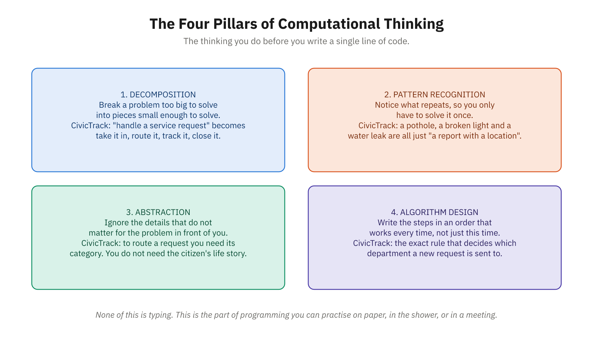

# Activity 11: Decompose a Real-World Process

**Module:** V (Computational Thinking, Data Structures & Algorithms)
**Related reading:** [Problem-Solving with Computational Thinking](../docs/Module-05-Computational-Thinking-Data-Structures-Algorithms/01-problem-solving-with-computational-thinking.md)

---

## Objective

You'll take a complex, multistep process from your professional background and apply the four pillars of computational thinking—decomposition, pattern recognition, abstraction, and algorithm design—to break it down, identify patterns, simplify it, and finally express it as a step-by-step algorithm.

---

## Background

One of the most powerful skills in programming is the ability to decompose large, messy problems into smaller, manageable pieces. This is computational thinking in action.



*Parts 2 to 5 of this activity walk one pillar at a time.*

The four pillars work together:

1. **Decomposition**: Breaking a big problem into smaller subproblems.
2. **Pattern Recognition**: Spotting repeating steps or similar operations.
3. **Abstraction**: Removing unnecessary details and focusing on what matters.
4. **Algorithm Design**: Creating a clear, general procedure to solve it.

When you think this way, even unfamiliar problems become solvable, and you can teach a computer (through code) to solve them too.

---

## Warm-Up: The Human Robot (10–15 minutes)

Before you decompose anything on paper, do this with a partner. It takes about ten minutes and makes the rest of the activity click.

**Setup.** Pair up. One person is the **Programmer**, the other is the **Robot**. Pick a simple physical task — for example:
- Draw a specific shape (a house with a door and two windows; a five-pointed star)
- Fold a paper airplane
- Make a peanut-butter sandwich (real or mimed)

**Round 1 — write the program.** The Programmer writes down *exact* step-by-step instructions for the task. No diagrams, no gestures — words only. The Robot must not watch or help.

**Round 2 — run the program.** The Robot performs the instructions **literally**, doing exactly what each line says and nothing more. If a step says "put peanut butter on the bread," the Robot might set the closed jar on top of the loaf — because that is literally what was written. Missing or ambiguous steps will visibly break the task.

**Swap roles** and run it again with a different task if time allows.

**Debrief (2 minutes).** Talk through:
- Where did the Robot do something you didn't intend? Which step was *ambiguous* or *missing*?
- How much did you assume the Robot already "knew"?

That gap — between what you meant and what you literally wrote — is the whole game. **A computer is the ultimate literal Robot: it does exactly what you say, not what you meant.** Decomposition (breaking the task into steps) and algorithmic precision (making each step unambiguous) are how you close that gap. That's exactly the skill you'll practice for the rest of this activity.

---

## Step-by-Step Instructions

### Step 1: Choose Your Process (5 minutes)

Pick a real process from your previous career that you understand well. Examples:
- Onboarding a new employee at your company
- Processing a customer order or purchase request
- Handling an insurance claim or support ticket
- Planning and executing an event or project
- Approving a budget or expense report
- Triaging patients or complaints by priority

Choose something complex enough to have multiple steps and decisions, but something you know intimately.

**Tied to our running example:** A great choice is CivicTrack's **"submit a service request"** workflow — a resident reports an issue, it's validated, saved as **New**, routed to the right department, and tracked through to **Closed**. If you decompose this one, you'll be analyzing the exact process the rest of the course builds in code. (See [`../course-project/README.md`](../course-project/README.md).)

### Step 2: Decompose It (10 minutes)

Write down every step in your process. Be detailed—don't skip steps because they seem "obvious." Identify decision points (if this happens, do that). You might end up with 8–15 steps.

**Worked Example: Processing a Restaurant Order**
- Customer arrives and is seated
- Server greets customer and offers menu
- Customer reviews menu (decision: ready to order?)
- Customer orders food and drink
- Server enters order into system
- Kitchen receives order and starts cooking
- Drink is prepared and delivered
- Food is cooked and plated
- Server delivers food
- Customer eats and indicates satisfaction (or not)
- Customer requests bill
- Server presents bill
- Customer provides payment
- Server processes payment
- Customer leaves and is thanked

### Step 3: Identify Patterns (8 minutes)

Look at your steps. What repeats? What happens in similar ways at different points?

**In our restaurant example:**
- Multiple "delivery" steps (drink, food, bill)
- Multiple "decision points" (ready to order? satisfied?)
- Multiple "input/collection" steps (menu review, order taking, payment)

Mark these patterns. They hint at what parts of your algorithm can be generalized or looped.

### Step 4: Abstract Away Unnecessary Details (8 minutes)

Which details matter for understanding the *essence* of the process, and which are noise? Remove the noise.

**In the restaurant example**, these details matter:
- Order taking
- Preparation
- Delivery
- Payment

These are less essential:
- The customer's name (doesn't change the flow)
- Specific menu items (the process is the same for pizza or pasta)
- How the kitchen is organized internally

Your abstracted version is simpler, making the core logic clear.

### Step 5: Write Your Pseudocode Algorithm (9 minutes)

Now write a general algorithm in pseudocode that would work for any instance of this process. Use plain language mixed with code-like structures (IF, REPEAT, etc.).

**Restaurant Order Processing (Pseudocode):**
```
ALGORITHM: ProcessRestaurantOrder
  INPUT: customer

  SEAT customer
  GIVE customer menu

  REPEAT until customer is ready:
    WAIT for customer

  order ← TAKE_ORDER from customer
  SEND order to kitchen
  WAIT until food is prepared
  DELIVER food to customer

  REPEAT until customer is done eating:
    CHECK on customer

  bill ← CALCULATE bill for order
  DELIVER bill to customer
  payment ← RECEIVE payment
  PROCESS payment
  THANK customer

  RETURN: completed transaction
```

---

## Expected Deliverable

A document (1–2 pages) that shows:

1. **Your chosen process** (name and brief description)
2. **Decomposed steps** (numbered list of 8–15 steps)
3. **Patterns identified** (with specific examples from your list)
4. **Abstraction notes** (what you removed, why)
5. **Your pseudocode algorithm** (using a format like the example above)

You can format this as a markdown file, Word document, or PDF. Clarity and completeness matter more than polish.

---

## Reflection Questions

1. **What surprised you most about the process when you decomposed it?** Did you realize it was more complex than you thought, or simpler? Why do you think that was?

2. **Where did abstraction help the most?** Removing which details made your algorithm clearer or more reusable?

3. **How could someone new to your job use your pseudocode algorithm to understand and execute the process?** What additional details might they need, and what would they figure out on their own?

---

## Tips for Success

- **Don't aim for perfection.** Your pseudocode doesn't need to be flawless; it should be *clear*.
- **Talk it out loud.** Explaining your process to a colleague often reveals steps you missed.
- **Think about edge cases.** What if something goes wrong? What if the customer changes their mind? Your decomposition should hint at these.
- **Remember: abstraction is subjective.** There's no single "right" level of detail. Choose the level that makes the core logic obvious.

---

## Going Deeper

Once you've completed this activity, consider:
- How would you measure the *efficiency* of this process? What's fast, and what's slow?
- If you wanted a computer to execute this process (or part of it), what data would you need to store? What decisions would the computer struggle with?
