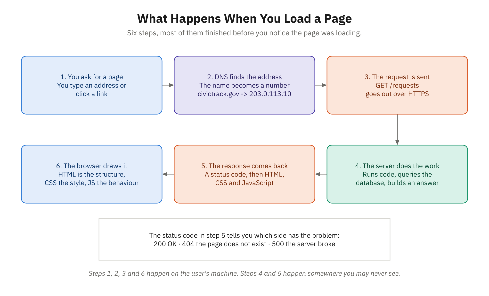

# Activity 17: Build a Personal Webpage — Your "About Me" Page

**Module:** VII (Programming Syntax & Logic)
**Related reading:** [Modern Web Development Overview](../docs/Module-07-Programming-Syntax-and-Logic/04-modern-web-development-overview.md), [JavaScript Fundamentals](../docs/Module-07-Programming-Syntax-and-Logic/02-javascript-fundamentals.md)

---

## Objective

Create a functioning personal webpage that tells your story as someone transitioning into programming. By combining HTML, CSS, and JavaScript, you'll see how these three languages work together to create the interactive web experiences we use every day. This is a real webpage you can add to a portfolio, share with friends, or use as a starting point for a larger project.

---

## Background

HTML is the structure. CSS is the style. JavaScript is the interactivity. Separately, each is useful. Together, they're the foundation of the modern web.



*Your page lives in step 6. Everything else is already done for you by the browser.*

In this activity, you'll build a small webpage from scratch. It won't need to be fancy—in fact, simplicity is the goal. What matters is that you understand how each piece contributes to the whole. You'll write the HTML that organizes content, the CSS that makes it look intentional, and the JavaScript that makes it respond to user interaction. When you click that button and see a fact appear, you'll feel the power of this combination.

This webpage also serves a purpose beyond this course: it tells your story. Hiring managers, collaborators, and people considering career transitions will see your journey and get to know you as a programmer. That's valuable.

---

## Step-by-Step Instructions

### Part 1: Create the HTML Structure (15 minutes)

1. **Create a new folder** for this project called `my-about-page`.
2. **Create a file** called `index.html` inside that folder.
3. **Copy this HTML structure** into your file and fill in the placeholders:

```html
<!DOCTYPE html>
<html lang="en">
<head>
    <meta charset="UTF-8">
    <meta name="viewport" content="width=device-width, initial-scale=1.0">
    <title>[YOUR NAME] - Career Transition into Programming</title>
    <link rel="stylesheet" href="style.css">
</head>
<body>
    <header>
        <h1>[YOUR NAME]</h1>
        <p class="tagline">Career Transition into Programming</p>
    </header>

    <main>
        <section id="about">
            <h2>About Me</h2>
            <p>[Write 2-3 sentences about your background before programming. What was your previous career? What brought you to programming?]</p>
        </section>

        <section id="skills">
            <h2>Skills I'm Learning</h2>
            <ul>
                <li>JavaScript</li>
                <li>HTML & CSS</li>
                <li>Problem-solving</li>
                <li>[Add 2-3 more skills you've learned in this course]</li>
            </ul>
        </section>

        <section id="facts">
            <h2>Fun Fact About Me</h2>
            <p id="fact-display">Click the button to discover a random fact!</p>
            <button id="fact-button">Show Me a Fact</button>
        </section>

        <section id="journey">
            <h2>My Learning Journey</h2>
            <p>I started this course on [DATE]. My goal is to [your goal].</p>
        </section>
    </main>

    <footer>
        <p>&copy; 2026 [YOUR NAME]. Learning to code, one challenge at a time.</p>
    </footer>

    <script src="script.js"></script>
</body>
</html>
```

4. **Personalize it.** Replace every `[PLACEHOLDER]` with your actual information. Your story matters. Write it genuinely.

---

### Part 2: Add CSS Styling (15 minutes)

1. **Create a file** called `style.css` in the same folder.
2. **Copy this CSS structure** and customize the colors, fonts, and spacing to match your style:

```css
* {
    margin: 0;
    padding: 0;
    box-sizing: border-box;
}

body {
    font-family: 'Segoe UI', Tahoma, Geneva, Verdana, sans-serif;
    line-height: 1.6;
    color: #333;
    background-color: #f4f4f4;
}

header {
    background-color: #2c3e50;
    color: white;
    padding: 3rem 1rem;
    text-align: center;
}

header h1 {
    font-size: 2.5rem;
    margin-bottom: 0.5rem;
}

.tagline {
    font-size: 1.1rem;
    font-style: italic;
}

main {
    max-width: 800px;
    margin: 2rem auto;
    padding: 0 1rem;
}

section {
    background-color: white;
    padding: 2rem;
    margin-bottom: 2rem;
    border-radius: 8px;
    box-shadow: 0 2px 4px rgba(0, 0, 0, 0.1);
}

section h2 {
    color: #2c3e50;
    margin-bottom: 1rem;
    border-bottom: 2px solid #3498db;
    padding-bottom: 0.5rem;
}

ul {
    list-style-position: inside;
}

li {
    margin-bottom: 0.5rem;
}

button {
    background-color: #3498db;
    color: white;
    padding: 0.75rem 1.5rem;
    border: none;
    border-radius: 4px;
    cursor: pointer;
    font-size: 1rem;
    transition: background-color 0.3s ease;
}

button:hover {
    background-color: #2980b9;
}

button:active {
    transform: scale(0.98);
}

footer {
    background-color: #2c3e50;
    color: white;
    text-align: center;
    padding: 2rem;
    margin-top: 3rem;
}
```

3. **Customize colors and fonts.** Change the hex colors (`#2c3e50`, `#3498db`) to colors you like. Change the font family if you prefer something different.

---

### Part 3: Add JavaScript Interactivity (15 minutes)

1. **Create a file** called `script.js` in the same folder.
2. **Copy this JavaScript code**:

```javascript
// Array of fun facts about you
const facts = [
    "I once [unique thing you did in your previous career].",
    "My favorite programming concept so far is [concept].",
    "Outside of coding, I love to [hobby or interest].",
    "Something I'm proud of: [accomplishment].",
    "My coding superpower is [something you're good at]."
];

// Get the button and display elements
const factButton = document.getElementById('fact-button');
const factDisplay = document.getElementById('fact-display');

// When the button is clicked, show a random fact
factButton.addEventListener('click', function() {
    const randomIndex = Math.floor(Math.random() * facts.length);
    const randomFact = facts[randomIndex];
    factDisplay.textContent = randomFact;
});
```

3. **Personalize the facts array.** Replace each placeholder with real facts about yourself. Make them genuine—this is your webpage.

---

### Part 4: Test and Preview (15 minutes)

1. **Install Live Server** (if you haven't already):
   - In VS Code, open the Extensions panel (Ctrl+Shift+X / Cmd+Shift+X).
   - Search for "Live Server" and install the one by Ritwick Dey.

2. **Start Live Server**:
   - Right-click on your `index.html` file and select "Open with Live Server".
   - A browser window will open automatically.

3. **Test your webpage**:
   - Check that your content appears.
   - Click the "Show Me a Fact" button several times. You should see different facts each time.
   - Resize the browser window. The page should adapt responsively.
   - If something doesn't work, check the browser console (F12) for error messages.

4. **Make adjustments**:
   - Colors not right? Edit `style.css`.
   - Button not working? Check that your `script.js` file is linked in `index.html`.
   - Text looking cramped? Adjust padding and margins in `style.css`.

---

## Expected Deliverable

A folder called `my-about-page` containing three files:

1. **index.html** — Your personalized HTML structure with all placeholders filled in
2. **style.css** — Custom styling (colors, fonts, spacing) that reflects your taste
3. **script.js** — Working JavaScript that displays random facts when the button is clicked

The webpage should:
- Display your name prominently
- Tell your story in the "About Me" section
- List skills you've learned
- Show a random fact when the button is clicked
- Have intentional styling that looks professional
- Work without console errors

---

## Reflection Questions

1. **Why did the browser need all three files (HTML, CSS, and JavaScript)?** What would the page look like without CSS? Without JavaScript? What does that tell you about how the web is built?

2. **You just wrote code that interacted with the user (the fact button).** How is that different from the JavaScript challenges in Activity 16? Why does that matter for a programmer?

3. **Imagine you wanted to add a new section to your webpage—maybe a "My Projects" section with a list of projects you've completed.** What changes would you need to make to each of the three files (HTML, CSS, JavaScript)? Which file would need the most changes?

---

## Tips for Success

- **Save frequently.** Live Server automatically refreshes when you save, so you'll see changes instantly.
- **Use the browser console.** Press F12 and click the "Console" tab. Errors there will help you debug.
- **Don't overthink the design.** Simple, clean, readable pages look better than cluttered ones. Whitespace is your friend.
- **Make it yours.** The CSS colors, fonts, and spacing don't matter as much as the fact that you chose them intentionally.

---

> ### 🚀 If you finish early (stretch)
>
> - **Build the "My Projects" section from Reflection Question 3.** Add a new `<section>` in `index.html`, style it in `style.css`, and list two or three things you've built.
> - **No-repeat facts.** Change `script.js` so the fact button never shows the same fact twice in a row (track the last index and re-roll if it matches).
> - **Add a theme toggle.** Add a second button that switches the page between a light and dark color scheme by toggling a CSS class on `<body>`.

> ### 🆘 If you get stuck
>
> - **Open the browser console (F12 → Console).** A red error like `Cannot read properties of null` almost always means JavaScript ran before it could find an element — check that your `id` in the HTML exactly matches the `getElementById('...')` string.
> - **Confirm the files are linked.** The button does nothing? Make sure `<script src="script.js">` is at the bottom of `<body>` and `<link rel="stylesheet" href="style.css">` is in `<head>` — and that the filenames match exactly, including case.
> - **Change one thing, then save and look.** Live Server refreshes on save. Make one edit at a time so you can see exactly which change fixed (or broke) the page.
> - **Ask an AI assistant to *explain*, not just fix.** Paste the console error and your relevant HTML/JS and ask what's wrong and why. Apply the fix yourself, then reload to verify it actually worked.

You've just built a real webpage. This is something you can email to friends, add to a portfolio, or extend later. You should be proud of this.

---

<details>
<summary><strong>Instructor Answer Key / Solutions</strong> (click to expand)</summary>

Unlike Activity 16, this activity **hands students the working HTML, CSS, and JavaScript**. There is no single right answer to compare against — every page is personal, and every colour scheme is valid. So this key is about **what "done" looks like, where students actually get stuck, and how to answer the reflection questions** — plus reference solutions for the three stretch goals.

### What a complete submission looks like

A folder `my-about-page/` with `index.html`, `style.css`, and `script.js`, where:

- [ ] **Every `[PLACEHOLDER]` is replaced.** This is the single most common miss — a page still reading `[YOUR NAME]` in the header or `[concept]` in the facts array is not finished. Skim the facts array especially; it's the last thing students personalize and the easiest to forget.
- [ ] **The page loads with no console errors** (F12 → Console).
- [ ] **The button works** and shows a different fact across several clicks.
- [ ] **At least 2–3 skills were added** to the `<ul>` beyond the three provided.
- [ ] **Something in the CSS was changed intentionally** — a colour, a font, spacing. It does not need to look good; it needs to be a *choice*. "I picked these colours because…" is the bar.

If a student is running behind, the personalization (Part 1) and the working button (Part 3) are the load-bearing parts. Part 2's CSS customization is the first thing to trim.

### The four failure modes, in the order you'll see them

1. **Button does nothing, `Cannot read properties of null` in console.** The `id` in the HTML doesn't match the `getElementById('...')` string — usually `fact-display` typo'd, or capitalization drift (`factButton` vs `fact-button`). The HTML `id` and the JS string must match exactly, including case and hyphens.
2. **Page is unstyled.** `style.css` isn't in the same folder, or the filename case doesn't match the `<link href="style.css">`. Live Server serves from disk, so `Style.css` will fail even though Windows itself is case-insensitive about it.
3. **Button does nothing, no console error at all.** `<script src="script.js">` is missing, misspelled, or was moved into `<head>` — where it runs before the button exists. It belongs at the bottom of `<body>`, as provided.
4. **"Live Server isn't in my right-click menu."** The extension installed but VS Code needs the folder opened (File → Open Folder), not just the loose file. Opening `index.html` directly in a browser (`file://`) also works fine for this activity — Live Server is a convenience, not a requirement.

### Reflection questions — what to listen for

1. **Why all three files?** Listen for the *separation of concerns* idea, not the exact words: HTML alone renders as unstyled text that still works; CSS-less is ugly but readable; JS-less means the button is inert but the page still informs. The insight worth drawing out: **the page degrades in layers**, and HTML is the one that carries the actual content. That's why HTML comes first.
2. **How is this different from Activity 16?** Activity 16's code ran top-to-bottom and finished. This code **waits** — it sits idle until a user acts, then responds. That's *event-driven* programming, and it's the model for essentially all UI work. Students who articulate "the program isn't over when it reaches the last line" have the point.
3. **Adding a "My Projects" section?** The right answer is that **HTML needs the most change** (a whole new `<section>` with real content), CSS needs little or none (the existing `section` rule already styles it — that's the payoff of styling by element/class rather than per-section), and **JavaScript needs none at all** unless the section is interactive. Students who assume all three must change every time have a misconception worth correcting here: *most* web work is HTML and CSS, and JS is added only where behaviour is needed.

### Stretch solutions

**No-repeat facts** — replace the click handler in `script.js`:

```javascript
let lastIndex = -1;

factButton.addEventListener('click', function() {
    let randomIndex;
    do {
        randomIndex = Math.floor(Math.random() * facts.length);
    } while (facts.length > 1 && randomIndex === lastIndex);

    lastIndex = randomIndex;
    factDisplay.textContent = facts[randomIndex];
});
```

> **The `facts.length > 1` guard is the teaching point.** Without it, a one-item `facts` array makes the `do...while` spin forever and the browser tab freezes — the loop can never find a different index. Students who hit this have found a genuine infinite loop, which is a great (and safe) thing to have happen in a classroom. Ask them *why* it hangs before showing the fix.

**Theme toggle** — add a button in `index.html` (inside `<header>` works well):

```html
<button id="theme-button">Toggle Theme</button>
```

Add to `style.css`:

```css
body.dark {
    background-color: #1a1a1a;
    color: #eee;
}

body.dark section {
    background-color: #2c2c2c;
}

body.dark section h2 {
    color: #6cb6e8;
}
```

Add to `script.js`:

```javascript
const themeButton = document.getElementById('theme-button');

themeButton.addEventListener('click', function() {
    document.body.classList.toggle('dark');
});
```

The point worth making: **JavaScript doesn't do the styling.** It toggles one class, and CSS does the rest. That division — JS changes state, CSS decides what state looks like — is how real applications are built.

**My Projects section** — a plain `<section>` copied from the pattern in `index.html`; it inherits all its styling from the existing `section` rule with zero CSS added. That *is* the answer to Reflection Question 3, so if a student does this stretch, have them explain why they didn't need to touch `style.css`.

</details>
