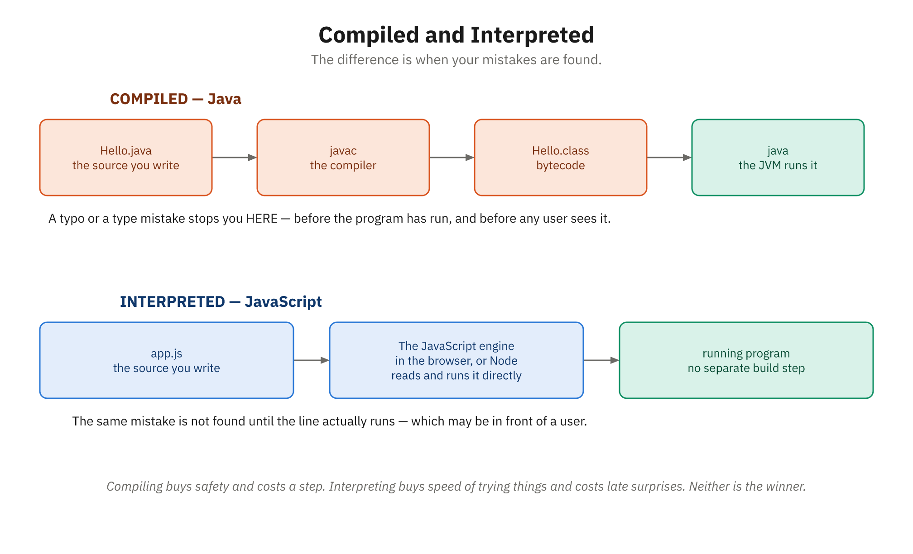

# Activity 19: Java Meets JavaScript — Comparing Languages Side by Side

**Module:** VII (Programming Syntax & Logic)
**Related reading:** [Introduction to Java](../docs/Module-07-Programming-Syntax-and-Logic/05-introduction-to-java.md), [JavaScript Fundamentals](../docs/Module-07-Programming-Syntax-and-Logic/02-javascript-fundamentals.md)

---

## Before You Start

This activity uses the Java compiler (`javac`) and runtime (`java`), which are not installed by default. Install the **JDK** (Java Development Kit) — for example, [Temurin/Adoptium](https://adoptium.net/) or Oracle's JDK — and verify it works:

```bash
javac --version
```

If you see a version number (e.g. `javac 25.0.2` — the exact number doesn't matter), you're ready. If installing a JDK isn't possible on your machine, you can use an online Java compiler such as [replit.com](https://replit.com/) or [onlinegdb.com](https://www.onlinegdb.com/) as a fallback.

---

## Objective

Write the same program in both JavaScript and Java, then carefully compare the two versions to understand how different languages approach the same problem. By the end, you'll see that while syntax differs, the underlying logic is identical—and you'll recognize what transfers between languages and what doesn't.

---

## Background

You've been learning JavaScript and Java in this course. You know they're both programming languages, but they have different syntax, different type systems, and different philosophies. Yet when you write a program in either language, you're solving the same problem using the same logical steps.



*The extra step in the top row is the whole reason this activity takes longer in Java.*

The real power of learning multiple languages comes from seeing these patterns. Once you understand that every language has variables, loops, functions, and objects (even if they look different), you can learn a new language much faster. You'll recognize the fundamentals and focus on learning the syntax.

In this activity, you'll implement the same program in both languages. The program filters and sorts a list of products. It's simple enough to finish in 45 minutes, but complete enough to show real differences between Java and JavaScript.

---

## Step-by-Step Instructions

### Part 1: Understand the Program (5 minutes)

The program you'll write does this:
1. Defines an array/list of product objects, each with a name, price, and category
2. Filters the list to include only products under $50
3. Sorts the filtered products by price (lowest to highest)
4. Prints the results in a readable format

You'll notice that this is a realistic task: every e-commerce website filters and sorts products like this.

---

### Part 2: Write the JavaScript Version (15 minutes)

You've already learned JavaScript in this course. Here's the complete JavaScript solution. Read it carefully, understand what each line does, and then type it into a file.

**Create a file:** `products.js`

```javascript
// Define product data
const products = [
    { name: "Desk Chair", price: 199.99, category: "Furniture" },
    { name: "Mouse", price: 25.00, category: "Electronics" },
    { name: "Keyboard", price: 75.00, category: "Electronics" },
    { name: "Monitor Stand", price: 45.00, category: "Furniture" },
    { name: "USB Cable", price: 8.99, category: "Electronics" },
    { name: "Desk Lamp", price: 39.99, category: "Furniture" },
    { name: "Mechanical Keyboard", price: 120.00, category: "Electronics" },
    { name: "Webcam", price: 79.99, category: "Electronics" }
];

console.log("=== Original Product List ===");
console.log(products);

// Filter: Get only products under $50
const affordable = products.filter(product => product.price < 50);

console.log("\n=== Products Under $50 ===");
console.log(affordable);

// Sort: Order by price (lowest to highest)
const sorted = affordable.sort((a, b) => a.price - b.price);

console.log("\n=== Sorted by Price (Lowest to Highest) ===");
sorted.forEach(product => {
    console.log(`${product.name}: $${product.price.toFixed(2)} (${product.category})`);
});

// Calculate total value of affordable items
const total = affordable.reduce((sum, product) => sum + product.price, 0);
console.log(`\nTotal value of affordable items: $${total.toFixed(2)}`);
```

**Run it:**
```bash
node products.js
```

**Expected output:**
```
=== Original Product List ===
[
  { name: 'Desk Chair', price: 199.99, category: 'Furniture' },
  { name: 'Mouse', price: 25, category: 'Electronics' },
  ...
]

=== Products Under $50 ===
[
  { name: 'Mouse', price: 25, category: 'Electronics' },
  { name: 'Monitor Stand', price: 45, category: 'Furniture' },
  { name: 'USB Cable', price: 8.99, category: 'Electronics' },
  { name: 'Desk Lamp', price: 39.99, category: 'Furniture' }
]

=== Sorted by Price (Lowest to Highest) ===
USB Cable: $8.99 (Electronics)
Mouse: $25.00 (Electronics)
Desk Lamp: $39.99 (Furniture)
Monitor Stand: $45.00 (Furniture)

Total value of affordable items: $118.98
```

---

### Part 3: Write the Java Version (20 minutes)

Now you'll write the same program in Java. Java is more verbose—it requires more boilerplate code. But the core logic is identical. Follow along carefully.

**Create a file:** `Products.java`

```java
import java.util.ArrayList;
import java.util.Collections;
import java.util.Comparator;
import java.util.List;

public class Products {

    // Define a Product class (Java requires explicit types)
    static class Product {
        String name;
        double price;
        String category;

        Product(String name, double price, String category) {
            this.name = name;
            this.price = price;
            this.category = category;
        }

        @Override
        public String toString() {
            return String.format("%s: $%.2f (%s)", name, price, category);
        }
    }

    public static void main(String[] args) {
        // Define product data using ArrayList
        List<Product> products = new ArrayList<>();
        products.add(new Product("Desk Chair", 199.99, "Furniture"));
        products.add(new Product("Mouse", 25.00, "Electronics"));
        products.add(new Product("Keyboard", 75.00, "Electronics"));
        products.add(new Product("Monitor Stand", 45.00, "Furniture"));
        products.add(new Product("USB Cable", 8.99, "Electronics"));
        products.add(new Product("Desk Lamp", 39.99, "Furniture"));
        products.add(new Product("Mechanical Keyboard", 120.00, "Electronics"));
        products.add(new Product("Webcam", 79.99, "Electronics"));

        System.out.println("=== Original Product List ===");
        for (Product p : products) {
            System.out.println(p);
        }

        // Filter: Get only products under $50
        List<Product> affordable = new ArrayList<>();
        for (Product p : products) {
            if (p.price < 50) {
                affordable.add(p);
            }
        }

        System.out.println("\n=== Products Under $50 ===");
        for (Product p : affordable) {
            System.out.println(p);
        }

        // Sort: Order by price (lowest to highest)
        Collections.sort(affordable, new Comparator<Product>() {
            @Override
            public int compare(Product a, Product b) {
                return Double.compare(a.price, b.price);
            }
        });

        System.out.println("\n=== Sorted by Price (Lowest to Highest) ===");
        for (Product p : affordable) {
            System.out.println(p);
        }

        // Calculate total value of affordable items
        double total = 0;
        for (Product p : affordable) {
            total += p.price;
        }
        System.out.printf("\nTotal value of affordable items: $%.2f\n", total);
    }
}
```

**Compile and run it:**
```bash
javac Products.java
java Products
```

**Expected output:** (same as JavaScript)
```
=== Original Product List ===
Desk Chair: $199.99 (Furniture)
Mouse: $25.00 (Electronics)
...

=== Products Under $50 ===
Mouse: $25.00 (Electronics)
Monitor Stand: $45.00 (Furniture)
USB Cable: $8.99 (Electronics)
Desk Lamp: $39.99 (Furniture)

=== Sorted by Price (Lowest to Highest) ===
USB Cable: $8.99 (Electronics)
Mouse: $25.00 (Electronics)
Desk Lamp: $39.99 (Furniture)
Monitor Stand: $45.00 (Furniture)

Total value of affordable items: $118.98
```

---

### Part 4: Create a Comparison Notes Document (10 minutes)

Now create a document called `COMPARISON.md` that compares the two versions. Use this template:

```markdown
# JavaScript vs. Java: Side-by-Side Comparison

## Similarities
- Both define product data in some form (array vs. ArrayList)
- Both use filtering logic to find products under $50
- Both use sorting logic to order by price
- Both calculate the total value

## Differences

### 1. Type Declarations
**JavaScript:** No type declarations needed
```javascript
const products = [ ... ];
```

**Java:** Must declare types explicitly
```java
List<Product> products = new ArrayList<>();
```

**Why:** Java is statically typed. The compiler checks types at compile time. JavaScript is dynamically typed. Types are checked at runtime.

---

### 2. Filtering
**JavaScript:** Uses built-in `.filter()` method
```javascript
const affordable = products.filter(product => product.price < 50);
```

**Java:** Uses a manual loop
```java
List<Product> affordable = new ArrayList<>();
for (Product p : products) {
    if (p.price < 50) {
        affordable.add(p);
    }
}
```

**Why:** Java's approach is more verbose but more explicit. JavaScript's `.filter()` is built-in and more concise.

---

### 3. Sorting
**JavaScript:** Uses built-in `.sort()` method with a comparator function
```javascript
const sorted = affordable.sort((a, b) => a.price - b.price);
```

**Java:** Uses `Collections.sort()` with a Comparator object
```java
Collections.sort(affordable, new Comparator<Product>() {
    @Override
    public int compare(Product a, Product b) {
        return Double.compare(a.price, b.price);
    }
});
```

**Why:** Java requires more code because of its type system and class-based approach.

---

### 4. Output
**JavaScript:** Uses template literals and `.forEach()`
```javascript
sorted.forEach(product => {
    console.log(`${product.name}: $${product.price.toFixed(2)}`);
});
```

**Java:** Uses `System.out.println()` and `for` loops
```java
for (Product p : affordable) {
    System.out.println(p);
}
```

**Why:** Different standard libraries and conventions.

---

### 5. Defining Objects
**JavaScript:** Objects are simple data containers
```javascript
{ name: "Mouse", price: 25.00, category: "Electronics" }
```

**Java:** Must define a class first
```java
static class Product {
    String name;
    double price;
    String category;
    Product(String name, double price, String category) { ... }
}
```

**Why:** Java is class-based and requires explicit structure.

---

## What Stays the Same
No matter which language, the **logic** is identical:
1. Organize the data
2. Filter to find what we want
3. Sort the results
4. Display the output
5. Calculate a total

The **thinking** is the same. Only the **syntax** changes.

---

## What We Learned
- Java is more verbose but more explicit about types and structure
- JavaScript is more concise but less rigid
- The same algorithm can be expressed differently in different languages
- Learning multiple languages helps you see the patterns that transcend syntax
- Once you understand the logic, syntax is just learning the rules of a new "dialect"
```

Feel free to expand this with your own observations!

---

## Expected Deliverable

Three files:

1. **products.js** — The complete JavaScript version, running without errors
2. **Products.java** — The complete Java version, compiling and running without errors
3. **COMPARISON.md** — A detailed comparison document noting similarities, differences, and key insights

Both programs should produce identical output (same filtered, sorted list, same total).

---

## Reflection Questions

1. **Which version felt more natural to you: JavaScript or Java?** Why? What does that tell you about your learning style as a programmer?

2. **If you had to explain the difference between Java and JavaScript to a non-programmer, what would you say?** (Hint: Don't mention syntax. Think about philosophy.)

3. **You wrote the same program twice.** Which parts were harder to understand: the parts that were similar (where you already knew the logic) or the parts that were different (where you had to learn new syntax)? What does that tell you about learning new programming languages?

4. **Look at the filtering and sorting code.** In JavaScript, you used `.filter()` and `.sort()`. In Java, you used loops and `Collections.sort()`. Which approach is easier to read? Why?

---

## Tips for Success

- **Type the code yourself.** Don't copy and paste. You'll learn the patterns better by typing.
- **Compile Java step by step.** If Java code won't compile, read the error message carefully. Java error messages are usually very specific.
- **Test both versions with the same data.** Make sure they produce identical output. This proves you understand the logic.
- **Resist the urge to simplify.** The Java code looks verbose, but that verbosity is intentional. Java values explicit structure.
- **Notice patterns.** Every filter operation in every language follows the same pattern: loop through, test a condition, keep what passes. Same with sorting: compare elements, rearrange.

---

> ### 🚀 If you finish early (stretch)
>
> - **Change the filter in both languages.** Show only `"Electronics"` products under $100, and confirm `products.js` and `Products.java` still produce identical output.
> - **Modernize the Java.** Rewrite the filter and sort using the Java Streams API (`products.stream().filter(...).sorted(...)`) and a lambda comparator. Notice how much closer it looks to the JavaScript once you do.
> - **Add a category total.** In both versions, also print the total value of *all* products (not just the affordable ones) and compare the two numbers.

> ### 🆘 If you get stuck
>
> - **Verify your toolchain first.** Run `javac -version` *and* `java -version`. "command not found" means the JDK isn't installed or not on your PATH — revisit the **Before You Start** section.
> - **Compile before you run.** Java is two steps: `javac Products.java` (produces `Products.class`), *then* `java Products` (no `.java`, no `.class`). Running `java Products.java` or skipping the compile is the most common mistake.
> - **Match the public class name to the file name.** `public class Products` must live in `Products.java` — Java enforces this exactly, including capitalization, or it won't compile.
> - **Compare types, not just values.** If output differs from JavaScript, suspect types: Java `double` division and formatting (`%.2f`) behave differently than JS numbers. Read the compiler error's line number — Java's messages are specific — and check the type on that line.

You've just written a real program in two real languages. You understand the logic. Now you're just learning dialects.
