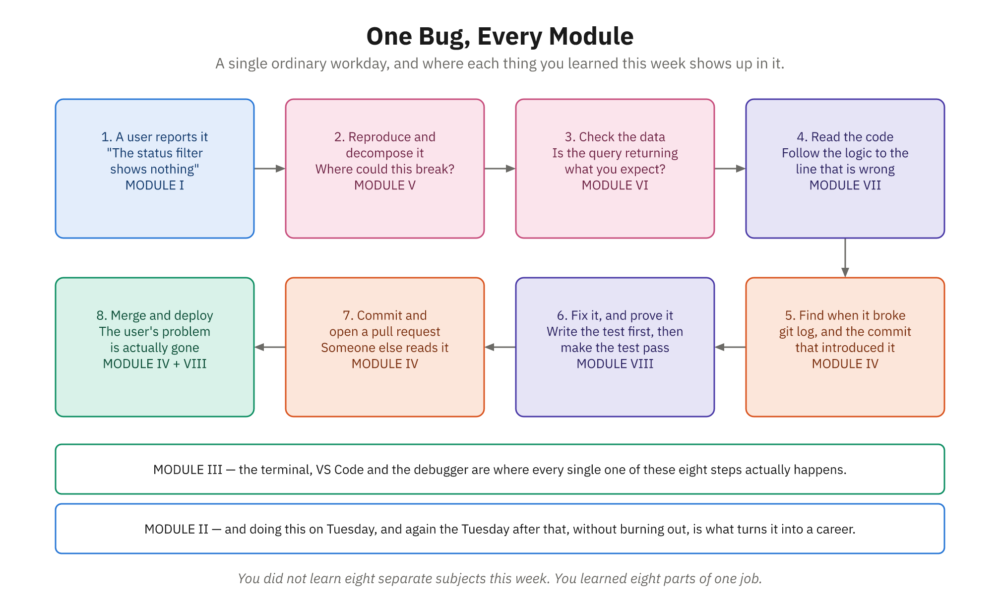

# Activity 20: My Learning Roadmap — Your 90-Day Path Forward

**Module:** VIII (Building for the Future)
**Related reading:** [Next Steps](../docs/Module-08-Building-for-the-Future/02-next-steps.md)

---

## Objective

Create a personal 90-day learning roadmap that charts your path forward as a programmer. By the end, you'll have chosen a specialization, researched next steps, set concrete goals, and started a version-controlled learning portfolio holding everything you built this week. This is your transition from student to self-directed programmer—which is what professionals actually are.

---

## Background

You've completed this course. You've built webpages, written JavaScript, debugged code, and compared languages—and you've seen how the whole picture fits together. You're no longer starting from zero.



*Every module you have finished this week shows up in one ordinary workday.*

What you don't have yet is depth in any one area. That comes from choosing a direction and going deeper in it. This roadmap is how you turn "I finished a course" into a plan you'll actually follow.

The best learners bring their own drive: they notice what excites them, line up resources, and build a body of work. That's what this activity sets up. You'll reflect on what engaged you most, connect it to where you want to go, line up resources, set concrete goals, and create a portfolio home for everything you build from here.

This is the start of the road, with a clear map of what's next.

---

## Step-by-Step Instructions

### Part 1: Reflect on Your Learning Journey (8 minutes)

Before moving forward, look backward. Answer these questions honestly in a document:

1. **What was the most exciting topic you learned in this course?** (JavaScript basics? Debugging? Objects and arrays? Functions? Comparing languages?)
2. **What frustrated you the most?** (Syntax? Logic? Concepts that took time to click?)
3. **When did you feel like a real programmer?** (What moment made you think, "Wow, I actually did that"?)
4. **What surprised you about programming?** (What was different from what you expected?)
5. **What do you want to build?** (Not in this course—in the real world. What's a program or website or tool you'd love to create?)

Write honestly. These answers matter because they point toward your next steps.

---

### Part 2: Map Your Path (5 minutes)

**Where this can lead.** Programmers tend to deepen into one of three broad specializations. You don't choose today — just notice which one pulls at you. (Think back to the [CivicTrack](../course-project/README.md) example: each of these builds a different piece of a system like it.)

**Front-End Web Development**
- Focus: JavaScript, HTML, CSS, React, Vue, user interfaces
- You build: Interactive websites, single-page applications (SPAs), responsive designs
- Skills: DOM manipulation, event handling, state management, design principles
- Why: Immediate visual feedback, job market is strong, creative problem-solving
- Best if: You loved Activity 17 (building your webpage), you enjoy visual design, you want to see your work immediately

**Back-End / Java Development**
- Focus: Java, databases, APIs, server logic, system architecture
- You build: Web servers, databases, microservices, enterprise systems
- Skills: Object-oriented programming, data structures, algorithms, database design, deployment
- Why: Powers all web applications, high demand in enterprise, intellectually deep
- Best if: You loved Activity 19 (Java/JavaScript comparison), you enjoy logical puzzles, you want to understand how systems work at a deep level

**Data Analysis and Science**
- Focus: JavaScript (Node.js), Python, SQL, data visualization, analytics
- You build: Data pipelines, dashboards, analytics tools, data-driven applications
- Skills: Data structures, statistical thinking, visualization libraries, SQL, automation
- Why: Every company needs data specialists, intellectually satisfying, good pay
- Best if: You love finding patterns, enjoy mathematics, want to impact business decisions, love tools like Excel but want to automate them

**Your longer-term lean:** Which of these three pulls at you most? Write it down — no commitment, just a direction to keep in mind as you decide what to learn next.

---

### Part 3: Research Your Next Steps (15 minutes)

You're going to find real resources for your chosen path. These should be specific courses, tutorials, books, or communities—not just "learn more about front-end."

**For each resource, find:**
1. **Title** (What's it called?)
2. **Type** (Course? Book? Tutorial series? Community?)
3. **Time Commitment** (How long will it take?)
4. **Cost** (Free, paid, subscription?)
5. **Why You Chose It** (What about this resource speaks to you?)

**Where to look:**
- **Courses:** Udemy, Coursera, Codecademy, freeCodeCamp (YouTube), Frontend Masters
- **Books:** "You Don't Know JS Yet" (JavaScript), "Java: The Complete Reference" (Java), "Python for Data Analysis" (Data)
- **Communities:** Dev.to, Hashnode, local meetups, Stack Overflow, Reddit (r/webdev, r/learnprogramming)
- **Official Docs:** JavaScript MDN Web Docs, Java Oracle Documentation, Python Official Docs

**Example (Front-End Path):**
```
Resource 1: "React for Beginners" by Wes Bos
- Type: Video course
- Time: 4-6 weeks (5 hours/week)
- Cost: $39
- Why: Highly rated, project-based, covers the #1 front-end framework

Resource 2: "JavaScript Design Patterns" book by Addy Osmani
- Type: Free online book
- Time: 3-4 weeks (5 hours/week)
- Cost: Free
- Why: Teaches professional JavaScript patterns, essential for scalable code

Resource 3: Frontend Masters community
- Type: Online community
- Time: Ongoing
- Cost: Free (community), paid for courses
- Why: Connects me with other front-end developers learning similar skills
```

Find 3 resources and document them.

---

### Part 4: Set Your 30-Day Goals (8 minutes)

You're not committing to a year. You're committing to the next 30 days. From today, what will you do?

**Goal 1 (Technical):** Learn or build something specific
- Example: "Complete Wes Bos's React for Beginners first 3 sections"
- Example: "Build a to-do app with React and localStorage"
- Example: "Understand Java ArrayList and HashMap through coding exercises"
- Make it measurable. Not "get better at React," but "build a specific project."

**Goal 2 (Coding Practice):** Code regularly
- Example: "Code 5 hours per week in a daily practice routine"
- Example: "Complete 3 coding challenges on LeetCode or CodeWars"
- Example: "Contribute to one open-source project"
- Make it specific and achievable.

**Goal 3 (Portfolio/Community):** Get your work visible
- Example: "Deploy 2 small projects to GitHub and my portfolio website"
- Example: "Write 1 blog post about something I learned"
- Example: "Attend 1 local developer meetup or online dev community event"
- This matters. You need a portfolio to show employers.

Write these goals down with specific dates. "By April 12, I will have..."

---

### Part 5: Build Your Learning Portfolio (10 minutes)

A portfolio is the body of work that shows what you can do. Right now it has one week in it; it will hold a great deal more as you keep building. Today you're giving that work a permanent home and putting it under version control — the same `git init` / `add` / `commit` cycle you practiced in Activity 8.

**Create the repository on your machine:**

Open PowerShell and create a folder for it, then initialize it as a Git repository:

```powershell
cd $HOME\Documents
New-Item -ItemType Directory -Name "learning-portfolio"
cd learning-portfolio
git init -b master
```

You've now got an empty repository — exactly what you built in Activity 8, but this one is going to outlast the week.

> **Why this stays on your machine.** Many developers keep their portfolio on a hosting service like
> GitHub, and you saw the instructor push a repository there in Demo 13. You're not doing that today:
> publishing to a hosted service needs an account and working authentication, which isn't something to
> set up in the last hour of the course. What matters is that the work exists, is organized, and is
> version-controlled. Putting it online later is a small step you can take whenever you want it.

**Create a README.md in your repository:**

```markdown
# My Programming Learning Portfolio

## About Me
[Your name] | [Date you started learning] | Transitioning into programming from [your previous career]

## My Learning Path
I'm specializing in [your chosen path: Front-End / Back-End / Data].

## Current Projects
- [Project 1: Description]
- [Project 2: Description]
- [Project 3: Description]

## Learning Resources I'm Using
- [Resource 1]
- [Resource 2]
- [Resource 3]

## 30-Day Goals (Ends [DATE])
- [ ] Goal 1: [specific technical goal]
- [ ] Goal 2: [coding practice goal]
- [ ] Goal 3: [portfolio/community goal]

## 90-Day Roadmap

### Month 1 (Now - [DATE])
- Learn/build: [what you'll do]
- Projects: [what you'll create]
- Community: [how you'll engage]

### Month 2 ([DATE] - [DATE])
- Learn/build: [what you'll do]
- Projects: [what you'll create]
- Community: [how you'll engage]

### Month 3 ([DATE] - [DATE])
- Learn/build: [what you'll do]
- Projects: [what you'll create]
- Community: [how you'll engage]

## Long-Term Vision
In 6 months, I want to [your bigger goal]. In 1 year, I want to [your ambitious goal].

---

*Last updated: [Today's date]*
*This roadmap is a living document. I update it as I learn and grow.*
```

Save that as `README.md` inside `learning-portfolio` and fill it in completely. Then:

1. **Copy in all your work** from this course: Activity 16 (JavaScript workout), Activity 17 (your webpage), Activity 18 (debug challenges), Activity 19 (Java/JavaScript comparison). Put each in its own subfolder so the structure stays readable.
2. **Stage and commit it** with a meaningful message:

   ```powershell
   git add .
   git commit -m "Add learning roadmap and this week's project work"
   ```

3. **Check your work** with the two commands you know:

   ```powershell
   git status
   git log --oneline
   ```

   `git status` should report a clean working tree, and `git log` should show your commit. That's the same confirmation loop from Activity 8 — nothing new, which is the point.

Your week's work is now in one place, under version control, with a history. That is a portfolio.

---

### Part 6: Write a Letter to Your Future Self (6 minutes)

This is the reflective piece. In a document called `LETTER_TO_MY_FUTURE_SELF.md` inside your `learning-portfolio` folder, write a letter to yourself 90 days from now. Address yourself by name. Reflect on:

1. **How far you've come.** You started this course with no programming experience (or limited experience). Look at what you can do now. Name specific things.
2. **What was hardest.** Be honest about struggles. What concept took time? What made you want to quit? How did you push through?
3. **What surprised you.** What aspect of programming was unexpected? What did you discover about yourself as a learner?
4. **What you're excited about.** What's next that makes you genuinely excited? Why?
5. **What you're committing to.** Tell your future self that you're serious about this path. Make a promise about your practice, your projects, your growth.

This letter is personal. Write it like you're talking to a friend who understands exactly where you started and how far you've come.

**Example opening:**

"Dear Sarah,

Three months ago, you didn't know what `const` meant. You thought curly braces were mysterious. You've just finished the "How Modern Programmers Think" course, and I want you to remember this moment.

Today, you built a webpage using HTML, CSS, and JavaScript. You debugged code. You compared Java and JavaScript. You're not where you started—you've written real code and you understand how the pieces fit. You're on your way.

The next 90 days will be harder than this course. There's no structure. No assignments. Just you, your curiosity, and the infinite landscape of programming. But you've proven you can do hard things..."

---

## Expected Deliverable

Your `learning-portfolio` Git repository on your machine, containing:

1. **README.md** — Your complete learning portfolio with specialization, resources, goals, and roadmap (filled in completely)
2. **LETTER_TO_MY_FUTURE_SELF.md** — Your personal letter reflecting on your journey and committing to your future
3. **All projects from this course:**
   - Your JavaScript workout file
   - Your "About Me" webpage (folder with HTML, CSS, JS)
   - Your debug practice file with fixes and explanations
   - Your Java and JavaScript product comparison files
4. **Your reflection document** from Part 1 (optional but recommended)

Everything committed, with a clean `git status` and a readable `git log` — ready to keep adding to, and ready to show anyone who asks, "What are you working on?"

---

## Reflection Questions

1. **You've now completed a structured course and created your own learning plan.** What's the difference between the two? Which felt scarier? Why?

2. **Look at your 30-day goals.** Are they achievable? What could stop you from reaching them? How will you overcome obstacles?

3. **Think about where you want to be a few months from now** — writing more JavaScript, building something that talks to a database, or working in a different language entirely. What will you need to succeed in that next phase that isn't about syntax or code? (Hint: think about resilience, community, habits, mindset.)

---

## Tips for Success

- **Pick a direction, not a destiny.** Choosing Front-End today doesn't lock you in. You're picking what
  to learn *next*, and plenty of working developers changed lanes more than once. The point is to stop
  standing still at the fork, not to be right forever.
- **Make the 30-day goals embarrassingly small.** "Build a full web app" is a wish. "Write JavaScript for
  25 minutes on Tuesday and Thursday" is a plan you'll still be keeping in three weeks. Cut whatever you
  wrote in half — you can always add more once the habit holds.
- **Schedule it against your real life.** Look at your actual calendar for the next month before you
  write a single goal. A roadmap built around the week you *wish* you had is the one you'll abandon
  first and feel guilty about second.
- **Your portfolio does not need to be impressive — it needs to exist.** Commit the messy version. A
  repository with a half-finished webpage in it beats a perfect one you never started. You're building
  the habit of keeping your work somewhere deliberate, and that starts today.
- **Reuse what you already built.** Don't start new projects for this. Everything from Activities 16–19
  is portfolio material — the work is done, you're just giving it an address.
- **Write the letter honestly, including the hard parts.** Naming what made you want to quit is the whole
  value of it. In 90 days you'll reread it and see how far you came — but only if you told the truth
  about where you started.
- **Rusty on the Git commands?** You did all of this in Activity 8 — `git init -b master`, `git add`,
  `git commit -m`, `git status`, `git log`. Go back and reread your own notes rather than starting from
  scratch. Reusing your past work instead of re-deriving it is a real professional skill, and this is a
  good place to practice it.

---

## The Real Work Starts Now

This activity marks a milestone: you've finished the foundation week and you can see the whole map. What you no longer have is a syllabus telling you what's next — this roadmap is how you supply one for yourself. That is what professional programmers do: continuous learning, self-direction, persistence through confusion, and the drive to build things.

The foundation is done. The real building starts now.

You've got this. And you've got a community behind you. Reach out, ask questions, share your projects. Programming is collaborative. You don't succeed alone, and you shouldn't try to.

Welcome to the programming community. We're glad you're here.

---

## Tips for Long-Term Success

1. **Code every day.** Even 30 minutes is better than 8 hours once a week. Consistency beats intensity.
2. **Build projects.** The best way to learn is by building something you care about. Tutorials help, but projects transform you into a real programmer.
3. **Read other people's code.** Look at open-source projects. See how experienced programmers solve problems.
4. **Join communities.** Dev.to, Hashnode, local meetups, Discord servers. You're not alone, and other people's support matters.
5. **Fail publicly.** Share your code, ask for code reviews, embrace feedback. Growth lives in feedback.
6. **Keep learning.** Technology changes. The best programmers are perpetual students. This course ends. Your learning doesn't.
7. **Be kind to yourself.** You're learning one of the most complex skills humans have invented. Setbacks are normal. Confusion is a sign you're at the edge of your growth.

You started this week unsure whether you could do this. You're leaving it having written real code, with a plan you wrote yourself for what comes next. Hold onto that.
