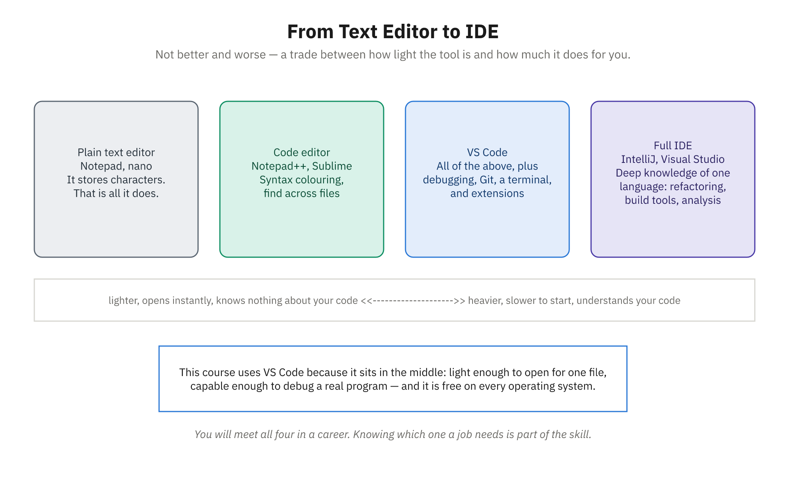

# Demo 4: VS Code Setup and Tour

**Module:** III
**Topic:** Text Editors and IDEs
**Estimated Time:** 15 minutes
**Related reading:** [Text Editors and IDEs](../docs/Module-03-Development-Environments-and-Efficiency/03-text-editors-and-ides.md)

## Objective
Walk students through the VS Code interface, show how to install essential extensions (Prettier, ESLint, Live Server), customize the editor with a theme and font settings, and configure auto-formatting so students understand the role of a modern code editor in daily development work.



*Project this while you explain where VS Code sits and why the course uses it.*

## Setup/Prerequisites
- VS Code installed (download from code.visualstudio.com)
- Internet connection (for downloading extensions)
- A sample project or folder to open (can be empty)
- Administrator access to install extensions (usually not needed)

---

## Step-by-Step Script

### Section 1: Opening and Touring the Interface (3 minutes)

1. **Open VS Code:**
   - Search for **"Visual Studio Code"** or click the VS Code icon
   - **Explain:** "VS Code is the most popular code editor among professional programmers. It's lightweight, powerful, and has an enormous ecosystem of extensions."

2. **Point out the five main areas:**
   - **Activity Bar (left edge):** "These icons let you switch between different views: Explorer, Search, Source Control, Run & Debug, and Extensions."
   - **Side Bar (left panel):** "Currently showing the Explorer — this is your file tree. You navigate your project here."
   - **Editor Area (center):** "This is where you write code. Multiple files can be open in tabs."
   - **Panel (bottom):** "Integrated terminal, problems, debug console. Right now it's probably hidden; we can open it."
   - **Status Bar (very bottom):** "Shows information about the current file: encoding, line endings, language, cursor position."

3. **Open the integrated terminal:**
   - Press **Ctrl + `** (backtick, usually below Esc key)
   - **Or:** Go to **View > Terminal**
   - **Explain:** "The integrated terminal means you don't need a separate window. Your code editor and command line are in one place."

4. **Point out the status bar in detail:**
   - Show the current language (`JavaScript`, `HTML`, etc.)
   - Show the line:column position of the cursor
   - Show line ending format (`CRLF` on Windows, `LF` on Mac/Linux)
   - **Talk point:** "The status bar at the bottom is always communicating useful info. As you work, this will tell you things like how many uncommitted Git changes you have."

### Section 2: Installing Essential Extensions (4 minutes)

5. **Open the Extensions panel:**
   - **Click the Extensions icon** on the Activity Bar (looks like four squares)
   - **Or press:** `Ctrl+Shift+X`
   - **Explain:** "Extensions add functionality to VS Code. Thousands are available, but we'll install three that are essential for any programmer."

6. **Install Prettier (code formatter):**
   - In the **search box**, type: `prettier`
   - **Click on the first result: "Prettier - Code formatter"** (publisher: Prettier)
   - **Click the "Install" button**
   - Wait for installation to complete (usually 10-15 seconds)
   - **Talk point:** "Prettier automatically formats your code — indentation, spacing, line breaks — all consistent. It's like a spell-checker for code style."

7. **Install ESLint (code quality):**
   - In the **search box**, clear and type: `eslint`
   - **Click "ESLint"** (publisher: Microsoft — the extension moved to Microsoft's publisher account, so don't be thrown if older tutorials say "Dirk Baeumer"; the extension ID `dbaeumer.vscode-eslint` is unchanged)
   - **Click "Install"**
   - **Explain:** "ESLint catches bugs and code quality issues before you even run your code. It's like having a teacher constantly reviewing your work."

8. **Install Live Server (local web server):**
   - Search for: `live server`
   - **Click "Live Server"** (by Ritwick Dey)
   - **Click "Install"**
   - **Talk point:** "Live Server starts a local web server and automatically reloads your browser when you make changes. Perfect for web development."

9. **Verify installations:**
   - **Click on one of the installed extensions** (e.g., Prettier)
   - You'll see its page with usage instructions
   - **Point out:** The green "Uninstall" button confirms it's installed

### Section 3: Selecting a Theme (2 minutes)

10. **Open settings for themes:**
    - **Click the gear icon** (⚙️) in the bottom-left corner
    - **Select "Color Theme"**
    - **Or go to:** File > Preferences > Theme > Color Theme (on Windows/Linux)

11. **Browse available themes:**
    - Use arrow keys to preview different themes
    - VS Code has several built-in themes: Light, Dark, Light+, Dark+
    - **Explain:** "Choose whatever is easiest on your eyes. I recommend 'Dark' for low-light conditions; 'Light' if you code in bright spaces."
    - **Select one** (e.g., "Dark Modern", which is the current default dark theme)

12. **Explain theme importance:**
    - **Talk point:** "You spend 8+ hours a day staring at this. Choosing a comfortable theme reduces eye strain and makes coding more enjoyable."

### Section 4: Configuring Editor Settings (3 minutes)

13. **Open the Settings UI:**
    - **Click the gear icon** again
    - **Select "Settings"**
    - **Or press:** `Ctrl+,`
    - **Explain:** "This is where you customize almost everything about VS Code. The settings are organized by category."

14. **Change the font size:**
    - In the **search box**, type: `font size`
    - Find the **"Editor: Font Size"** setting
    - **Change the value** from default (14) to something comfortable (e.g., 16)
    - **Explain:** "Larger text is easier to read, especially when presenting or in unfamiliar code. Many developers use 16-18pt."

15. **Enable format on save (critical setting):**
    - In the **search box**, type: `format on save`
    - Find **"Editor: Format On Save"**
    - **Check the checkbox** to enable it
    - **Talk point:** "This is a game-changer. Every time you save a file, Prettier automatically formats it. No manual cleanup needed — just write code and save."

16. **Tell VS Code *which* formatter to use (do not skip this):**
    - In the **search box**, type: `default formatter`
    - Find **"Editor: Default Formatter"** and select **"Prettier - Code formatter"** from the dropdown
    - **Talk point:** "VS Code ships with its own JavaScript formatter, and we just installed Prettier. Two formatters, one file — VS Code won't guess. If we skip this, the first time we save it'll stop and ask us to pick one, right in the middle of our demo. We're telling it now so saving Just Works."

17. **Show another useful setting - auto save:**
    - In the **search box**, type: `auto save`
    - Find **"Files: Auto Save"**
    - **Change it to "onFocusChange"** or "afterDelay"
    - **Explain:** "Auto-save means you don't have to manually save files. VS Code handles it. This prevents losing work if the app crashes."

18. **Verify settings are applied:**
    - **Close Settings** (click the X or press Escape)
    - Create a new file (`Ctrl+N`) and **save it as `messy.js` right away** (`Ctrl+S`, type the filename). Do this *before* typing the code.
    - **Talk point:** "The `.js` on the end isn't decoration — it's how VS Code knows this is JavaScript, and therefore which formatter and which syntax colors to use. An unsaved, unnamed file has no language, so nothing would happen when we save."
    - Now type some messy code:
      ```javascript
      const   x=1;  const y=  2;
      function hello(  ){console.log("hello")}
      ```
    - **Save the file** (`Ctrl+S`)
    - **Watch it auto-format** — Prettier cleans it up!
    - **Explain:** "This is the power of automation. You write the logic; Prettier handles the formatting."

    > **If a dialog appears saying "There are multiple formatters for 'JavaScript'":** step 16 didn't take. Choose **Prettier - Code formatter** and click **Configure**. Then save again.

### Section 5: Quick Settings Review and File Organization (2 minutes)

19. **Create a sample project structure:**
    - In the File Explorer (left sidebar), create a few files:
      - `index.html`
      - `style.css`
      - `app.js`
    - **Explain:** "A typical web project has these three files. VS Code's color-coding and syntax highlighting make it easy to identify file types."

20. **Point out syntax highlighting:**
    - **Click on `app.js`**
    - **Type some JavaScript:**
      ```javascript
      let message = "Hello, world!";
      console.log(message);
      ```
    - **Show how different elements are colored:** keywords (blue), strings (red), variables (white)
    - **Talk point:** "Syntax highlighting isn't just pretty — it helps you spot errors. If something is the wrong color, something is usually wrong with it."

21. **Mention the settings file (advanced):**
    - **Explain:** "Behind the UI, all these settings are stored in JSON files. Advanced users can edit `settings.json` directly, but the UI is easier for beginners."
    - **You can show this by:** Pressing `Ctrl+Shift+P` and typing "Open Settings (JSON)" but don't dive deep — just mention it exists

---

## Key Points to Emphasize

- **Extensions extend VS Code's power:** The base editor is great, but extensions make it tailored to your needs. Prettier + ESLint + Live Server are the holy trinity for web development.
- **Format on Save is a game-changer:** Let automation handle formatting. Focus on logic, not commas and indentation.
- **Syntax highlighting is your ally:** Colors tell a story. Learn to read them; they'll catch mistakes before they become bugs.
- **VS Code is highly customizable:** Don't settle for defaults you dislike. Spend an hour customizing your setup — you'll use it every day.

---

## Common Questions

**Q: Do I have to use VS Code, or are there other options?**
A: VS Code is the most popular, but other editors like JetBrains IDEs, Sublime Text, and even Vim have devoted users. VS Code is the safest choice because it's free, lightweight, and has the largest extension ecosystem.

**Q: What's the difference between VS Code and Visual Studio (the full IDE)?**
A: Visual Studio is Microsoft's heavier, enterprise-grade IDE with built-in compilation and debugging. VS Code is lightweight and language-agnostic. For learning and web development, VS Code is usually the better choice.

**Q: If I enable auto-format, does that mean I don't have to learn proper formatting?**
A: Prettier handles mechanical formatting, but you should still understand coding conventions. Auto-format lets you focus on logic without worrying about spaces and indentation. It's a tool to assist, not a replacement for learning good style.

**Q: Can I sync my VS Code settings across multiple computers?**
A: Yes! VS Code has a built-in "Settings Sync" feature. Sign in with your Microsoft account (File > Preferences > Turn on Settings Sync), and your settings, extensions, and keybindings follow you across all your machines.
