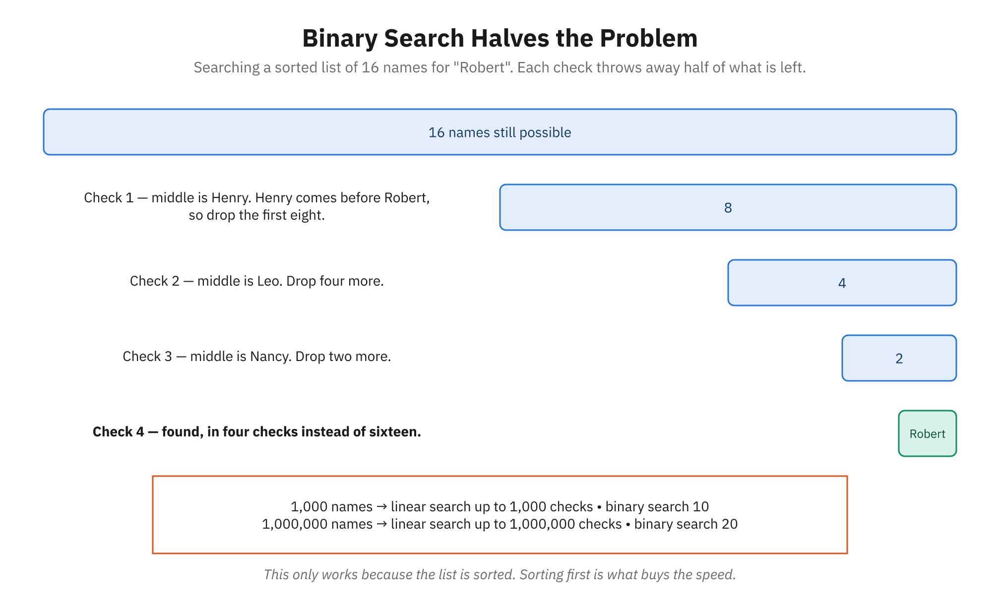

# Demo 20: Linear vs. Binary Search — The Power of Algorithms

**Module:** V (Computational Thinking, Data Structures & Algorithms)
**Topic:** Algorithm Basics
**Estimated Time:** 15 minutes
**Related reading:** [Algorithm Basics](../docs/Module-05-Computational-Thinking-Data-Structures-Algorithms/04-algorithm-basics.md)

---

## Objective

Students will compare the efficiency of two fundamental search algorithms: linear search (checking every item) and binary search (intelligently eliminating half the remaining items). Through hands-on step-by-step execution, they'll develop intuition for why algorithm choice matters and how logarithmic time complexity dramatically scales with data size.



*The shrinking bars are the whole idea. Project this rather than drawing it — it is the hardest thing in this demo to draw legibly.*

---

## Setup & Prerequisites

- **Browser with Developer Tools open** (F12 or right-click → Inspect → Console)
- **Pen and paper or whiteboard** to manually count steps and visualize eliminations
- **A calculator (optional)** to demonstrate logarithms (2^20 ≈ 1 million)
- **Clear the console** before starting
- **Optional:** Pre-write the search functions in a text editor for quick copy/paste if timing is tight

---

## Step-by-Step Script

### Part 1: Setup — Creating Our Sorted List (2 minutes)

**Talking Points:**
> "Imagine you're looking for a name in a phone directory. The directory has 16 entries, all sorted alphabetically. We're going to search for a person near the end of the list — let's say 'Robert'. We'll count exactly how many names we have to look at to find him. Then we'll do the same search with a smarter strategy and compare."

**Type in the console:**

```javascript
const phoneBook = [
  'Alice', 'Bob', 'Charlie', 'Diana',
  'Eve', 'Frank', 'Grace', 'Henry',
  'Iris', 'Jack', 'Karen', 'Leo',
  'Mike', 'Nancy', 'Oscar', 'Robert'
];

console.log('Phone book has', phoneBook.length, 'entries.');
console.log('We are searching for: "Robert"');
console.log('Entries:', phoneBook.join(', '));
```

**Output:**
```text
Phone book has 16 entries.
We are searching for: Robert
Entries: Alice, Bob, Charlie, Diana, Eve, Frank, Grace, Henry, Iris, Jack, Karen, Leo, Mike, Nancy, Oscar, Robert
```

**Talking Points:**
> "16 names, sorted A to Z. Robert is at the very end. Now let's search for it using two different approaches."

---

## Part 2: Linear Search — Check Every Item (4 minutes)

**Type in the console:**

```javascript
function linearSearch(array, target) {
  let steps = 0;

  for (let i = 0; i < array.length; i++) {
    steps++;
    console.log('Step ' + steps + ': Check index ' + i + ' → "' + array[i] + '" — Not ' + target);

    if (array[i] === target) {
      console.log('✓ Found "' + target + '" at index ' + i + ' after ' + steps + ' steps!\n');
      return { found: true, index: i, steps: steps };
    }
  }

  console.log('✗ Not found after ' + steps + ' steps.\n');
  return { found: false, steps: steps };
}

const resultLinear = linearSearch(phoneBook, 'Robert');
```

**Output:**
```text
Step 1: Check index 0 → "Alice" — Not Robert
Step 2: Check index 1 → "Bob" — Not Robert
Step 3: Check index 2 → "Charlie" — Not Robert
Step 4: Check index 3 → "Diana" — Not Robert
Step 5: Check index 4 → "Eve" — Not Robert
Step 6: Check index 5 → "Frank" — Not Robert
Step 7: Check index 6 → "Grace" — Not Robert
Step 8: Check index 7 → "Henry" — Not Robert
Step 9: Check index 8 → "Iris" — Not Robert
Step 10: Check index 9 → "Jack" — Not Robert
Step 11: Check index 10 → "Karen" — Not Robert
Step 12: Check index 11 → "Leo" — Not Robert
Step 13: Check index 12 → "Mike" — Not Robert
Step 14: Check index 13 → "Nancy" — Not Robert
Step 15: Check index 14 → "Oscar" — Not Robert
Step 16: Check index 15 → "Robert" — Not Robert
✓ Found "Robert" at index 15 after 16 steps!
```

> **Note:** The code prints the "Check index ... — Not Robert" line on *every* iteration (including the matching one) before it tests for a match, so step 16 shows both lines: the "Not Robert" line, then the "Found" line on the next line.

**Talking Points:**
> "Linear search is simple: start at the beginning and check every item one by one. To find Robert, we had to check all 16 names. In the worst case — searching for the last item — we check every single entry."

> "For a small list of 16, that's fine. But imagine a phone book with 1 million names. We'd have to check up to 1 million entries. That's not efficient."

**On your whiteboard, write:**
```
Linear Search for "Robert":
Checked: Alice, Bob, Charlie, Diana, Eve, Frank, Grace, Henry, Iris, Jack, Karen, Leo, Mike, Nancy, Oscar, Robert

Total steps: 16
Time complexity: O(n) — "linear" or "proportional to list size"
```

---

## Part 3: Binary Search — Divide and Conquer (6 minutes)

**Talking Points:**
> "Now let's use a smarter strategy. Binary search works like playing 'higher or lower' with a number. Each guess eliminates half the remaining possibilities. Since our list is sorted, we can compare our target to the middle item, and if it's not a match, we know which half to search next."

**Type in the console:**

```javascript
function binarySearch(array, target) {
  let steps = 0;
  let left = 0;
  let right = array.length - 1;

  while (left <= right) {
    steps++;
    const mid = Math.floor((left + right) / 2);
    const midValue = array[mid];

    console.log('Step ' + steps + ': Check middle of [' + array[left] + ' ... ' + array[right] + ']');
    console.log('  Index ' + mid + ' → "' + midValue + '"');

    if (midValue === target) {
      console.log('  ✓ Found "' + target + '" at index ' + mid + ' after ' + steps + ' steps!\n');
      return { found: true, index: mid, steps: steps };
    } else if (midValue < target) {
      console.log('  "' + midValue + '" < "' + target + '" — search right half\n');
      left = mid + 1;
    } else {
      console.log('  "' + midValue + '" > "' + target + '" — search left half\n');
      right = mid - 1;
    }
  }

  console.log('✗ Not found after ' + steps + ' steps.\n');
  return { found: false, steps: steps };
}

const resultBinary = binarySearch(phoneBook, 'Robert');
```

**Output:**
```text
Step 1: Check middle of [Alice ... Robert]
  Index 7 → "Henry"
  "Henry" < "Robert" — search right half

Step 2: Check middle of [Iris ... Robert]
  Index 11 → "Leo"
  "Leo" < "Robert" — search right half

Step 3: Check middle of [Mike ... Robert]
  Index 13 → "Nancy"
  "Nancy" < "Robert" — search right half

Step 4: Check middle of [Oscar ... Robert]
  Index 14 → "Oscar"
  "Oscar" < "Robert" — search right half

Step 5: Check middle of [Robert ... Robert]
  Index 15 → "Robert"
  ✓ Found "Robert" at index 15 after 5 steps!
```

**Draw on your whiteboard:**

```
Binary Search for "Robert" — Eliminating Half Each Time:

Start:  [Alice, Bob, Charlie, Diana, Eve, Frank, Grace, Henry, Iris, Jack, Karen, Leo, Mike, Nancy, Oscar, Robert]
         ─────────────────────────────────────────┼────────────────────────────────────────
                                                Check middle

Step 1: Middle = "Henry" (index 7)
        Henry < Robert, so Robert must be in the RIGHT half
        [Iris, Jack, Karen, Leo, Mike, Nancy, Oscar, Robert] ← Keep only this
        ─────────────────────┼────────────────────

Step 2: Middle = "Leo" (index 11)
        Leo < Robert, so Robert must be in the RIGHT half
        [Mike, Nancy, Oscar, Robert] ← Keep only this
        ───────────┼─────────

Step 3: Middle = "Nancy" (index 13)
        Nancy < Robert, so Robert must be in the RIGHT half
        [Oscar, Robert] ← Keep only this
        ───┼──

Step 4: Middle = "Oscar" (index 14)
        Oscar < Robert, so Robert must be in the RIGHT half
        [Robert] ← Keep only this

Step 5: Middle = "Robert" (index 15)
        ✓ Found!

Total steps: 5
```

**Talking Points:**
> "Watch how efficient this is. We found Robert in just 5 steps instead of 16. Each step, we eliminated half the remaining names. First we eliminated 8 names, then 4, then 2, then 1. That's the power of binary search."

> "The key insight: if the list is sorted, you don't need to check every item. You can intelligently eliminate huge chunks of the search space with each comparison."

---

## Part 4: Direct Comparison & Analysis (2 minutes)

**Type in the console:**

```javascript
console.log('=== COMPARISON ===\n');
console.log('List size: 16 names');
console.log('Target: "Robert" (at index 15)\n');
console.log('Linear Search:  ' + resultLinear.steps + ' steps');
console.log('Binary Search:  ' + resultBinary.steps + ' steps');
console.log('Efficiency gain: ' + Math.round((1 - resultBinary.steps / resultLinear.steps) * 100) + '% fewer steps\n');

console.log('Time Complexity:');
console.log('Linear: O(n)  — proportional to list size');
console.log('Binary: O(log n) — logarithmic\n');

console.log('What if the list had 1 million items?\n');
console.log('Linear: ~1,000,000 steps in the worst case');
console.log('Binary: ~20 steps (because 2^20 ≈ 1 million)');
```

**Output:**
```text
=== COMPARISON ===

List size: 16 names
Target: "Robert" (at index 15)

Linear Search:  16 steps
Binary Search:  5 steps
Efficiency gain: 69% fewer steps

Time Complexity:
Linear: O(n)  — proportional to list size
Binary: O(log n) — logarithmic

What if the list had 1 million items?

Linear: ~1,000,000 steps in the worst case
Binary: ~20 steps (because 2^20 ≈ 1 million)
```

**Talking Points:**
> "This is the profound insight of algorithm analysis. As data grows, the difference between linear and logarithmic time becomes astronomical."

> "With 16 items, binary search is 69% faster. That's nice, but not shocking."

> "But think about Google. Google indexes over a billion web pages. If they used linear search, they'd check a billion pages in the worst case. If they use binary search (or similar divide-and-conquer strategies), they'd need only about 30 checks. That's the difference between a search taking a year versus a few milliseconds."

---

## Part 5: Interactive Scenario — "What If?" (1 minute)

**Ask the students:**

> "What if we search for 'Alice', who's at the very beginning? How many steps would each algorithm take?"

**Let them think for 10 seconds, then show them:**

```javascript
console.log('\n=== Searching for Alice (index 0) ===\n');
const resultLinearAlice = linearSearch(phoneBook, 'Alice');
const resultBinaryAlice = binarySearch(phoneBook, 'Alice');

console.log('Linear: ' + resultLinearAlice.steps + ' step(s) — lucky, found on the first try!');
console.log('Binary: ' + resultBinaryAlice.steps + ' step(s) — still had to narrow down, even though Alice is first');
```

**Output:**
```text
=== Searching for Alice (index 0) ===

Linear: 1 step(s) — lucky, found on the first try!
Binary: 4 step(s) — still had to narrow down, even though Alice is first
```

**Talking Points:**
> "Look at that — **linear search beat binary search.** One step versus four. Everything we just said about binary being faster, and here it loses. Does that mean we were wrong?"

> "No — it means we got lucky. Linear search found Alice immediately because she happens to be first in the list. Binary search doesn't get lucky; it starts in the middle every time and narrows down systematically, so it took four steps to work its way back to the front."

> "This is exactly why understanding algorithm behavior matters. You can't judge an algorithm by one lucky case. Linear search's *best* case is 1 step — but its worst case is 16, and its average is 8. Binary search never gets the lucky 1, but it also never gets the terrible 16. It's consistently around 4 or 5, no matter where the name sits. When you're choosing an algorithm, you're choosing the shape of its worst case and how it scales — not its best day."

---

## Key Points to Emphasize

- **Linear search is simple but slow at scale** — it checks items one by one. If you have n items, you might check all n in the worst case. Time complexity: O(n).
- **Binary search requires sorted data but is exponentially faster** — each step eliminates half the search space. For 1 million items, you need only ~20 steps. Time complexity: O(log n).
- **The difference becomes critical at scale** — with billions of items, linear search is unusable; binary search is instant. This is why Google, databases, and every search engine uses divide-and-conquer logic.
- **Algorithm choice matters more than hardware** — a binary search on a slow computer beats linear search on a fast computer when datasets are large. You can't optimize your way out of a bad algorithm; you need the right one.

---

## Common Questions

**Q: Why does binary search need sorted data but linear search doesn't?**
> A: Great question. Linear search works on any data because it checks every item — no assumptions needed. Binary search relies on the fact that if the middle item is less than your target, the target must be in the right half. This only works if the data is sorted. If it's not sorted, the right-half assumption breaks down, and the algorithm fails.

**Q: Could we use binary search on unsorted data if we sorted it first?**
> A: Yes, but you'd pay the cost of sorting first. Sorting typically takes O(n log n) time. So if you're doing one search, you might as well do linear search — it's O(n) and you skip the sorting step. But if you're doing many searches, sorting once and then using binary search many times is a huge win.

**Q: Are there algorithms faster than binary search?**
> A: For general searching, no — binary search is optimal for sorted data. But specialized data structures like hash tables can give you O(1) average-case search time (constant, not even logarithmic!). The catch: they use extra memory and don't preserve order. Different tools for different jobs.

**Q: If I have 2 billion items, how many steps would binary search take?**
> A: About 31 steps. Because 2^31 ≈ 2 billion. Every time you double the data size, you add just one more step. That's the beauty of logarithms. It's one of the most elegant ideas in computer science.
