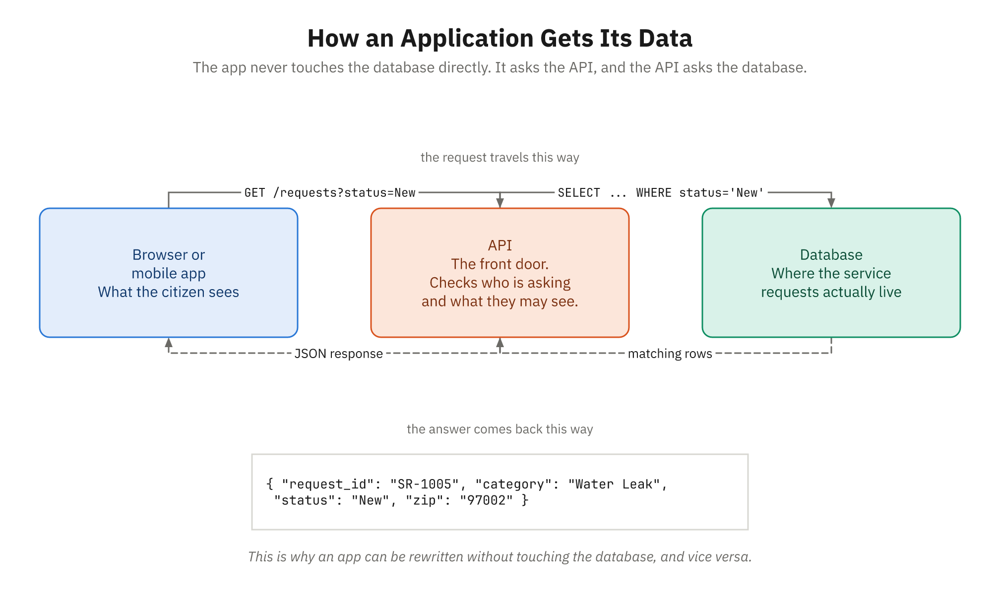

# Demo 26: Open Data and APIs

**Module:** VI | **Topic:** Introduction to Databases
**Estimated Time:** 15 minutes
**Related reading:** [Introduction to Databases](../docs/Module-06-Data-Management/03-introduction-to-databases.md)

## Objective
Complete the Module VI data story by showing the *same kind* of CivicTrack data served over the web by an API — as JSON, not raw database rows. Students will see the concept (a front end calls an API, which returns JSON), hit a real, free, no-key open-data 311 endpoint live in the browser, and understand that this is exactly the kind of endpoint a back-end developer builds.



*This is the flow the demo walks through. Project it, then make the real request against it.*

This is the final stop in the data story we've followed all week: the same City of Rivervale service-request data as a **messy CSV** (Demo 21) → a **spreadsheet** (Demo 22) → a **relational database** (Demos 23–25) → and now an **API that serves it as JSON** to apps.

## Setup/Prerequisites
- A web browser (Edge, Chrome, or Firefox — any modern browser on Windows works)
- The browser's **Developer Tools console** (press **F12**, then click the **Console** tab)
- The local CivicTrack JSON shape from `../course-project/data/schema.md` (used for the concept and the offline fallback)
- Internet access for the live example (a fallback is provided if the network or endpoint is unavailable)
- Familiarity with the CivicTrack tables (Demos 23–25)

> No installation, no account, no API key. Everything runs in a browser tab and the built-in console. This is deliberately Windows-friendly: the browser is the only tool.

> **Teaching note — verify the endpoint the week you teach.** Public open-data endpoints drift: URLs change, datasets get renamed, query parameters get deprecated, and rate limits change. Before class, paste the live URL below into your own browser and confirm it returns JSON. If it doesn't, use the Fallback (Part 4) and tell students this drift is itself a real lesson about depending on someone else's API.

## Step-by-Step Script

### Part 1: The Concept — Apps Don't Talk to the Database (3 minutes)

**Set up the problem:**
> "All week we've put CivicTrack data into a database and queried it with SQL. But here's the catch: the resident-facing web page and the city's mobile app do *not* connect to the database directly. That would be slow, insecure, and would expose the raw tables to the whole internet. Instead, the front end calls an **API** — a web address it can request data from — and the API returns the data in a tidy, universal format called **JSON**. The API sits in the middle: it talks to the database on one side and hands clean data to the app on the other."

**Draw the flow (on a whiteboard or slide):**
```
[ Browser / mobile app ]  --HTTP request-->  [ API ]  --SQL-->  [ Database ]
[ Browser / mobile app ]  <--JSON response--  [ API ]  <--rows--  [ Database ]
```

**Show the JSON shape — one CivicTrack request over the wire** (from `schema.md`):
```json
{
  "request_id": "SR-1005",
  "date_submitted": "2026-03-03",
  "category": "Water Leak",
  "description": "Water pooling on street",
  "address": "300 Pine St",
  "zip": "97002",
  "status": "In Progress",
  "department": "Utilities",
  "priority": "High"
}
```

**Talk through it:**
> "Look closely — this is the *same SR-1005* we filtered with SQL in Demo 23. But notice two things. First, it's JSON: curly braces, `"key": value` pairs, easy for any programming language to read. Second, it's already been *joined for us* — the API turned `category_id = 7` back into `"category": "Water Leak"` and added `"department": "Utilities"`. The app doesn't see IDs or tables; it sees a clean, finished object. That join — the work we did by hand in Demo 24 — is exactly the kind of thing the API does behind the scenes before sending data out."

> "An API that returns a *list* of requests just sends an array of these objects: `[ {...}, {...}, {...} ]`. That's all a '311 API' is."

### Part 2: Hit a Real Open-Data 311 API in the Address Bar (4 minutes)

> "CivicTrack is fictional, but real cities publish their 311 service-request data as open data through exactly this kind of API — no login, no key. Let's hit one live. New York City publishes its 311 requests on its open-data portal, and we can ask it for data straight from the browser address bar."

**Paste this URL into the browser address bar and press Enter:**
```
https://data.cityofnewyork.us/resource/erm2-nwe9.json?$limit=5
```

**What students see:**
> "A wall of JSON — an array of five service-request objects, each with fields like `unique_key`, `created_date`, `complaint_type`, `descriptor`, `status`, and `incident_zip`. This is real 311 data, served live over HTTP as JSON, no different in shape from our CivicTrack example. The field *names* differ from ours, but the idea is identical: an ID, a date, a category, a status, a location."

> Tip: Edge, Chrome, and Firefox all pretty-print JSON in the tab. If it looks like one cramped line, it's still valid — the browser just isn't formatting it.

**Now ask the API a question — filter and pick columns (this is SoQL, the open-data query language):**
```
https://data.cityofnewyork.us/resource/erm2-nwe9.json?$select=unique_key,created_date,complaint_type,descriptor,status,incident_zip&$limit=5
```

**Talk through it:**
> "That `$select` parameter is choosing columns — it's the API's version of `SELECT request_id, status, ...` from Demo 23. `$limit=5` caps the results. We're querying a live city database from a web address. Map it back to our SQL: `$select` is SELECT, the dataset is the FROM table, and there are even `$where` and `$order` parameters that are WHERE and ORDER BY. Same questions we've asked all week — now answered by someone else's API over the internet."

**One more — filter for pothole-style requests (mirrors our most common CivicTrack category):**
```
https://data.cityofnewyork.us/resource/erm2-nwe9.json?$where=descriptor='Pothole'&$limit=5
```

> "`$where=descriptor='Pothole'` is `WHERE descriptor = 'Pothole'`. The same potholes that dominated the CivicTrack data are a real, queryable category in NYC's open data. The skills transfer directly."

### Part 3: Call the API from Code with fetch() (4 minutes)

> "Typing a URL in the address bar is how a *human* reads an API. An *app* does it in code. Every browser has a built-in function called `fetch()` that makes the same HTTP request from JavaScript — this is exactly what the CivicTrack front end would do."

**Open the console:** press **F12**, click the **Console** tab.

**Paste this and press Enter:**
```javascript
fetch("https://data.cityofnewyork.us/resource/erm2-nwe9.json?$limit=5")
  .then(response => response.json())
  .then(data => console.log(data));
```

**Talk through what happens:**
> "`fetch(url)` sends the HTTP request. `.then(response => response.json())` parses the JSON text into real JavaScript objects. The final `.then(data => console.log(data))` prints them. Expand the array in the console and you can click into each object and read its fields. This is the actual mechanism a web page uses to load data — no magic, just a function call to a URL."

**Show that JSON becomes ordinary objects you can use:**
```javascript
fetch("https://data.cityofnewyork.us/resource/erm2-nwe9.json?$limit=5")
  .then(response => response.json())
  .then(data => {
    console.log("Got", data.length, "requests");
    data.forEach(r => console.log(r.unique_key, "-", r.complaint_type, "-", r.status));
  });
```

**Explain:**
> "Once the JSON is parsed, each request is just an object: `r.complaint_type`, `r.status`, `r.unique_key`. The front end loops over them and draws them on the page — a list of service requests, a status badge, a map pin. That's the whole job of the resident-facing CivicTrack page: fetch the JSON, then display it. You don't need to understand all the JavaScript yet; the point is that reading an API is a few lines of code, and the data comes back as objects you can pick fields out of."

### Part 4: Fallback — Use the Local CivicTrack JSON (offline / endpoint down) (2 minutes)

> **Use this if the live endpoint is slow, blocked on the training network, has changed, or returns an error.** Public endpoints drift — see the teaching note at the top. The lesson is identical with local data; you just skip the network.

**Demonstrate with the CivicTrack JSON directly in the console** (no network needed):
```javascript
// The same shape an API would return — a list of CivicTrack requests
const requests = [
  { request_id: "SR-1005", date_submitted: "2026-03-03", category: "Water Leak",
    description: "Water pooling on street", address: "300 Pine St", zip: "97002",
    status: "In Progress", department: "Utilities", priority: "High" },
  { request_id: "SR-1004", date_submitted: "2026-03-02", category: "Graffiti",
    description: "Graffiti on park wall", address: "12 River Rd", zip: "97003",
    status: "New", department: "Code Enforcement", priority: "Low" },
  { request_id: "SR-1014", date_submitted: "2026-03-07", category: "Pothole",
    description: "Deep pothole after storm", address: "175 Main St", zip: "97001",
    status: "In Progress", department: "Public Works", priority: "High" }
];

console.log("Got", requests.length, "requests");
requests.forEach(r => console.log(r.request_id, "-", r.category, "-", r.status));

// Filter just like the API (or like SQL WHERE) — open requests only:
const open = requests.filter(r => r.status === "New" || r.status === "In Progress");
console.log("Open requests:", open.length);
```

**Talk through it:**
> "This is the exact JSON shape from our schema doc — the same CivicTrack data, just defined in the console instead of fetched over the network. Notice `requests.filter(...)` does in JavaScript what `WHERE status IN ('New','In Progress')` did in SQL and what `$where` did in the API: filtering open requests. Whether the data comes from a live API or sits right here, the front end works with it the same way. When the network cooperates, you get this list from a real server; when it doesn't, the idea is unchanged."

### Part 5: Tie It Together and Forward (2 minutes)

**Close the data story:**
> "Step back and see the whole arc of Module VI. The *same* CivicTrack service-request data has now appeared in four forms:
> 1. A **messy CSV** export — how data arrives (Demo 21).
> 2. A **spreadsheet** — quick analysis with COUNTIF (Demo 22).
> 3. A **relational database** — three normalized tables, queried and built with SQL (Demos 23–25).
> 4. An **API serving JSON** — how a real app actually gets the data (today).
>
> The database stores it, the API serves it, the front end displays it. That's the shape of essentially every modern web application."

**Point forward:**
> "One last thing before we close. The endpoint we *called* today is the kind of endpoint somebody *builds* — and it isn't magic. On the other side of that URL is code doing exactly what we did by hand this week. It runs a SQL query against tables like ours. It joins the IDs back into readable names. It hands the result back as JSON. Then front-end code calls it with `fetch()`, the same way we just did in the console. Today you saw the finished picture from the outside. Build one yourself and you're assembling the same three pieces from the inside — a query, a little logic, and JSON."

## Key Points to Emphasize

- **Apps call an API, not the database directly.** The API sits in the middle: it queries the database and returns clean, joined data as JSON, keeping the raw tables private and the data app-ready.
- **JSON is the universal data format for the web.** `"key": value` pairs and arrays of objects — readable by any language. The API does the JOIN work so the app receives finished objects, not raw IDs.
- **An API URL is a query.** `$select` / `$where` / `$order` / `$limit` on the live 311 endpoint map straight onto SQL's SELECT / WHERE / ORDER BY / LIMIT. The skills from Demos 23–24 transfer directly.
- **`fetch()` is how code reads an API.** A few lines in the browser console make the request, parse the JSON into objects, and let you pull out fields — the same mechanism the real CivicTrack front end uses.
- **Someone builds this.** Behind the URL is code that queries the database, joins the results, and returns JSON — the same three pieces we've worked with all week, assembled on the server side.

## Common Questions

**Q: Is JSON the same as the JavaScript objects I saw in the console?**
A: Very nearly. JSON (JavaScript Object Notation) is a *text* format — what travels over the network. When `fetch()` calls `.json()`, it parses that text into real in-memory JavaScript objects you can use with dot notation like `r.status`. So JSON is the on-the-wire form; objects are the in-memory form. They look almost identical, which is exactly why JSON caught on.

**Q: Why doesn't the app just connect to the database directly — wouldn't that be simpler?**
A: Simpler, but unsafe and brittle. Exposing the database to the public internet would let anyone read or alter the raw tables, tie the app to the exact table structure, and offer no place to enforce rules or hide sensitive columns. The API is a controlled front door: it decides what data is exposed, in what shape, to whom. That's why essentially every real application puts an API between the app and the database.

**Q: The live URL didn't return data — did I do something wrong?**
A: Probably not. Public open-data endpoints change over time — the dataset can be renamed, the URL can move, parameters can be deprecated, or the portal can rate-limit or go down. That's why this demo ships with the local-JSON fallback in Part 4, which teaches the identical concept without the network. (It's also a genuine lesson: depending on someone else's API means depending on their uptime and their decisions.)

**Q: Do I need an API key or an account to use that 311 endpoint?**
A: Not for the basic read-only requests in this demo — it's open data, served to anyone. Many production APIs *do* require a key to identify and rate-limit callers, and you'd send one when you build or consume APIs for real work. For now, the no-key open-data endpoint lets us see the whole idea with nothing but a browser.

**Q: Is `fetch()` something special I have to install?**
A: No — it's built into every modern browser, available right in the console with no setup. That's part of why it's the standard way front-end code reads APIs. Node.js (the back-end JavaScript runtime) also includes `fetch()`, so the same call works on the server side too.
