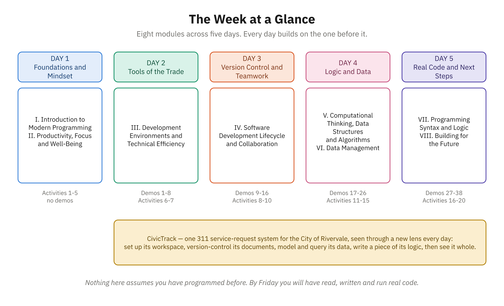

# Module I: Introduction to Modern Programming

## Module Overview

Welcome to Module I of *How Modern Programmers Think*. This foundational module sets the stage for your journey into professional software development. Rather than jumping directly into code, we begin by establishing a shared understanding of what modern programming actually is, who programmers are in today's landscape, and how the learners in this course fit into this evolving field.



*The whole week on one page. You are at the far left.*

### Purpose of This Module

This module answers three essential questions:

1. **What does modern programming really look like?** We'll move past Hollywood depictions and explore the actual landscape of programming today—the roles, tools, responsibilities, and mindsets that define professional developers.

2. **How did we get here?** Understanding the historical trajectory from early computing to today's cloud-native, AI-assisted development environment provides context for why programming works the way it does and helps you anticipate where the field is heading.

3. **Why is this course designed the way it is?** By understanding who this course serves and what constitutes foundational programming knowledge, you'll maximize the value of each module that follows.

## Learning Objectives

After completing Module I, you will be able to:

1. **Describe** the daily work of modern programmers across different specializations (front-end, back-end, full-stack, data, DevOps)
2. **Explain** how programming has evolved and why certain tools, practices, and perspectives have become standard
3. **Identify** the core tools and environments programmers use and understand their purposes
4. **Articulate** the gap between technical skills and the professional competencies employers actually seek
5. **Recognize** how your background and existing skills provide a foundation for learning to program
6. **Assess** which learning paths in programming might align with your career goals
7. **Apply** a growth mindset to the learning curve ahead

## Topic List

This module consists of two topics:

### **Topic 1: Defining the Modern Programmer**
- **File:** `01-defining-the-modern-programmer.md`
- **Focus:** What programmers do day-to-day, the evolution of programming, today's landscape of specializations, essential tools, employer expectations, the creator mindset, programming paradigms, open source culture, and current industry trends
- **Key concept:** Programming is a professional craft with a history, a culture, and a daily reality that looks very little like its popular image

### **Topic 2: Who This Course Is For**
- **File:** `02-who-this-course-is-for.md`
- **Focus:** The career transition journey, transferable skills from your background, different learning paths, what foundational skills mean, growth mindset in practice, common fears about learning to code, success stories, and how this course is structured
- **Key concept:** Career changers arrive with real, transferable professional assets — the work is to recognize and redirect them, not to start from zero

---

## How to Use This Module

Throughout this course, you'll engage with increasingly sophisticated programming concepts—from foundational thinking patterns through full application design and deployment. Module I provides the context for all that follows:

- **Modules I-II** establish foundations and a healthy, focused mindset for learning to program
- **Modules III-IV** set up your tools and environments, then introduce the development lifecycle and collaborating with Git
- **Modules V-VI** build computational thinking and show how programs work with data
- **Modules VII-VIII** put it together with real code in JavaScript and Java, then point you toward next steps

By understanding the "why" and "who" now, you'll better understand the "how" in subsequent modules.

At the end of each topic file, you'll find **review and discussion questions**. The discussion questions are invitations to pause and think, not hurdles to clear. They're not graded — use them to connect the material to your own experience, and consider discussing them with classmates.

### Course Structure at a Glance

```
Module I: Introduction to Modern Programming
├── What programming is, who programmers are, and who this course is for
│
Module II: Productivity, Focus, and Developer Well-Being
├── Healthy habits, focus, attention to detail, sustainable learning
│
Module III: Development Environments & Technical Efficiency
├── Operating systems, terminals, editors/IDEs, research practices
│
Module IV: Software Development Lifecycle (SDLC) & Collaboration
├── How software gets built, version control, and Git
│
Module V: Computational Thinking, Data Structures & Algorithms
├── Thinking like a programmer, independent of any language
│
Module VI: Data Management
├── Spreadsheets, CSV, relational databases (RDBMS), and NoSQL
│
Module VII: Programming Syntax & Logic
├── Writing real code in JavaScript and Java
│
Module VIII: Building for the Future
├── Bridging theory to practice and choosing your next steps
```

## Prerequisites

- **No prior coding knowledge:** This course is designed for beginners; we don't assume you've programmed before
- **Basic computer literacy:** You can navigate a file system and edit files — that's the only technical requirement
- **Openness:** Be willing to question assumptions about what programming is and challenge myths about who can learn it
- **Curiosity:** Programming is a field of constant learning; this course models that mindset
- **A reflective stance:** This module includes discussion questions designed for self-reflection; use them

## A Word About Pace

This module takes approximately 4-6 hours to read thoroughly and engage with reflection questions. You might read it in one sitting or spread it across several sessions. There's no "right" pace—move at the speed that allows concepts to settle and questions to form.

---

## Key Themes Throughout This Module

### **Past the Stereotype**
The popular image of the programmer — a lone figure typing green text in a dark room — is almost entirely wrong. Much of the job is reading, thinking, communicating, and deciding. Correcting that picture now is what makes the rest of the week make sense.

### **Abstraction Is the Story of the Field**
From punch cards through high-level languages to cloud platforms and AI assistants, the arc of programming is the steady hiding of detail so people can work on bigger problems. Nearly every tool you'll meet this week exists because someone wanted to stop thinking about something.

### **From Consumer to Creator**
You've used software your entire career. This module begins the shift to seeing it as something built by people who made choices — choices you'll soon be making yourself.

### **Your Background Is an Asset, Not a Deficit**
Career changers often assume their prior work is irrelevant. The opposite is true: process design, troubleshooting, stakeholder communication, and attention to detail all transfer directly. Naming those assets now makes the technical material easier to absorb later.

---

## Ready to Begin?

Begin with **Topic 1: Defining the Modern Programmer**, where we'll explore what programming is, how it's evolved, and what professional developers actually spend their time doing.
