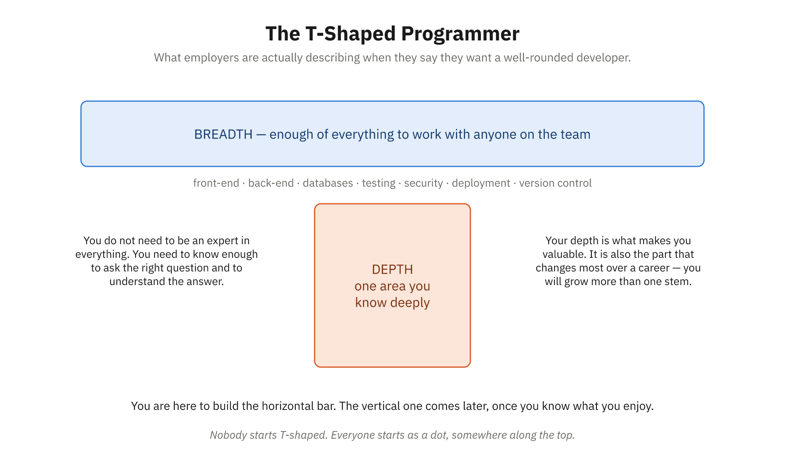

# Topic 1: Defining the Modern Programmer

## What Does a Programmer Actually Do Day-to-Day?

If you ask people on the street what programmers do, you'll likely hear some variation of: "They sit at computers and write code all day." This is technically true but remarkably incomplete. It's like saying a lawyer "reads documents" or a doctor "looks at patients." The job title tells you the primary tool, but not the actual work.

Let's start by dispelling some myths and describing what professional programmers actually spend their time doing.

### The Myth: Programming is 8 Hours of Typing Code

The reality is far richer and more varied. In a typical professional environment, a programmer's day might include:

**Collaborative Problem-Solving (25-35% of time)**
Much of programming is working through problems with others. This might involve pairing with a colleague to debug a tricky issue, attending a design meeting to discuss how a new feature should work, reviewing a teammate's code and providing feedback, or explaining a complex system to a non-technical stakeholder. A surprising amount of this work is conversation, not code.

**Reading and Understanding Code (30-40% of time)**
Before you can write code, you must understand existing code. Professional programmers spend significant time reading code written by their teammates (or by themselves, months ago). You learn how the system works, where a feature should fit, what patterns have been established, and what pitfalls to avoid. This reads-more-than-writes reality means that code clarity and thoughtful naming matter enormously.

**Research and Learning (10-20% of time)**
Programming languages, frameworks, libraries, and best practices are constantly evolving. Professional programmers regularly research questions: "What's the best way to handle this kind of problem?" "Has someone solved this before?" "Are there security implications I should know about?" "What did that error message mean?" This is not a sign of insufficient knowledge—it's professional practice. Stack Overflow and documentation sites exist because looking things up is central to programming work.

**Testing and Verification (10-20% of time)**
Professional programmers don't just write code and hope it works. They test their code, often repeatedly, to ensure it does what's expected and doesn't break anything else. They might run automated tests they've written, perform manual testing, or work with quality assurance specialists. Testing is so integral to professional programming that in many organizations, developers write extensive tests alongside their actual features.

**Writing and Communicating (10-15% of time)**
Programmers write documentation, send explanatory emails, create architecture diagrams, write commit messages explaining why they made a change, and author design documents before building something complex. Clear communication about code and design is a professional responsibility, not an afterthought.

**Meetings and Planning (5-15% of time)**
This includes team standups, project planning sessions, retrospectives where teams discuss what went well and what could improve, and sometimes presentations. Not every organization handles meetings efficiently, but most development teams use meetings to coordinate work, share knowledge, and solve problems together.

**The Reality: Active Thinking Looks Like Stillness**
If you watched a programmer work, you might notice long periods of apparent inactivity—staring at the screen, hand on chin, no typing. This is work. This is a programmer thinking through a problem, considering approaches, weighing tradeoffs. The typing that produces code is often the endpoint of substantial thinking.

### Different Paths: Not All Programmers Do the Same Thing

The umbrella term "programmer" covers an astonishing variety of specialties, each with different focus areas.

**Front-End Programmers**
Front-end developers build the parts of software that users see and interact with. If you've used a website or mobile app, you've encountered their work. Their day involves understanding user interface design, making sure things look right and work smoothly on different devices and browsers, and creating responsive, accessible experiences. They often collaborate closely with designers and spend time thinking about user experience, performance, and how information should be presented. Front-end programming has historically been web-focused, but increasingly includes mobile applications and even desktop applications using web technologies.

**Back-End Programmers**
Back-end developers build the logic and systems that run "behind the scenes." Users don't see their code directly, but they depend on it. Back-end programmers might design the systems that handle customer data, process payments, send emails, manage inventory, or analyze business metrics. They think deeply about how data flows through systems, how to handle thousands of simultaneous requests, how to secure sensitive information, and how to keep systems running reliably even when things go wrong. Back-end work often involves databases, APIs (standardized ways for different systems to communicate), and server infrastructure.

**Full-Stack Programmers**
Full-stack developers are comfortable across the full depth of an application: front-end, back-end, and everything in between. They might build a feature that spans from user interface design through database work. This requires breadth of knowledge rather than necessarily deep expertise in every area. Full-stack roles are common in smaller organizations where developers must wear multiple hats.

**Data Engineers and Data Scientists**
These specialists work with data—analyzing it, building systems to process it, and creating models that find patterns or make predictions. A data engineer might build the infrastructure for collecting and storing enormous amounts of data; a data scientist might analyze that data to answer business questions or train a machine learning model. These roles require strong analytical thinking and often involve mathematical and statistical knowledge.

**DevOps Engineers**
DevOps (development + operations) specialists focus on infrastructure, deployment, and keeping systems running smoothly in production. They build the systems and tools that developers use to deploy their code to production servers, monitor application health, manage security, and respond to outages. DevOps people are often the experts who ensure that when you click "deploy," your code reliably goes live and continues running.

**Quality Assurance Engineers**
While some programming involves writing tests, QA specialists often focus more deeply on testing and quality. They might build test infrastructure, develop testing strategies, or manually test complex user journeys. In some organizations, QA is its own specialty; in others, all programmers share testing responsibilities.

**Security Specialists**
As cyber threats have grown, security specialists have become essential. They think about how systems can be attacked, build defenses, and help other programmers write secure code. This might involve penetration testing (ethically trying to break into systems), code review for security issues, or designing secure authentication systems.

**Embedded Systems Programmers**
While most programming today targets computers or servers, embedded systems programmers write code that runs on specialized hardware—in cars, medical devices, industrial equipment, IoT devices, and more. This work often involves deep knowledge of specific hardware and operating at a lower level than typical application programming.

### Common Thread

Despite these specializations, all professional programmers share certain characteristics:

- **They solve problems systematically.** Rather than hacking until something works, programmers think through approaches, consider tradeoffs, and choose solutions deliberately.
- **They communicate.** Either through code, documentation, or conversation, programmers regularly explain what they're doing and why.
- **They think about the people downstream.** Will other programmers understand this code? Will users be able to use this feature? Will the system handle the expected load? Professional programming always considers those who come after.
- **They learn continuously.** Technology changes rapidly. Professional programmers expect to spend time learning new tools, languages, and techniques throughout their careers.

---

## The Evolution of Programming: From Punch Cards to Cloud Computing

To understand where programming is today, it helps to understand where it came from. The evolution of programming reveals why we do things the way we do and helps us anticipate where the field is heading.

### The Early Era: Hardware Was Everything (1940s-1960s)

The earliest electronic computers were enormous machines—room-filling, power-hungry, and specialized devices. Programming these computers was nearly as specialized as building them.

**Punch Card Programming**
Programmers initially fed instructions to computers on punch cards: physical cards with holes representing data and instructions. A program might be thousands of cards, stacked in precise order. Making a mistake meant re-punching cards. Debugging required running the cards through the machine, discovering errors in the output, and trying again.

This era established some crucial insights:

- *Programs are separate from hardware.* The same computer could run different programs (different punch card decks), establishing the concept of software as distinct from the machine.
- *Systematic thinking is essential.* With such limited ability to change code once entered, programmers had to think through logic very carefully beforehand.
- *Communication about code matters.* If a colleague was working on cards 50-150 of your 5,000-card program, clear documentation was survival.

### The Transition Era: Assemblers and High-Level Languages (1950s-1970s)

As computers became more common, programming became less of a hardware-adjacent specialty and more of a distinct profession. Several key developments:

**Assembly Language**
Instead of punch cards directly, programmers began writing in assembly language: human-readable (barely) instructions that corresponded directly to the computer's actual operations. This was less error-prone than punch cards but still tedious and hardware-specific.

**High-Level Languages**
Then came Fortran (1956), COBOL (1959), Algol, and others—languages that looked more like English or mathematical notation. Programmers could write code that was easier to understand, and a compiler would translate it into the machine instructions the computer needed. This was revolutionary. Now programmers could think in terms of the problem rather than the computer's operations.

**Operating Systems**
As computers became more powerful, the need emerged for software that managed the computer's resources and allowed multiple programs to run. Unix, developed in the 1970s, established design philosophies that persist today: modular design, clear interfaces between components, and the principle that tools should do one thing well.

**Key Insight: Abstraction**
This era established a fundamental principle of programming: abstraction. You write code assuming a consistent, simplified interface (a programming language, an operating system), without needing to understand the complex details below. This layering of abstraction—each layer can be understood and built without necessarily understanding the layers below—became foundational to programming.

### The Personal Computing Era: Programming Becomes More Accessible (1970s-1990s)

When computers became small enough and affordable enough for individuals and small businesses, programming changed dramatically.

**New Languages and Paradigms**
The 1970s-80s brought languages like C (powerful, efficient, and highly influential), Pascal (educational, structured), and eventually C++ (adding object-oriented features to C). Each language embodied different philosophies about how programs should be structured.

**From Mainframes to Distributed Systems**
As computers proliferated, the problem shifted from "How do we use one powerful computer?" to "How do we build systems across many computers?" This led to networking, databases, and distributed systems—the modern challenge of building systems where no single computer has all the information or power.

**The Rise of Version Control**
When programming was largely an individual activity, version control (systems for tracking changes to code) wasn't critical. As teams grew and programmers worked on the same code simultaneously, version control became essential. Tools like CVS and later Git created systems to merge multiple people's changes to the same codebase.

**Key Insight: Collaboration and Scale**
This era established that programming is fundamentally a collaborative activity at scale. A single programmer might build something from scratch, but serious software is team effort, and managing that collaboration requires specialized tools and practices.

### The Internet Era: Distributed Development Becomes Standard (1990s-2000s)

The explosion of the internet changed programming in three major ways:

**Networked Applications**
Programmers were no longer primarily building tools for a single computer. Now they built applications that communicated across networks, pulled data from remote servers, and served users globally. Web browsers and web servers became the dominant platforms.

**Open Source Culture**
The internet enabled programmers worldwide to collaborate on shared projects. Linux, Apache, PHP, MySQL, and thousands of other open-source projects created a culture of freely shared code and collaborative development. This democratized programming—you could learn from code written by brilliant programmers worldwide, and your own code could be learned from too.

**Three-Tier Architecture**
The standard architecture for web applications—presentation layer (what users see), application logic layer (what the application does), and data layer (what the application remembers)—became dominant. This separation of concerns allowed different specialists to focus on different parts.

**Key Insight: Community and Open Standards**
Programming became an explicit community activity. Standards (HTTP for web communication, HTML for marking up content, TCP/IP for network communication) allowed thousands of programmers to build compatible systems. Open source created norms of transparency, code review, and collaborative development that became mainstream.

### The Modern Cloud Era: Infrastructure as Abstraction (2010s-Present)

The most recent shift is as profound as the personal computer revolution: the move to cloud computing.

**Before: You Owned the Servers**
Running a web application meant managing physical servers. You bought computers, put them in data centers, kept them running, managed their storage and backups, and paid for the electricity. Operations teams were essential; deployment meant coordinating with operations to install your code on shared machines.

**Now: Infrastructure is Abstraction**
Cloud providers like Amazon Web Services, Google Cloud Platform, and Microsoft Azure offer computing as a service. You write your code, and instead of worrying about individual servers, you describe your needs to the cloud provider. The cloud provider handles multiple servers, redundancy, backups, and scaling automatically. This is abstraction again: you describe what you want (a database that holds a million records, a service that can handle 10,000 simultaneous requests) without needing to manage the hardware details.

**Microservices Architecture**
Instead of building monolithic applications (one large program that does everything), modern applications are often built from many small, independent services that communicate with each other. Each service can be developed, deployed, and scaled independently. This mirrors how modern organizations work: small teams owning specific services.

**DevOps: Development and Operations Converge**
The traditional separation between developers (who wrote code) and operations (who ran systems) has largely dissolved. Developers now deploy their own code and share responsibility for keeping it running. This created the DevOps specialization and tools that automate deployment, monitoring, and infrastructure management.

**Containerization**
Docker and container technology created a way to package code along with its dependencies so that it runs consistently anywhere. You no longer say "It works on my machine"—you package your code in a container that includes everything needed to run it, and it works consistently on any system that can run containers.

**Key Insight: Automation and Reliability**
The modern era is characterized by automation of previously manual work (deployment, testing, infrastructure management) and expectation of reliability at scale. Programmers increasingly spend time writing tools for other programmers and building systems that work reliably with minimal human intervention.

### Where We're Heading: AI-Assisted Development and Beyond

As we move deeper into the 2020s, new developments are reshaping programming:

**AI as Coding Assistant**
AI-powered tools like GitHub Copilot, ChatGPT, and others can now generate code based on descriptions of what you want to build. This is not replacing programmers—programmers still need to understand what code to write and verify that generated code is correct. But it changes the work: more focus on specifying clearly what you want, less time on routine code generation.

**Platform Engineering**
A new specialization is emerging: platform engineers who build internal platforms that make it easier for other developers to deploy, monitor, and maintain their code. This continues the trend of abstraction—layers of tools built to make development more productive.

**Sustainability and Efficiency**
As the environmental cost of computing becomes clearer, more focus is going toward writing efficient code that uses fewer resources. This brings back some concerns from the early computing era (where every bit of efficiency mattered) but with different stakes.

**Distributed and Remote-First Development**
The tools and practices of programming are now fundamentally designed for distributed teams. It's less necessary (though still valuable) to be co-located with your team.

### Lessons from History

Several consistent patterns emerge from programming's evolution:

1. **Abstraction keeps building.** Each era adds another layer of abstraction, allowing programmers to focus on higher-level problems. You don't think about individual bits or CPU operations anymore; you might not even think about individual servers.

2. **Tools enable collaboration.** Version control, remote deployment, containerization—each innovation is fundamentally about making it easier for teams to work together.

3. **Specialization increases.** As the field matures, it splits into more specific niches. Early programmers had to understand hardware, language design, and applications; modern programmers often specialize deeply in one area.

4. **Standards matter.** Agreed-upon standards (whether HTML, JSON data formats, or network protocols) enable ecosystems where many independent pieces work together.

5. **Learning is constant.** From punch cards to AI-assisted development, the tools have changed utterly. Professional programmers accept that their skills must continually evolve.

---

## Today's Programming Landscape: Specializations and Roles

Understanding the diversity of modern programming roles helps you see where you might fit and recognize that "programmer" is an umbrella covering many distinct career paths.

### The Three-Tier Structure

Most applications are built using a conceptually similar three-tier structure, even as technologies change:

**Presentation Tier (Front-End)**
This is what users interact with—websites in browsers, mobile apps, desktop applications. A user's clicks, form entries, and interactions happen here. Front-end programmers build this layer, focused on responsiveness, accessibility, visual design, and user experience. The work spans HTML (structure), CSS (styling), JavaScript and other languages (interactivity), and increasingly specialized frameworks that manage the complexity of interactive interfaces.

**Logic Tier (Back-End/Application Logic)**
This is where the core business logic lives. When a user clicks "buy," this tier figures out if they have enough money, if the item is in stock, how much to charge, and what records to update. Back-end programmers write this logic, often in languages like Python, Java, Go, or C#. They build APIs (standardized ways for the front-end and other systems to request data and actions) and handle complex workflows. Performance, security, and reliability are paramount at this tier.

**Data Tier (Databases and Storage)**
This is where information persists. Customer data, products, transaction histories, preferences—all stored in databases that allow efficient retrieval and updating. While all programmers interact with databases, some specialists (database administrators and database engineers) focus deeply on database design, optimization, and management.

### Specialization Paths

Beyond the three-tier structure, several specialization paths have emerged:

**Full-Stack Development**
Full-stack developers are comfortable across all three tiers and can take a feature from concept through database design, API construction, and user interface. This path emphasizes breadth and the ability to understand how different parts connect. Full-stack is common in startups and smaller organizations where individuals must be generalists.

**Mobile Development**
Mobile developers build applications for phones and tablets, whether native applications (built specifically for iOS or Android) or cross-platform applications using frameworks that work across platforms. Mobile development involves understanding mobile-specific constraints (limited screen space, varying network conditions, battery life) and platform-specific guidelines (how apps should behave on iOS vs. Android).

**Data Engineering and Analytics**
Data specialists work with large volumes of data. Data engineers build pipelines that collect, clean, and organize data from various sources. Data analysts query existing data to answer business questions. Data scientists build predictive models using statistical and machine learning techniques. This path requires comfort with statistics, databases, and increasingly machine learning frameworks.

**DevOps and Infrastructure**
DevOps engineers and Site Reliability Engineers (SREs) focus on making systems reliable and efficient at scale. They might build CI/CD pipelines (continuous integration/continuous deployment—automated testing and deployment systems), manage cloud infrastructure, design monitoring systems, and respond to outages. This path appeals to people who enjoy automation and systems thinking.

**Security Specialization**
Security engineers and specialists focus on protecting systems from attack. They might perform security audits, design secure authentication systems, respond to security incidents, or help other programmers write secure code. This requires understanding both how systems work and how they can be attacked.

**Game Development**
Game developers build interactive experiences, whether for desktop, mobile, console, or web. Game development often involves specialized graphics knowledge, real-time performance optimization, and understanding player engagement. While it uses similar programming fundamentals, the domain has its own specialized tools and knowledge.

**Embedded Systems and IoT**
Embedded systems developers write code for specialized hardware—automotive systems, medical devices, industrial equipment, smart home devices. This path often requires deeper hardware knowledge and understanding of real-time constraints (the code must execute within precise timing windows).

**Machine Learning and AI**
As machine learning has become mainstream, ML engineers and AI researchers focus on building and training models, often in Python using frameworks like TensorFlow and PyTorch. This path requires mathematical knowledge and understanding of statistical concepts.

### Role Progression

Within specializations, roles typically progress from:

**Junior Developer** — Recently started, learning the codebase and team practices, working on smaller features with mentorship.

**Mid-Level Developer** — Can own full features, mentor juniors, and contribute to technical decisions.

**Senior Developer** — Deep expertise, involved in architecture decisions, mentoring, and strategic technical planning.

**Staff/Principal Engineer** — Broad influence across teams, often involved in company-wide technical direction.

**Engineering Manager** — Shifts focus from writing code to managing people and projects, though many retain hands-on technical involvement.

Many programmers follow a progression from junior to senior within a specialization, while others move between specializations or between individual contributor and management tracks.

---

## The Tools of the Trade

Professional programmers use an interconnected set of tools. Understanding these tools is part of understanding what modern programming is.

### Development Environment

**Code Editors and IDEs**
Programmers spend their days in text editors or Integrated Development Environments (IDEs). A text editor like Visual Studio Code or Sublime Text is focused and lightweight, giving you full control. An IDE like IntelliJ IDEA or Visual Studio is more comprehensive, with built-in debugging, testing, and other features integrated. Both approaches are valid; most programmers have strong preferences about which they use.

**The Terminal/Command Line**
Despite the graphical interfaces on modern computers, many programming tasks happen in the terminal—a text-based interface where you type commands rather than pointing and clicking. The terminal might seem archaic, but it's powerful and precise. You often build and run code from the terminal, manage files, interact with version control, and deploy applications through terminal commands. Learning to be comfortable in the terminal is part of becoming a professional programmer.

**Git and Version Control**
Git is the dominant version control system—software that tracks changes to code over time. Every professional programmer uses Git. It allows you to see the history of changes, understand who changed what and why, collaborate with others on the same codebase, and easily revert if something goes wrong. Git is so important that entire workflows and branching strategies have developed around it.

### Development and Deployment

**Package Managers**
Modern programming languages come with package managers that handle dependencies—other people's code that your code depends on. Python has pip, JavaScript has npm, Java has Maven. Rather than manually managing where code from other libraries lives, you list your dependencies and the package manager fetches and manages them. This enables reuse at scale.

**Build Tools**
Build tools automate the process of turning your source code into executable code (compiling), running tests, and preparing code for deployment. Tools like Maven, Gradle, or npm scripts automate repetitive tasks and ensure consistency.

**Continuous Integration / Continuous Deployment (CI/CD)**
CI/CD systems automatically test and deploy code. When you push code to a shared repository, the CI/CD system runs automated tests to ensure nothing broke, and if all tests pass, automatically deploys the code to production. This reduces manual errors and allows frequent, small deployments rather than rare, massive ones.

**Container Tools**
Docker has become the standard for containerization. You describe your application and all its dependencies in a Dockerfile, and Docker creates an image that can run consistently anywhere. Tools like Kubernetes manage containers at scale, orchestrating which containers run where.

### Collaboration and Communication

**Version Control Platforms**
GitHub, GitLab, and Bitbucket are web-based platforms built around Git that add collaboration features: issue tracking, pull requests (formal code review processes), wikis, and team communication. These platforms are central to modern collaborative development.

**Chat and Communication Tools**
Slack, Teams, and Discord have become standard for team communication, replacing many meetings and email threads. Programmers share code snippets, ask quick questions, and coordinate work in these channels.

**Documentation Platforms**
From wikis to Notion to specialized documentation sites, teams maintain documentation about how systems work, how to deploy code, how to set up your development environment. Good documentation is a sign of a mature team.

### Development and Debugging

**Debuggers**
Debuggers allow you to pause code execution, examine variables, and step through code line by line. This is invaluable for understanding what code actually does and why bugs occur.

**Logging and Monitoring**
In production, you can't use a debugger. Instead, applications emit logs (records of what happened) and metrics (counts and measurements). Programmers spend significant time examining logs when something goes wrong. Modern logging and monitoring tools aggregate logs from many servers and alert engineers when things look wrong.

**Testing Tools**
Professional development includes extensive testing. Unit testing frameworks let you write code that tests your code. Integration testing frameworks test how different parts work together. Every major language has testing frameworks; using them is standard practice.

### Learning and Reference

**Stack Overflow and Documentation**
Stack Overflow—a question-and-answer site for programmers—and official documentation for languages and frameworks are indispensable resources. Professional programmers frequently look things up; this is standard practice, not a sign of insufficient knowledge.

**Package Documentation**
Each library or framework has documentation explaining how to use it. Reading documentation is a core skill.

**Version-Controlled Code Repositories**
GitHub contains millions of open-source projects. Programmers learn by reading others' code, both to understand how problems have been solved and to see different approaches.

### Conclusion on Tools

The specific tools change relatively quickly (a tool popular five years ago might be obsolete today), but the categories are stable. Professional programmers are comfortable:

- Writing and editing code in multiple editors
- Using the terminal and command-line tools
- Using version control to manage code
- Understanding how code is built, tested, and deployed
- Collaborating with others using shared platforms
- Debugging and monitoring code
- Looking up information in documentation
- Reading others' code to learn approaches

Learning new tools is part of the job; the fundamental comfort with tools is what matters.

---

## What Employers Expect: The T-Shaped Programmer

When companies hire programmers, they're looking for more than someone who can write code in a particular language. They want "T-shaped" professionals.

### What is T-Shaped?

Imagine a T rotated so the vertical bar is on the left:



*This course builds the horizontal bar. The vertical one comes later, once you know what you enjoy.*

```
     DEPTH
       |
  BREADTH—+
       |
```

The horizontal bar represents breadth: comfort with many aspects of programming, the ability to talk intelligently with front-end and back-end developers, understanding of databases and DevOps, familiarity with security concerns. You don't need to be an expert in everything.

The vertical bar represents depth: deep expertise in one particular area. Maybe you're particularly skilled at building responsive user interfaces, or designing database schemas, or writing secure code. This depth is what makes you valuable.

### Technical Skills Expected

**Fundamentals Are Universal**
All programmers, regardless of specialization, need to understand:

- How to think in terms of algorithms and data structures
- Logic and control flow (if/then, loops, functions)
- Debugging—finding and fixing problems
- How to read and understand code written by others
- How computers actually work at a basic level (memory, processors, I/O)
- How networks work (HTTP, APIs, basic security)
- Version control and git

These fundamentals transcend specific languages or tools. A programmer who masters these can learn new languages or frameworks relatively quickly.

**Language Depth Is Often Specialized**
Most junior programmers learn their first language thoroughly. As they progress, they might learn additional languages to deepen breadth or follow specialization paths. A back-end developer might be very deep in Java or Go, while a front-end developer might be very deep in JavaScript. But all expect to learn new languages over time.

**The Right Tool for the Job**
Professional programmers choose the right language and framework for the problem. Python is different from JavaScript, which is different from Java, for good reasons. The ability to choose and learn new technologies is more important than knowing every existing technology.

### Professional Competencies

Beyond technical skills, employers expect:

**Communication**
You'll explain technical concepts to non-technical stakeholders, ask clarifying questions, and write documentation. Programmers who communicate well are vastly more valuable than those who code brilliantly but can't explain their work.

**Problem-Solving Over Feature Implementation**
Employers want to hire problem-solvers. They give you a problem (users are experiencing slow load times, customers are confused about this workflow, we need to track customer behavior) and expect you to figure out the right approach. This might involve more reading and discussing than coding.

**Attention to Quality**
This includes code quality (making sure code is clear and maintainable), quality assurance (testing thoroughly), security quality (thinking about vulnerabilities), and operational quality (ensuring systems run reliably). Junior programmers often focus on making something work; professional programmers make something work well.

**Collaboration**
Nearly all professional programming is team-based. You need to work effectively with teammates, respect different approaches, ask for help, and help others. Code review (giving and receiving feedback on code) is a form of collaboration that all professionals engage in.

**Learning Agility**
Technologies change rapidly. Employers need programmers who learn new tools, languages, and approaches throughout their careers. They're less concerned that you know specific technologies and more concerned that you can learn new ones.

**Project Management and Planning**
Experienced programmers help estimate how long work takes, break large problems into smaller pieces, and communicate progress. These skills develop over time but are fundamental to professional work.

### Soft Skills That Matter

**Intellectual Honesty**
Saying "I don't know, but I'll find out" is a strength, not a weakness. Programmers who admit what they don't know are easier to work with and learn faster than those who pretend to know everything.

**Curiosity**
Programmers who ask "why?" and "how could this be better?" tend to grow faster and contribute more. Passive acceptance of "that's how we've always done it" limits growth.

**Humility**
Code review, pair programming, and learning from others all require humility. Programmers who see feedback as growth opportunities rather than personal criticism tend to advance faster.

**Persistence**
Programming is problem-solving, and problems rarely have obvious solutions on the first try. The ability to work through frustration, try different approaches, and keep trying is fundamental.

**Empathy**
For users of the code, for teammates, for people maintaining your code years from now. Empathy—thinking about the person downstream who has to understand or use what you've created—is fundamental to professional programming.

---

## The Mindset Shift: From Consumer to Creator

Becoming a programmer involves a fundamental shift in how you relate to technology. This mindset shift might be as important as learning any specific technical skill.

### From "How Do I Use This?" to "How Does This Work?"

As a user of technology, you interact with finished products: apps, websites, services. You mostly care about whether they work and whether they're easy to use. If something doesn't work, you might restart, update, or switch to an alternative.

As a programmer, you ask deeper questions:

- How is this built? What technology choices were made?
- Why was it built this way? What problems was the designer solving?
- What could be better? What would I do differently?
- How would I build this? What would I need to know?
- When this fails, why does it fail this way?

This is a shift from passive consumption to active curiosity. You begin to see technology not as magical and mysterious but as human-made systems with specific design choices, tradeoffs, and purposes.

### From Problems You Encounter to Problems You Can Solve

As a user, you encounter problems: this website is slow, this app crashes, this workflow is annoying. You report the problem and hope someone fixes it.

As a programmer, you shift to thinking: "I could fix this." Or more accurately, "I now have the tools to understand why this doesn't work and how to make it better."

This is empowering but also carries responsibility. When you understand that software is built by people making choices, you begin to think about your own choices and their impact on users.

### From Instruction-Following to Problem-Solving

K-12 education often emphasizes following instructions: the teacher explains how to solve a problem, you follow the steps and reach the answer. There's usually a single right answer, and you're graded on accuracy.

Programming is often the opposite. You're given a problem: "Make it so that when users upload a photo, it's optimized for different screen sizes." There's no instruction sheet. You need to research approaches, choose an option, try it, and verify that it works. You might discover that your approach doesn't work as well as you hoped and need to try something else.

This is liberating but disorienting. There are usually multiple valid approaches. You're measured not on reaching a predetermined answer but on solving the problem well.

### From Right and Wrong to Tradeoffs and Context

In many domains, solutions are right or wrong. A mathematical proof is correct or incorrect; a historical fact is true or false.

Programming is full of context-dependent tradeoffs:

- This approach is faster but uses more memory. Which tradeoff makes sense for this situation?
- This library is well-designed but adds a dependency. Is that worth it?
- This code is very clever but might be hard for others to understand. Should we simplify it?

Professional programming requires comfort with ambiguity. You're not looking for right answers but for good solutions that balance multiple concerns.

### From Individual Achievement to Collaborative Creation

In school, you often work individually. Your test score reflects your knowledge; your project grade reflects your effort. Success is individual achievement.

Professional programming is collaborative. You write code that others read, test, and modify. Others write code you read and integrate into your work. The final product is created by a team; your individual contribution is one piece of a larger whole.

This requires learning to:

- Write code that others can understand
- Accept feedback and criticism without taking it personally
- Help others succeed, not just yourself
- Contribute to shared goals

### The Identity Shift: Becoming a Programmer

These mindset shifts collectively amount to an identity change. You're shifting from "someone who uses technology" to "someone who creates technology." This is profound because it changes how you see the world, what you can accomplish, and how others see you.

This identity shift is not automatic or instant. You don't become a programmer when you understand a certain amount of programming. Rather, you become a programmer through consistent practice, engagement with programming communities, and increasingly identifying yourself as someone who solves problems through code.

---

## Programming Paradigms: Different Ways of Thinking

Programming languages are not all equivalent. Different languages are built on different philosophies about how code should be structured. These philosophies are called paradigms.

### Imperative Programming: Giving Instructions

Imperative programming is the most intuitive starting point for most people. You explicitly tell the computer what to do, step by step:

```
ALGORITHM: Make Toast
    1. Get bread from cupboard
    2. Open toaster
    3. Place bread in toaster
    4. Set timer
    5. Activate toaster
    6. Wait until toast pops
    7. Remove toast
    8. Apply butter
```

Imperative languages like C, Java, Python, and JavaScript all support imperative programming. You write sequences of statements that tell the computer to perform actions.

Imperative programming is straightforward: the code clearly describes what happens and in what order. However, for complex problems, long sequences of instructions can become hard to follow.

### Object-Oriented Programming: Organizing Code with Objects

Object-oriented programming (OOP) is a way of organizing code around objects—representations of real-world things.

Imagine modeling a banking system:

```
OBJECT: BankAccount
    STATE (properties):
        - accountNumber
        - balance
        - accountHolder
    BEHAVIORS (methods):
        - deposit(amount)
        - withdraw(amount)
        - getBalance()

OBJECT: Customer
    STATE:
        - name
        - email
        - accounts[]
    BEHAVIORS:
        - openAccount()
        - closeAccount()
```

In OOP, you define objects with state (properties, data they hold) and behaviors (things they can do). Objects interact with each other. A Customer has Accounts, and you can ask a Customer to open a new Account.

Object-oriented programming structures code in ways that often map to real-world concepts, making large systems easier to reason about. Most enterprise systems use OOP. Languages like Java, C++, C#, and Python support OOP.

### Functional Programming: Composing Functions

Functional programming treats computation as the evaluation of mathematical functions. Rather than modifying state (the traditional imperative approach), functional programming emphasizes composing functions that transform data:

```
FUNCTION: calculateDiscount(price, customerType)
    IF customerType equals "loyal"
        RETURN price * 0.9
    ELSE
        RETURN price

FUNCTION: applyTax(price, taxRate)
    RETURN price * (1 + taxRate)

FUNCTION: finalPrice(price, customerType, taxRate)
    discountedPrice = calculateDiscount(price, customerType)
    RETURN applyTax(discountedPrice, taxRate)
```

Functional programming emphasizes pure functions (functions that always produce the same output for the same input, without side effects) and composition (building complex operations from simple functions).

Functional programming is powerful for certain problems, particularly data transformation and parallel processing. Languages like Lisp, Scheme, and Haskell are purely functional. Languages like Python, JavaScript, and Java support functional approaches alongside imperative or object-oriented styles.

### Declarative Programming: Specifying What, Not How

Declarative programming focuses on specifying what you want, letting the system figure out how to do it.

HTML is declarative:

```
<form>
    <input type="email" required>
    <input type="password" required>
    <button type="submit">Login</button>
</form>
```

You describe the form you want; you don't instruct the browser how to render it. SQL is declarative:

```
SELECT customerName, total
FROM orders
WHERE orderDate > '2024-01-01'
```

You specify what data you want; the database figures out the efficient way to retrieve it.

Declarative programming is powerful because it separates what you want from how to achieve it, often allowing the system to optimize. However, it works best for well-defined domains where the system can understand what you want.

### Why Multiple Paradigms?

Different paradigms are good for different problems:

- **Imperative** is intuitive and gives you full control but can become complex
- **Object-oriented** is good for modeling systems with many interacting entities
- **Functional** is good for data transformation and reasoning about correctness
- **Declarative** is powerful for specifying constraints and letting systems optimize

Professional programmers often work with multiple paradigms. JavaScript supports imperative, object-oriented, and functional styles. Python emphasizes imperative and object-oriented but supports functional. Most languages have picked elements from multiple paradigms.

Learning your first language, you'll likely learn one paradigm deeply. As your career progresses, learning other paradigms changes how you think about problems, often making you a better programmer even in your original language.

---

## The Open Source Ecosystem and Community

A remarkable characteristic of modern programming is the open source ecosystem: millions of programmers worldwide collaborating on shared software that anyone can use, modify, and learn from.

### How Open Source Works

Open source software has its source code publicly available. Anyone can read it, modify it, and share improvements. Major open source projects have governance structures that determine whose changes are accepted.

Open source projects exist at different maturity levels:

- **Mature projects** like Linux, Apache, or TensorFlow have large communities, formal governance, and long histories
- **Growing projects** are building momentum and community
- **Hobby projects** exist for learning or solving specific problems
- **Abandoned projects** are no longer maintained but might still be useful

### Why Open Source Matters to Programmers

**Learning Resource**
You can read code written by world-class programmers. Want to understand how an HTTP server works? Read the Apache source code. Want to see how large Python projects are organized? Look at Django or Flask. Open source is a vast library of exemplary code.

**Building on Others' Work**
Instead of building everything from scratch, you reuse libraries and frameworks that others have built. Your code depends on hundreds of packages, each written by other programmers. This enables rapid development and allows you to focus on what's unique about your problem.

**Contributing and Growing**
Many programmers start their careers by contributing to open source. This gives you experience, builds a portfolio, and connects you to the broader community. Contributing to open source is how many programmers got their first job.

**Trust and Transparency**
Because the code is public, bugs and security issues are more likely to be discovered and fixed. You can audit code to ensure it's doing what it claims.

### The Open Source Community

Open source is fundamentally a community phenomenon. The culture emphasizes:

- **Sharing knowledge** through code and documentation
- **Collaborative improvement** through code review and discussion
- **Transparency** in how decisions are made
- **Meritocracy** based on contribution and expertise, not credentials
- **Helping others** without expecting compensation

Open source culture is central to how professional programmers think and work. Even in closed-source companies, the practices and culture of open source (code review, documentation, version control) are standard.

### The Role of Open Source in Your Career

As you learn to program, you'll likely:

- Use open source tools and libraries in your code
- Read open source code to understand how things work
- Potentially contribute to open source projects
- Learn from open source communities

The open source world is one of the most welcoming, collaborative parts of programming. It's where many programmers start their journey and where the field's values of sharing and collaboration are most evident.

---

## Current Industry Trends

Understanding where programming is heading helps contextualize where it is now.

### Cloud-Native and Serverless

The move to cloud computing has accelerated. Modern applications are often cloud-native—designed assuming they run on elastic cloud infrastructure. Serverless computing takes this further, abstracting servers away almost entirely. You write functions that respond to events; the cloud provider handles everything else.

This shift means programmers less often think about server management and more about service composition and data flows.

### AI-Assisted Development

Tools like GitHub Copilot and ChatGPT are changing how programmers write code. Rather than typing every line, programmers increasingly describe what they want, and AI tools generate code as a starting point. This changes the work from code generation to code specification and verification.

This trend doesn't replace programmers; it changes their focus. Programmers become more focused on clear specification, testing, and validation.

### Increasing Specialization and Role Fragmentation

As systems become more complex, roles fragment further. A few years ago, "full-stack developer" was common. Now, specialization into front-end, back-end, DevOps, data, and platform engineering is more common. This allows deeper expertise but increases coordination complexity.

### Security Becoming Fundamental

As cyber threats increase, security is no longer an afterthought or separate specialty. All programmers are expected to think about security in their code. Zero-trust architecture, encryption everywhere, and secure-by-default design are increasingly standard.

### Diversity and Inclusion

The programming field is actively working to become more inclusive. Historically dominated by a narrow demographic, the field is recognizing that diversity makes better teams and that excluding talented people is a loss for everyone. Initiatives to support underrepresented groups in tech are growing.

### Local-First and Offline-Capable Applications

After decades of increasing dependence on cloud connectivity, there's a counter-trend toward applications that work well offline and sync when connectivity is available. This is driven partly by mobile usage patterns and partly by a recognition that always-on connectivity is neither reliable nor desirable.

### The Rise of Edge Computing

Computing is moving to the edge—closer to users and devices. Rather than all computation happening in distant data centers, computation happens on local devices and edge nodes. This reduces latency, improves privacy, and creates new programming challenges.

---

## Bridging from Business: Programming Within Organizations

If you're transitioning from another career, understanding how programming fits into organizational context helps.

### Programmers Within Companies

Programmers are typically part of an engineering team or department. The team might:

- Build products that the company sells
- Build internal tools that other employees use
- Maintain and improve existing systems
- Research new technologies
- Support legacy systems

The relationship with the business varies by organization. In some, programmers have significant influence on strategic decisions. In others, programmers are implementers of decisions made by product, business, or management teams.

### Product Managers and Programmers

Many companies have product managers who decide what gets built. The interaction between product (what to build) and engineering (how to build it) is central to how teams function. If you're coming from product management or business strategy, you'll recognize this as similar to the relationship between strategy and execution.

### Estimated vs. Actual

In business contexts, cost estimation is important. Projects need budgets; teams need forecasts. Programming estimation—how long will a feature take—is notoriously difficult because:

- You often don't fully understand the problem until you start building
- Unexpected complexity frequently arises
- Integration with existing systems takes time
- Testing and debugging have uncertain duration

Professional programmers approach estimation seriously but expect that estimates will be off, sometimes significantly. This is not failure; it's reality.

### Technical Debt

Businesses understand the concept of debt: borrowing money now, paying it back later with interest. Programming has an analogous concept: technical debt. If you solve a problem quickly but inelegantly, you've created debt. Future changes will be harder because of the quality of the initial solution. Like financial debt, technical debt accumulates interest: the more debt you have, the slower you move.

Mature organizations understand that paying down technical debt is necessary for long-term health. But there's a constant tension: address technical debt or build new features?

### Security, Privacy, and Compliance

Organizations increasingly care about security, privacy, and compliance with regulations like GDPR or HIPAA. Programmers are responsible for implementing security controls, protecting user data, and ensuring compliance. This requires thinking about:

- How could someone malicious attack this system?
- What would happen if data was exposed?
- Are we complying with regulations?

This responsibility is shared across teams—security specialists, infrastructure teams, and application programmers all contribute.

### The Role of Culture

How teams function depends heavily on culture. Some organizations encourage experimentation and learning; others are risk-averse. Some prioritize programmer well-being; others emphasize output. The culture shapes what it's like to be a programmer there.

As you seek roles, understanding company culture—through interviews, talking with employees, and observation—helps predict whether the role will be fulfilling.

---

## Conclusion: What It Means to Be a Modern Programmer

A modern programmer is:

- **Problem-solver** who uses code as a tool
- **Learner** who expects continuous growth
- **Collaborator** who works effectively with diverse teams
- **Creator** who thinks about impact and responsibility
- **Communicator** who makes complex ideas clear
- **Pragmatist** who chooses the right tool for the problem
- **Professional** who values quality, security, and reliability

Programming is more than a technical skill. It's a way of thinking, a set of professional practices, and a community of people solving problems together.

The field is dynamic—constantly changing, always offering new problems to solve and new tools to learn. For people who enjoy problem-solving, learning, and creating, programming can be a deeply satisfying career. For people who find satisfaction in building things and helping others, it's a field that rewards that orientation.

---

## Review and Discussion Questions

1. **Daily Work Perception**: Before reading this section, what did you imagine programmers spend most of their time doing? How does that compare to what you learned about their actual daily work?

2. **Specialization Fit**: Which programming specializations (front-end, back-end, data, DevOps, security, etc.) sound most interesting to you? What aspects appeal to you?

3. **Historical Perspective**: The evolution of programming shows increasing abstraction—from punch cards through high-level languages to cloud computing. Why do you think abstraction is important? What does it enable?

4. **Tools and Skills**: Of the tools discussed (git, terminals, IDEs, testing frameworks), which are you most curious about? Which concern you most?

5. **Mindset Shift**: Which aspect of the mindset shift from consumer to creator most resonates with you? Is there an aspect that feels challenging?

6. **Paradigm Thinking**: Do you find imperative, object-oriented, functional, or declarative approaches more intuitive? Why?

7. **Open Source Significance**: How does the existence of free, open-source software change your understanding of programming as a field?

8. **Bridge to Your Background**: If you're coming from another career, what parallels do you see between your prior work and programming? What key differences stand out?
