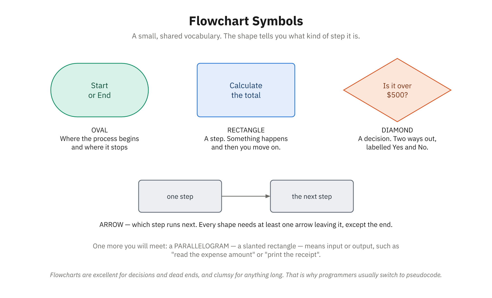

# Topic 1: Problem-Solving with Computational Thinking

## What Is Computational Thinking?

Computational thinking is not about computers. It's a way of approaching problems—any problems—by breaking them down, recognizing patterns, abstracting complexity, and designing step-by-step solutions. You probably use elements of computational thinking already, especially if you've worked in business, operations, or project management. Programming is simply where computational thinking is most formalized and rigorously applied.

Consider a situation you might have faced in your career: planning a product launch. You probably:
- **Broke the launch into phases** (research, development, testing, marketing, launch)
- **Recognized patterns** from previous launches
- **Focused on what mattered** (launch date, key markets, critical features) while ignoring details that didn't
- **Designed a sequence of steps** to move from concept to launch

That's computational thinking. You were solving a complex problem by applying the same four pillars that programmers use every day.

In programming, computational thinking is even more critical because computers do exactly what you tell them to do—no more, no less. You can't rely on human intuition or judgment on the other end. You must think through every step, anticipate every scenario, and communicate your solution with perfect clarity.

## The Four Pillars of Computational Thinking

Computational thinking rests on four interconnected concepts. Understanding these pillars will change how you approach problem-solving, both in programming and in other areas of your professional life.


*None of this is typing. This is the part of programming you can practise on paper.*

### Pillar 1: Decomposition

**Decomposition** means breaking a large, complex problem into smaller, more manageable parts. When you decompose a problem, you're asking: "What are the smaller problems I need to solve to solve the big problem?"

#### Why Decomposition Matters

A recipe for Thanksgiving dinner isn't written as "make Thanksgiving dinner." It's broken into components: prepare the turkey, make the stuffing, cook the vegetables, make the gravy, set the table, prepare dessert. Each component is smaller and more focused than the original goal, which makes it less overwhelming and easier to coordinate.

Programming works the same way. A payroll system is never built as "make a payroll system." It's decomposed into: collect employee hours, validate the hours, calculate gross pay, calculate deductions, calculate net pay, generate paychecks, update accounting records. Each piece can be understood, tested, and modified independently.

#### Decomposition in Business Contexts

If you've worked in project management, business analysis, or operations, you've done decomposition under different names:

**Breaking a project into phases and tasks:** A software development project might decompose into requirements gathering, architecture design, development, testing, and deployment. Each phase has specific deliverables and milestones.

**Organizing a company structure:** An organization chart is a form of decomposition. A CEO doesn't do everything; the work is divided among departments, each with specific responsibilities. Those departments are further divided into teams.

**Analyzing a business process:** When you document a workflow—say, the customer onboarding process—you're decomposing it into steps: collect contact info, verify credit, set up account, send confirmation, schedule training. Each step is a smaller problem contributing to the overall solution.

#### How Programmers Use Decomposition

In code, decomposition manifests as **functions** and **modules**. A payroll calculation might be decomposed like this:

```
Program: CalculatePayroll
  |
  ├─ Function: CollectHours()
  |  ├─ Validate each hour entry
  |  └─ Sum total hours worked
  |
  ├─ Function: CalculatePay()
  |  ├─ Function: CalculateGrossPay()
  |  ├─ Function: CalculateTaxes()
  |  └─ Function: CalculateDeductions()
  |
  ├─ Function: GeneratePaycheck()
  |
  └─ Function: UpdateRecords()
```

Each function solves a smaller part of the problem. The main program coordinates them.

#### Decomposition Strategy: Top-Down and Bottom-Up

There are two approaches to decomposition:

**Top-down decomposition:** Start with the big problem and break it into smaller parts. This is like planning a project: "We need a payroll system. That requires collecting hours, calculating pay, and generating checks." You keep breaking things down until each part is small enough to implement.

**Bottom-up decomposition:** Start with small, basic tasks and think about how they combine to solve larger problems. This is like building with LEGO blocks: you have small, simple pieces that combine into more complex structures.

Most programmers use both approaches. You start top-down to understand the big picture, then switch to bottom-up thinking as you implement each component.

#### Decomposition Exercise: Planning an Event

Let's decompose the problem "plan a company conference" into manageable pieces:

**Level 1 (High-level tasks):**
- Secure venue
- Organize logistics
- Coordinate content
- Manage attendees
- Execute event

**Level 2 (Decomposing "Secure venue"):**
- Research venues
- Compare options (capacity, cost, location, amenities)
- Negotiate contract
- Reserve dates
- Confirm requirements with venue

**Level 3 (Decomposing "Compare options"):**
- For each venue candidate:
  - Get capacity (does it fit attendees?)
  - Get cost (is it within budget?)
  - Get location (is it accessible?)
  - Get available dates (can we get our preferred dates?)
  - Evaluate amenities (breakout rooms, AV capability, catering options)

You can see how the big, vague problem "plan a conference" becomes a series of concrete, solvable subproblems.

### Pillar 2: Pattern Recognition

**Pattern recognition** means identifying similarities, regularities, and trends in problems or data. Humans are naturally good at spotting patterns—it's how we learn and make sense of the world. In programming, pattern recognition helps you avoid reinventing solutions and design more elegant code.

#### Why Pattern Recognition Matters

In business, pattern recognition has enormous value. A sales analyst looking at quarterly revenue might recognize a seasonal pattern: "Summer months always have 30% higher sales." A marketer analyzing customer behavior might recognize: "Customers who receive personalized email have 2x higher conversion rates than those who receive generic email." An operations manager analyzing production data might recognize: "Equipment failures spike after six months of operation."

Once you recognize a pattern, you can act on it. In the equipment example, recognizing the six-month pattern leads to preventive maintenance at five months, avoiding costly failures.

Programming is no different. Programmers constantly recognize patterns:
- "I've written this validation check three times; I should write it once as a reusable function"
- "This data follows a hierarchical pattern (category → subcategory → item), so a tree structure would be efficient"
- "This algorithm is slower than it needs to be because it repeats the same calculations"

#### Pattern Recognition in Data

Let's say you're analyzing customer purchase history:

```
Customer A: buys widgets monthly
Customer B: buys widgets monthly
Customer C: buys widgets monthly
...pattern recognized: regular purchasing behavior

Customer D: bought widgets 3 times, then nothing for 6 months
Customer E: bought widgets 3 times, then nothing for 6 months
...pattern recognized: initial trial followed by churn
```

Recognizing this pattern lets you:
- Treat regular customers differently from trial customers
- Focus retention efforts on the "trial-and-churn" group
- Design your code to handle these different customer types appropriately

#### Common Patterns in Programming

Programmers have identified common patterns that appear repeatedly in different contexts. Some patterns are about how data is structured:

**Hierarchical patterns:** A company has departments, departments have teams, teams have individuals. An ecommerce site has categories, categories have products, products have variants. When you see this pattern, it tells you something about how to organize your data.

**Sequential patterns:** A customer goes through steps in order: browse, add to cart, checkout, enter payment, confirm. When you recognize the sequence, you know the order matters and shouldn't be changed.

**Cyclical patterns:** Business cycles with regular repetitions (daily, weekly, seasonal). Equipment maintenance cycles. Software release cycles. When you recognize a cycle, you can predict and plan accordingly.

**Exception patterns:** Some cases are special. "Most customers pay by credit card, but VIP customers can arrange invoicing." Most transactions are standard, but some require supervisor approval." Recognizing these patterns helps you handle special cases without cluttering the main logic.

#### Pattern Recognition and Code Reuse

One of the most practical applications of pattern recognition is recognizing when the same logic appears in multiple places. Instead of writing it multiple times, you write it once and reuse it.

For example, you might notice this pattern in your code:

```
Situation 1: Check if user age is valid
  IF age < 0 THEN
    PRINT error message
    RETURN false
  ENDIF
  IF age > 150 THEN
    PRINT error message
    RETURN false
  ENDIF

Situation 2: Check if salary is valid
  IF salary < 0 THEN
    PRINT error message
    RETURN false
  ENDIF
  IF salary > 1000000 THEN
    PRINT error message
    RETURN false
  ENDIF
```

You've recognized the pattern: "validating that a number is within a range." Once recognized, you write it once as a reusable function:

```
Function ValidateRange(value, min, max)
  IF value < min OR value > max THEN
    PRINT "Value out of range"
    RETURN false
  ENDIF
  RETURN true
END

// Now use it everywhere:
IF NOT ValidateRange(age, 0, 150) THEN
  RETURN false
ENDIF

IF NOT ValidateRange(salary, 0, 1000000) THEN
  RETURN false
ENDIF
```

This is code reuse through pattern recognition. It's more maintainable, less error-prone, and easier to understand.

### Pillar 3: Abstraction

**Abstraction** means focusing on the relevant details while ignoring irrelevant complexity. In essence, you're asking: "What do I need to know to solve this problem, and what can I safely ignore?"

#### Why Abstraction Matters

Your brain has limited processing capacity. When you abstract, you reduce cognitive load by hiding unnecessary complexity. A map of a city is an abstraction of the real city. It shows streets, landmarks, and transit but omits every building, tree, and person. That's the right level of detail for navigation; showing everything would be overwhelming.

In business, abstractions are everywhere:

**Financial summaries** are abstractions. A CEO doesn't need to know every transaction a company made; they need a summary: "Revenue is $10M, costs are $8M, profit is $2M." That abstraction hides thousands of individual transactions but reveals the essential picture.

**Organization charts** are abstractions. They show reporting structure and responsibilities but hide the informal relationships, actual influence, and daily interactions that make an organization work.

**Process documentation** abstracts away the personalities, politics, and small variations to show the standard flow that should happen.

#### Levels of Abstraction

Abstraction works at different levels. Consider a car:

**Level 1 - User perspective:** Turn the key, press the accelerator, turn the wheel. You don't need to know how the engine works.

**Level 2 - Mechanic perspective:** Understand the fuel system, ignition system, brake system, transmission. You abstract away the fact that spark plugs contain ceramic, the exact metallurgy of the brake pads, etc.

**Level 3 - Engineer perspective:** Understand combustion chemistry, material science, electrical theory. Different level of abstraction for a different purpose.

In programming, you use abstraction the same way. When you call a function called `CalculateTax()`, you don't need to know how tax calculations work internally. You just need to know: "Give it an income, get back a tax amount." The implementation is abstracted away.

#### Examples of Abstraction in Programming

**Database abstraction:** Your program doesn't need to know whether data is stored in MySQL, PostgreSQL, or SQL Server. Your program calls database functions; the database layer abstracts away the specific database system.

**Operating system abstraction:** Your program doesn't need to know whether it's running on Windows, macOS, or Linux. The operating system abstracts away those differences.

**User interface abstraction:** A user sees a "Save" button. They don't need to know whether the system is writing to disk, uploading to cloud storage, or syncing to a database. The system abstracts away the implementation details.

#### Abstraction in Data Structures

A list is an abstraction. Users of a list don't need to know whether it's stored as an array in memory, a linked list, or some other internal structure. They just need to know: "I can add items, remove items, access items by position, check the size." The internal details are abstracted away.

Similarly, a "customer" is an abstraction. The program doesn't store "John Smith, born 1980, address is 123 Main St, phone is 555-1234" as separate pieces of data. It abstracts this into a "customer object" with properties: name, birth date, address, phone. The program works with "customers," abstracting away the underlying data.

#### The Danger of Over-Abstraction

Like anything, abstraction can be taken too far. If you abstract away important details, you lose information critical to understanding the problem.

A weather forecast is useful because it has the right level of abstraction: temperature, precipitation chance, wind. If it only said "weather tomorrow: yes," that's too much abstraction.

In programming, this happens when:
- Code is so generic it's hard to understand what it actually does
- Abstractions hide performance implications (a function that looks fast but isn't)
- Details necessary for debugging or security are hidden

The goal is **appropriate abstraction**: hiding complexity that doesn't matter while keeping visible what does.

### Pillar 4: Algorithm Design

**Algorithm design** means creating a sequence of precise, unambiguous steps to solve a problem. An algorithm is more than just an idea; it's a detailed specification of exactly how to solve something.

We'll cover algorithms in depth in Topic 4, but it's important to introduce the concept here as part of computational thinking.

#### What Makes an Algorithm

An algorithm must have these properties:

**Clear input:** The algorithm knows what information it's starting with. "Here are these numbers; sort them."

**Clear output:** The algorithm knows what result it should produce. "I should have sorted numbers in ascending order."

**Unambiguous steps:** Each step is precise and leaves no room for interpretation. "If this, then that"—no guessing.

**Termination:** The algorithm must eventually finish. It doesn't loop forever.

**Correctness:** The algorithm produces the right answer.

#### Algorithm Design in Business

In business, algorithms are called "processes" or "procedures":

**Customer onboarding process:**
1. Receive inquiry
2. Send information packet
3. IF customer interested, THEN:
   - Collect contact details
   - Run credit check
   - IF credit approved, THEN:
     - Create account
     - Send welcome email
     - Schedule training
   - ELSE:
     - Send decline letter
4. END IF
5. Archive record

This algorithm is unambiguous; anyone following it gets the same result.

**Expense approval process:**
1. Employee submits receipt and business justification
2. Expense < $500? Approve and proceed to step 4
3. Expense >= $500? Send to manager for approval
4. Manager reviews receipt, business justification, and budget
5. IF approved, THEN mark approved, proceed to step 6
6. IF not approved, THEN send denial email to employee, END
7. Accounting processes the reimbursement

This algorithm handles normal cases and exceptions; it's specific enough to follow consistently.

#### Designing Good Algorithms

Designing a good algorithm requires:

**Understanding the problem deeply:** Before you design steps, you need to understand what you're solving. What inputs will we get? What output do we need? What constraints exist?

**Identifying the approach:** There are usually multiple ways to solve a problem. Some are better than others. Do we need a systematic, step-by-step approach? Do we need to consider special cases? Will we need to sort, search, or transform data?

**Writing steps precisely:** Each step must be clear and unambiguous. "Find the largest number" is too vague. "Compare the first number to the second. Keep whichever is larger. Compare that to the third. Keep whichever is larger. Continue until you've compared with all numbers. The largest is the one you're keeping" is precise.

**Testing the algorithm:** Trace through your algorithm with sample input. Does it work for typical cases? Does it handle edge cases (very small input, very large input, unusual patterns)?

## Breaking Down Complex Problems: Decomposition in Depth

Let's explore decomposition more deeply because it's the cornerstone of programming. How programmers decompose problems directly affects how good their code is.

### The Art of Knowing Where to Cut

When decomposing a problem, you make decisions about where to divide it. These decisions matter. Poor decomposition leads to:
- Functions that are too large and hard to understand
- Functions that do too many things and are hard to test
- Functions that are too small and the overhead of calling them outweighs their benefit

Good decomposition leads to:
- Clear, focused functions each doing one job
- Functions that are easy to test, debug, and modify
- Code that's easy for other programmers (and future you) to understand

How do you know where to cut? Ask:
- **Is this a distinct task?** Does this piece represent a complete, recognizable task? "Calculate gross pay" is a distinct task. "Multiply hours by rate" might be part of calculating gross pay, but it's not distinct enough to be its own function.
- **Could I reuse this?** If you might need this logic in another part of the program, it should be its own function.
- **Can someone understand it at a glance?** If the logic is complex, it probably needs to be broken down further.
- **Does changing this require changing something else?** If two pieces are tightly coupled, they're probably not decomposed correctly.

### Worked Example: Decomposing an Event Planning System

Let's decompose "build an event planning system" step by step.

**Level 1 - The big problem:**
"Build a system where customers can browse events, buy tickets, and event organizers can manage events."

This is too big. Decompose it.

**Level 2 - Major functional areas:**
- Event Management (organizers create/edit/delete events)
- Event Browsing (customers search/filter/view events)
- Ticket Management (tracking tickets, availability, sales)
- Payment Processing (taking money safely and securely)
- User Management (login, authentication, profiles)

Good. Now each is a major component. Let's decompose further.

**Level 3 - Decomposing Event Management:**
- Create Event (organizer enters event details)
- Edit Event (organizer updates details)
- Delete Event (organizer removes an event)
- View Event Details (organizer sees their own event)

**Level 3 - Decomposing Event Browsing:**
- Search Events (find events by keyword)
- Filter Events (show only events matching criteria)
- View Event Details (customer sees full event information)
- View Customer Reviews (customer sees other customers' opinions)

**Level 4 - Decomposing Search Events:**
- Accept search terms from user
- Query database for matching events
- Sort results by relevance
- Return matching events

You can see how the big problem breaks down into smaller, increasingly specific tasks. A programmer would implement each task as a function or group of functions.

### Common Mistakes in Decomposition

**Decomposing too much:** Breaking things down so finely that there are hundreds of tiny functions, each doing almost nothing. This creates overhead and makes the overall flow hard to understand.

**Decomposing too little:** Keeping functions large because "they work." This creates code that's hard to understand, test, and modify.

**Wrong boundaries:** Grouping things together that don't belong, or separating things that conceptually belong together.

**Ignoring patterns:** Not recognizing that similar logic appears in multiple places, leading to duplicated code instead of reused functions.

The right level of decomposition comes with experience. As you read code, implement algorithms, and practice decomposition, you'll develop an intuition for good decomposition.

> **🤖 Working with AI:** An AI assistant can be a useful thinking partner here—ask it to brainstorm ways to break a problem down or to suggest steps you might have missed. But the decomposition is yours to own. Read every suggestion critically, check that the steps actually fit your problem, and make sure you understand the logic before you adopt it. **Verify the output:** AI is a partner for your thinking, not a substitute for understanding it.

## Pattern Recognition in Practice

Let's look at how pattern recognition improves code.

### Recognizing Repetition

Original code (no pattern recognition):
```
// Calculate bonus for sales team
FUNCTION CalculateSalesBonus(totalSales)
  IF totalSales < 10000 THEN
    RETURN 0
  ENDIF
  IF totalSales >= 10000 AND totalSales < 25000 THEN
    RETURN totalSales * 0.05
  ENDIF
  IF totalSales >= 25000 AND totalSales < 50000 THEN
    RETURN totalSales * 0.10
  ENDIF
  IF totalSales >= 50000 THEN
    RETURN totalSales * 0.15
  ENDIF
END

// Calculate bonus for support team
FUNCTION CalculateSupportBonus(tasksCompleted)
  IF tasksCompleted < 100 THEN
    RETURN 0
  ENDIF
  IF tasksCompleted >= 100 AND tasksCompleted < 250 THEN
    RETURN tasksCompleted * 1.50
  ENDIF
  IF tasksCompleted >= 250 AND tasksCompleted < 500 THEN
    RETURN tasksCompleted * 2.50
  ENDIF
  IF tasksCompleted >= 500 THEN
    RETURN tasksCompleted * 3.50
  ENDIF
END
```

**Pattern recognized:** Both functions use the same tier-based bonus structure. The tiers are different, but the logic is identical.

**Improved code (pattern extracted into reusable function):**
```
FUNCTION CalculateTieredBonus(value, tiers)
  bonus = 0  // default if value matches no tier above the lowest
  // NOTE: tiers must be ordered from lowest minimumValue to highest,
  // so the last tier that matches (the highest one the value qualifies for) wins.
  FOR EACH tier IN tiers
    IF value >= tier.minimumValue THEN
      bonus = value * tier.rate
    ENDIF
  END
  RETURN bonus
END

// Define tiers once
salesTiers = [
  {minimumValue: 0, rate: 0.00},
  {minimumValue: 10000, rate: 0.05},
  {minimumValue: 25000, rate: 0.10},
  {minimumValue: 50000, rate: 0.15}
]

supportTiers = [
  {minimumValue: 0, rate: 0.00},
  {minimumValue: 100, rate: 1.50},
  {minimumValue: 250, rate: 2.50},
  {minimumValue: 500, rate: 3.50}
]

// Use it for both
salesBonus = CalculateTieredBonus(totalSales, salesTiers)
supportBonus = CalculateTieredBonus(tasksCompleted, supportTiers)
```

The improved version:
- Reduces code duplication
- Makes the pattern explicit
- Makes it easier to add new tiers or new bonus types
- Is easier to test

### Recognizing Data Patterns

You might notice a pattern in your data:

```
Problem: Many functions check if a customer is "premium"
A customer is premium if:
  - Lifetime purchases > $10000 AND
  - Account age > 12 months AND
  - No unpaid invoices

This same check appears in 7 different functions.
```

**Pattern recognized:** The definition of "premium" is a property that belongs on the customer, not scattered across multiple functions.

**Solution:** Create a function that encapsulates this definition:

```
FUNCTION IsCustomerPremium(customer)
  IF customer.lifetimePurchases > 10000 AND
     customer.accountAgeDays > 365 AND
     customer.unpaidInvoices = 0 THEN
    RETURN true
  ELSE
    RETURN false
  ENDIF
END
```

Now all 7 functions call `IsCustomerPremium()` instead of having their own definition. If the definition of "premium" changes, you update one function, and all 7 places automatically reflect the change.

## Applying Computational Thinking: The Problem-Solving Cycle

Real-world problem solving isn't a straight line. It's a cycle: understand, plan, implement, review. You often loop back to earlier stages as you learn more.

### Stage 1: Understand the Problem

Before you do anything, understand what you're solving.

**What are the inputs?** What information do you start with?

**What are the outputs?** What should the solution produce?

**What are the constraints?** What restrictions apply? Does it need to be fast? Use little memory? Handle errors gracefully? Follow certain rules?

**What are the edge cases?** What unusual or boundary situations might occur? Empty input? Very large input? Invalid input? Duplicate input?

**Example:** "Build a feature that shows a customer their order history"

- *Inputs:* Customer ID
- *Outputs:* Ordered list of past orders, each showing date, items ordered, and total cost
- *Constraints:* Page loading time < 2 seconds, must work even if a customer has 10,000+ orders
- *Edge cases:* Customer with no orders, customer who just signed up, very old orders from before the system existed

### Stage 2: Plan Your Approach

Now you design your solution conceptually before writing code.

**Decompose:** Break the problem into smaller parts.
**Recognize patterns:** Have you solved something similar before?
**Abstract:** What details matter? What can you ignore?
**Design the algorithm:** What's your step-by-step approach?

**Example continued:**

- Decompose: (1) Find the customer in the database, (2) Find their orders, (3) Retrieve items for each order, (4) Format and display
- Patterns: "Find data for a specific customer ID"—this pattern appears elsewhere; can we reuse the code?
- Abstraction: Don't show all 50 fields stored for each order; show only what customers care about (date, what they ordered, how much)
- Algorithm:
  1. Receive customer ID
  2. Query database: find customer with this ID
  3. If not found, show "Customer not found" and return
  4. Query database: find all orders for this customer, sorted by date (newest first)
  5. For each order, retrieve the items from that order
  6. Format as HTML table or JSON response
  7. Return to user

### Stage 3: Implement

Now you write code following your plan. If you planned well, implementation is straightforward—you're just translating your plan into a programming language.

### Stage 4: Review and Verify

Test your solution. Does it work? Is it efficient? Is it understandable? What could be better?

- **Does it work?** Test with normal inputs. Test with edge cases. Does it break anywhere?
- **Is it correct?** Does it produce the right answer?
- **Is it efficient?** Is it fast enough? Does it use memory efficiently?
- **Is it clear?** Could another programmer understand this code? Could you understand it six months from now?
- **Are there errors?** What happens if something goes wrong (invalid input, database error)?

If your review reveals problems, loop back to earlier stages. Often you'll realize: "I didn't understand the problem correctly" (back to Stage 1), or "My approach won't work" (back to Stage 2), or "I can simplify the code" (back to Stage 3).

## Pseudocode and Flowcharts: Tools for Thinking

Before we transition to code, we need tools to express algorithms clearly. Two tools are essential: pseudocode and flowcharts.

### What Is Pseudocode?

Pseudocode is language-independent notation for expressing algorithms. It looks like code but doesn't follow any specific programming language's syntax. The goal is to be clear and unambiguous without worrying about the details of a particular language.

Here's pseudocode for a simple algorithm:

```
FUNCTION FindLargestNumber(numberList)
  IF numberList is empty THEN
    RETURN error "Cannot find max of empty list"
  ENDIF

  largest = numberList[0]

  FOR i = 1 TO length of numberList
    IF numberList[i] > largest THEN
      largest = numberList[i]
    ENDIF
  END FOR

  RETURN largest
END
```

This pseudocode is clear about:
- What input the function expects (a list of numbers)
- What it returns (the largest number)
- The exact steps it follows
- How it handles an edge case (empty list)

You could translate this pseudocode into any real programming language (Python, Java, JavaScript, C++) and get the correct implementation. The logic is language-independent.

### Why Use Pseudocode?

In real programming, developers often write pseudocode first, then translate it to a real programming language. Why?

- **Focuses on logic, not syntax:** You're thinking about the algorithm, not remembering syntax rules.
- **Language-independent:** You can discuss algorithms with programmers who use different languages.
- **Easier to review:** Non-programmers can often understand pseudocode well enough to verify the logic.
- **Easier to modify:** It's easier to rethink an algorithm in pseudocode than to rewrite code.

For this course, we use pseudocode extensively. This forces you to understand **what** an algorithm does and **why**, which is more important than **how** a specific language implements it.

### Flowcharts: Visual Representation

A flowchart uses diagrams to represent an algorithm visually. Standard shapes represent different operations:



*A small, shared vocabulary. The shape tells you what kind of step it is.*

- **Rectangle:** A process or step (e.g., "Calculate total")
- **Diamond:** A decision point (e.g., "Is age > 18?")
- **Oval:** Start or end point
- **Parallelogram:** Input or output
- **Arrow:** Flow direction

Here's a flowchart for a simple approval process:

```
                    [START]
                       |
                       v
          [Receive expense request]
                       |
                       v
          [Is amount < $500?]----No----> [Send to manager]
                       |                        |
                      Yes                       v
                       |          [Manager approves?]
                       |                  |     |
                       v                 Yes   No
          [Approve immediately]          |      |
                       |                 |      v
                       |                 |  [Deny request]
                       |                 |      |
                       v<----------------       |
          [Process reimbursement]<--------------
                       |
                       v
                  [END]
```


*Read it out loud and you have the rule in plain English.*

Flowcharts are useful for understanding flow and decision points, especially for non-programmers. However, they can become cumbersome for complex algorithms, which is why programmers usually prefer pseudocode.

## Common Logical Fallacies and Thinking Errors

Even experienced programmers make thinking errors. Recognizing these errors helps you avoid them.

### Off-by-One Errors

This is the most common error in programming. It's the mistake of counting wrong by one.

**Example:**
```
FUNCTION PrintNumbers(n)
  FOR i = 0 TO n
    PRINT i
  END FOR
END
```

If you want to print numbers 0 through 9 (10 numbers), and you call `PrintNumbers(9)`, this function will loop from 0 to 9 inclusive—that's 10 numbers. Correct.

But if you want to print 10 numbers and call `PrintNumbers(10)`, the function will print 0 through 10—that's 11 numbers. Off by one.

The error comes from imprecision in thinking: "I'll loop until i equals n" vs. "I'll loop i times starting from 0."

### Forgetting Edge Cases

Programmers often write logic for the "happy path"—the normal case—and forget about edge cases.

**Example:** "Users can rate products 1 to 5 stars."

```
FUNCTION GetAverageRating(ratings)
  sum = 0
  FOR EACH rating IN ratings
    sum = sum + rating
  END FOR
  average = sum / length of ratings
  RETURN average
END
```

This works fine if there's at least one rating. But what if there are no ratings? You'd divide by zero—an error.

A programmer who thinks through edge cases would write:

```
FUNCTION GetAverageRating(ratings)
  IF length of ratings = 0 THEN
    RETURN null  // or 0, or "no ratings yet"
  ENDIF
  sum = 0
  FOR EACH rating IN ratings
    sum = sum + rating
  END FOR
  average = sum / length of ratings
  RETURN average
END
```

### Assuming Input Is Always Valid

Programmers sometimes assume input is always correct. But in reality, users make mistakes, data gets corrupted, and systems send unexpected information.

**Risky assumption:**
```
FUNCTION ProcessAge(ageString)
  age = convert ageString to number
  IF age > 18 THEN
    PRINT "Adult"
  ELSE
    PRINT "Minor"
  ENDIF
END
```

What if `ageString` is "abc"? Converting that to a number might crash the program.

**Better approach:**
```
FUNCTION ProcessAge(ageString)
  IF ageString is empty THEN
    PRINT "Error: age required"
    RETURN
  ENDIF

  age = convert ageString to number
  IF age is invalid number THEN
    PRINT "Error: age must be a number"
    RETURN
  ENDIF

  IF age < 0 OR age > 150 THEN
    PRINT "Error: age out of reasonable range"
    RETURN
  ENDIF

  IF age > 18 THEN
    PRINT "Adult"
  ELSE
    PRINT "Minor"
  ENDIF
END
```

This checks the input before using it.

### Logical AND/OR Confusion

Beginners sometimes mix up AND and OR logic.

**Problem:** "Find customers who live in California OR Oregon"

**Wrong approach (AND instead of OR):**
```
IF customer.state = "CA" AND customer.state = "OR" THEN
  // This is impossible! A state can't be both CA and OR at the same time
END
```

**Correct approach:**
```
IF customer.state = "CA" OR customer.state = "OR" THEN
  // This customer is in one of our target states
END
```

**Problem:** "Only let users who are at least 18 years old AND have verified their email"

**Correct approach:**
```
IF user.age >= 18 AND user.emailVerified = true THEN
  // Both conditions must be true
END
```

### Infinite Loops

A loop that never terminates is a serious error.

**Example:**
```
count = 0
WHILE count < 10
  PRINT "Hello"
  // Oops! Forgot to increment count
END WHILE
// This will print "Hello" forever
```

**Corrected:**
```
count = 0
WHILE count < 10
  PRINT "Hello"
  count = count + 1
END WHILE
```

The lesson: when writing loops, verify that your termination condition will eventually become false.

### Modifying Data While Iterating

Changing a list while you're looping through it can cause unexpected behavior.

**Problem:**
```
items = ["apple", "banana", "cherry"]
FOR EACH item IN items
  IF item = "banana" THEN
    REMOVE item from items
  ENDIF
END FOR
```

Depending on how the loop is implemented, removing "banana" while iterating might skip the next item or cause other errors.

**Solution:** Collect items to remove first, then remove them after the loop:

```
items = ["apple", "banana", "cherry"]
itemsToRemove = []
FOR EACH item IN items
  IF item = "banana" THEN
    ADD item to itemsToRemove
  ENDIF
END FOR
FOR EACH item IN itemsToRemove
  REMOVE item from items
END FOR
```

## Connecting to Real Programming Languages

Computational thinking concepts map directly to programming language features. Here's how:

**Decomposition** → Functions/methods/classes
- When you decompose a problem, you're creating the functions that a program will call.

**Abstraction** → Data structures, functions, libraries
- When you abstract, you're deciding what interface to expose and what to hide.

**Pattern recognition** → Code reuse, design patterns
- When you recognize patterns, you're identifying opportunities to write once and use many times.

**Algorithm design** → Control flow, data structure choice
- When you design algorithms, you're deciding how to use loops, conditionals, and data structures to solve the problem.

## The Problem-Solving Mindset

The most important takeaway from this topic is the **problem-solving mindset**. Before you write code, you:

1. **Understand the problem deeply.** Don't guess; ask clarifying questions.
2. **Break it down.** Decompose large problems into smaller, manageable parts.
3. **Recognize patterns.** Look for similarities to problems you've solved before.
4. **Abstract appropriately.** Decide what details matter and what you can ignore.
5. **Design the algorithm.** Create a step-by-step plan before writing code.
6. **Handle edge cases.** Think about what could go wrong.
7. **Test and verify.** Make sure your solution actually works.

This mindset transfers to every programming project you'll encounter. It's the difference between programmers who write code that works and programmers who write code that's maintainable, understandable, and correct.

---

## Review and Discussion Questions

1. **Decomposition in your field:** Think of a complex problem from your previous career (or a business process you understand well). How would you decompose it into smaller parts? What are the challenges in deciding where to divide the problem?

2. **Pattern recognition:** Describe a situation where you recognized a pattern in data, behavior, or processes at work. How did recognizing the pattern help you solve the problem or make better decisions?

3. **Abstraction levels:** Consider a tool or system you use regularly (email, a spreadsheet, a database). What details are abstracted away from the user? Why are those details hidden? What would happen if they weren't?

4. **Algorithm in your work:** Describe a process or procedure from your professional background as an algorithm. Write it out step-by-step with decision points and conditions. Does viewing it this way reveal any gaps or improvements?

5. **Edge case thinking:** Choose an algorithm from this topic (or one you know well). What edge cases might occur? How would you modify the algorithm to handle them gracefully?
