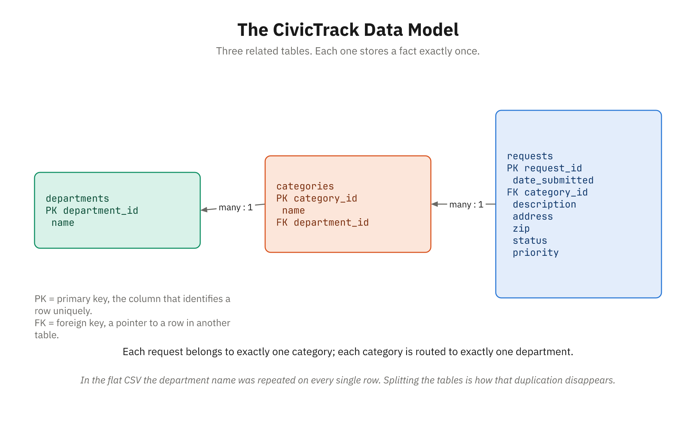

# Topic 3: Introduction to Databases

## Exploring SQL and NoSQL Systems and Their Use in Modern Applications

---

## Introduction: Beyond Spreadsheets

A database is a purpose-built system for storing, organizing, and retrieving data. While spreadsheets are general-purpose tools that happen to store data, databases are specialized for one job: managing data efficiently, reliably, and at scale.

When you use a spreadsheet, you're interacting with it directly—opening the file, editing cells, saving your work. When you use a database, you're using it through an intermediary—a program or application that sends requests to the database asking for data, waiting for results, and presenting them to you.

This distinction is fundamental. A database isn't something you directly see or interact with the way you interact with a spreadsheet. Instead, databases are a hidden layer that applications rely on. When you use a web application, check your bank balance, or search for a product online, you're using a database without seeing it.

This topic introduces the world of purpose-built data systems. You'll learn why databases exist, what problems they solve, how they work, and the major paradigms (SQL databases and NoSQL databases) that dominate modern systems.

---

## What Is a Database? More Than a Spreadsheet

A **database** is an organized collection of structured data along with a system for storing, retrieving, and managing that data. But this definition alone doesn't capture what makes databases powerful and necessary.

To understand why databases exist, consider what you'd need to build if databases didn't exist:

### The Problem: Why Databases Exist

Imagine you're building a system for an online store. Thousands of customers browse products, add items to carts, and place orders. You need to:

**Store data reliably**: If the system crashes, you can't lose customer information or order history. You need automatic backups, crash recovery, and redundancy.

**Handle multiple users simultaneously**: Hundreds of customers might be browsing and buying at the same time. Two customers can't both think they got the last item in stock.

**Query efficiently**: When a customer logs in, the system needs to instantly retrieve their profile, order history, and recommended products. This can't require scanning through millions of records.

**Maintain consistency**: If a customer places an order and pays for it, the system must ensure that either both happen or neither happens. Partial order placement is unacceptable.

**Control access**: Some employees should see customer data. Others should only see inventory. Some should only see sales reports.

**Audit changes**: If there's a dispute about an order, you need to know exactly what happened and when.

You could build all this yourself, but it would be enormous work. Databases provide all of this built-in.

### What Databases Provide

The following capabilities make databases the foundation of modern systems:

**Concurrency**: Multiple users can access and modify data simultaneously without corrupting it. The database handles the complexity of ensuring consistency.

**Integrity**: Data remains accurate and consistent. Constraints prevent invalid states. Relationships between data are maintained.

**Reliability**: Data persists even if the system crashes. Backups are automatic. Recovery is built in.

**Scalability**: A well-designed database handles growth from thousands of records to millions without you rethinking the design — you add indexes, not a new architecture. (Past a certain size the game does change, and the "Tradeoffs" section later in this topic covers what happens then.)

**Query power**: You can ask complex questions about data and get answers quickly, even when examining millions of records.

**Security**: Access control, encryption, and audit trails protect sensitive data.

**Separation of concerns**: Applications don't need to understand all the details of how data is stored and retrieved. They send requests and get results.

---

## Relational Databases: The Standard Approach

The majority of business systems use **relational databases** (also called **RDBMS** for Relational Database Management System). Relational databases are based on the tabular data model from the first topic—data organized in tables with rows, columns, and relationships.



*Each request belongs to exactly one category; each category is routed to exactly one department.*

### The Relational Model

The relational model is based on tables (also called relations), where:

- Each table represents one type of entity (departments, categories, service requests)
- Each row is one instance of that entity
- Each column is an attribute of the entity
- Relationships between tables are expressed through foreign keys

Here's CivicTrack's model, using the data we cleaned up in the previous topic:

**departments table:**
| department_id | name |
|---|---|
| 1 | Public Works |
| 3 | Code Enforcement |

**categories table:**
| category_id | name | department_id |
|---|---|---|
| 1 | Pothole | 1 |
| 2 | Streetlight | 1 |
| 5 | Graffiti | 3 |

**requests table** (abbreviated — the full table also carries description, address, zip, and priority):
| request_id | date_submitted | category_id | status |
|---|---|---|---|
| SR-1001 | 2026-03-01 | 1 | Resolved |
| SR-1004 | 2026-03-02 | 5 | New |
| SR-1014 | 2026-03-07 | 1 | In Progress |

The relationships are expressed through those id columns. When you see `category_id = 1` on a
request, you look up category 1 and find `Pothole`; that category's `department_id = 1` tells you
Public Works handles it. Two hops, and you've gone from a row of ids to "a pothole, and it's Public
Works' problem."

Notice what this buys you. In the flat CSV, the word "Pothole" was typed out on every pothole row —
which is exactly how one of them ended up as "pot hole" and broke the count. Here it's stored
**once**, in one place. Fix it there and every request that points to it is fixed too. The word for
this is **normalization**, and it's the subject of the next section.

### Normalization: Storing Each Fact Exactly Once

**Normalization** is the practice of organizing data so that every fact lives in exactly one place.
That's the whole idea. Everything else is detail.

You already know why it matters, because you met the alternative. In the messy CivicTrack export,
the department name was spelled out on all fourteen rows. That single design choice caused three
separate problems:

- **Update problems.** The city renames "Parks & Rec" to "Parks and Recreation." In the flat file you
  have to find and change every row, and you will miss one. In the normalized model you change one
  row in `departments` and you're done.
- **Inconsistency.** Because the value is typed repeatedly, it drifts — "pot hole" versus "Pothole,"
  "in progress" versus "In Progress." Every duplicate is another chance to typo. Store it once and
  there's nothing to drift from.
- **Things you can't record.** Suppose the city creates a new department that hasn't received any
  requests yet. In a flat file there's nowhere to put it — no request, no row, no department. With a
  separate `departments` table, it simply exists, waiting.

**A working definition for this course:** a table is well-normalized when each row is about one
thing, each column describes that one thing, and nothing is repeated that could instead be pointed
at. CivicTrack's three tables pass that test — a request is about one complaint, a category is about
one kind of complaint, a department is about one team.

You'll see this discussed formally as "normal forms" — First Normal Form, Second, Third, usually
written 1NF, 2NF, 3NF. They're a precise, stepwise version of the same instinct, and most working
databases stop at 3NF. You don't need them yet. You need the instinct: **when you find yourself
typing the same value into a second row, that value probably wants its own table.**

The trade-off, so you're not surprised later: normalizing means your data is spread across more
tables, so answering a real question takes a JOIN. That's the deal — you trade a little query
complexity for data you can trust. Sometimes teams deliberately go the other way and duplicate data
on purpose to make reads faster, which is called **denormalization**. That's a considered decision
made under measurement, not a shortcut, and it's not where you start.

### Why Relational Databases Work So Well

The relational model has dominated for decades because it:

**Matches how we think about data**: Tables match spreadsheets, which match how business organizes information.

**Eliminates redundancy**: By separating customers from orders, you store customer information once, not once per order.

**Enforces consistency**: Relationships are explicit and can be validated.

**Enables complex queries**: You can join tables, filter, aggregate, and analyze data in powerful ways.

**Scales efficiently**: Decades of research have optimized how relational databases work at any scale.

**Is mathematically sound**: The relational model is based on set theory and has formal guarantees about consistency and correctness.

---

## SQL: The Language of Relational Databases

**SQL** (Structured Query Language) is the standard language for working with relational databases. SQL lets you:

- Create tables (schema)
- Insert data (Create)
- Retrieve data (Read)
- Modify data (Update)
- Delete data (Delete)

SQL is a **declarative** language—you describe *what* you want, not *how* to get it. You say "give me all the requests that are still open," and the database figures out the most efficient way to find them.

> **Everything below runs against CivicTrack.** The examples in this section use the three tables
> defined in [`course-project/data/schema.md`](../../course-project/data/schema.md) — `requests`,
> `categories`, and `departments` — with the fourteen service requests we cleaned up in the last
> topic. That's the same data you'll query live in Demos 23–25 and Activity 14, so the results here
> are the results you'll see on screen. As a reminder of the shape:
>
> ```
> departments (department_id, name)
> categories  (category_id, name, department_id → departments)
> requests    (request_id, date_submitted, category_id → categories,
>              description, address, zip, status, priority)
> ```

### SELECT: Retrieving Data

The `SELECT` statement is how you query data.

**Simple query: Get every service request**

```sql
SELECT * FROM requests;
```

The `*` means "all columns." This returns all fourteen rows from the requests table.

**Specific columns:**

```sql
SELECT request_id, status, priority FROM requests;
```

This returns only those three columns, ignoring the description, address, and the rest.

**With a condition (WHERE clause):**

```sql
SELECT request_id, description FROM requests WHERE status = 'New';
```

This returns just the five requests nobody has picked up yet — the same five the spreadsheet's
`COUNTIF` found in the previous topic.

**With sorting (ORDER BY):**

```sql
SELECT request_id, date_submitted, priority
FROM requests
ORDER BY date_submitted DESC;
```

This returns requests newest-first. `ASC` sorts the other way, and is the default if you leave it off.

**With filtering on a summary (HAVING clause):**

```sql
SELECT status, COUNT(*) AS request_count
FROM requests
GROUP BY status
HAVING COUNT(*) > 2;
```

This shows only the statuses with more than two requests in them — so `Closed` (2) drops out of the
results. We'll explain GROUP BY next.

### Aggregation: Summarizing Data

When you want summary information rather than individual records, you use aggregate functions.

`COUNT()`: How many records?
```sql
SELECT COUNT(*) FROM requests;
```
Returns `14`.

`MIN()` and `MAX()`: Earliest and latest?
```sql
SELECT MIN(date_submitted), MAX(date_submitted) FROM requests;
```
Returns the first and last dates in the batch — `2026-03-01` and `2026-03-07`.

`SUM()` and `AVG()`: Total and average of a **numeric** column.

CivicTrack's `requests` table doesn't have one yet — every column in it is text. But imagine the city
adds a `repair_cost` column that crews fill in when they close a request. Then:

```sql
SELECT SUM(repair_cost), AVG(repair_cost) FROM requests WHERE status = 'Resolved';
```

would give you the total and average cost of the work that's been finished. This is the point at
which a manager stops asking "how many?" and starts asking "how much?" — and it's why deciding
early which columns are numbers and which are text matters so much.

### GROUP BY: Breaking Data Into Groups

`GROUP BY` organizes data into groups and applies aggregates to each group.

```sql
SELECT status, COUNT(*) AS request_count
FROM requests
GROUP BY status;
```

This groups the requests by status and counts each group:

| status | request_count |
|---|---|
| New | 5 |
| In Progress | 4 |
| Resolved | 3 |
| Closed | 2 |

Those four numbers add up to 14, which is a useful sanity check — and they're exactly the numbers
the spreadsheet produced with four separate `COUNTIF` formulas. One SQL statement, same answer,
and it doesn't break when a new status appears.

`GROUP BY` is powerful because it lets you answer questions like:
- How many requests per department?
- How many of each category came in this month?
- What's the average time to close, by priority?

### JOIN: Combining Related Data

A `JOIN` combines rows from two tables based on a relationship.

Look at the `requests` table on its own and you'll notice something unhelpful: it stores
`category_id = 1`, not `'Pothole'`. That number is a pointer into the `categories` table. A JOIN is
how you follow the pointer.

```sql
SELECT r.request_id, c.name AS category, r.status
FROM requests r
JOIN categories c ON r.category_id = c.category_id;
```

| request_id | category | status |
|---|---|---|
| SR-1001 | Pothole | Resolved |
| SR-1002 | Streetlight | In Progress |
| SR-1003 | Trash Pickup | Closed |
| ... | ... | ... |

The `ON` clause is the important part: it says *how* the two tables line up — match a request's
`category_id` to a category's `category_id`. Without a JOIN you'd have to look up each id by hand.

You can chain JOINs to follow the relationship further. A request points to a category, and a
category is routed to a department, so this gets you from a request all the way to the department
responsible for it:

```sql
SELECT d.name AS department, COUNT(*) AS request_count
FROM requests r
JOIN categories  c ON r.category_id = c.category_id
JOIN departments d ON c.department_id = d.department_id
GROUP BY d.name
ORDER BY request_count DESC;
```

| department | request_count |
|---|---|
| Public Works | 6 |
| Code Enforcement | 3 |
| Sanitation | 2 |
| Utilities | 2 |
| Parks & Rec | 1 |

That is the report a city manager actually wants, and it came out of three small tables that each
store one kind of thing.

Different types of JOINs exist:

**INNER JOIN** (shown above): Returns only rows with matches in both tables.

**LEFT JOIN**: Returns all rows from the left table, with matching data from the right table (or NULL if no match).

```sql
SELECT d.name AS department, COUNT(r.request_id) AS open_requests
FROM departments d
LEFT JOIN categories c ON d.department_id = c.department_id
LEFT JOIN requests   r ON c.category_id = r.category_id
                       AND r.status IN ('New', 'In Progress')
GROUP BY d.name;
```

This one starts from `departments`, so **every** department appears — including Sanitation and
Parks & Rec, which have no open requests at all and would silently vanish from an INNER JOIN. They
show up with a count of `0`. "Nothing to report" and "not in the report" look very different to a
manager, and choosing the right JOIN is how you control which one they see.

**RIGHT JOIN**: The opposite of LEFT JOIN.

**FULL OUTER JOIN**: Returns all rows from both tables (supported in some databases but not all).

### CREATE TABLE: Defining Schema

To create a new table, you specify the structure. Here's CivicTrack's `categories` table, written
in **MySQL** syntax:

```sql
CREATE TABLE categories (
  category_id INT PRIMARY KEY AUTO_INCREMENT,
  name VARCHAR(50) NOT NULL,
  department_id INT,
  created_date DATE
);
```

This creates a categories table with:
- `category_id`: An integer that's the primary key (unique identifier). AUTO_INCREMENT means the database automatically assigns incrementing numbers.
- `name`: Text up to 50 characters. NOT NULL means this field must always have a value.
- `department_id`: An integer pointing at the department that handles this category.
- `created_date`: A date value.

> **Careful if you're typing this into a sandbox.** The example above is written in **MySQL** syntax. SQL is a standard, but every database bends it slightly, and `AUTO_INCREMENT` is one of the places they disagree — SQLite (the engine behind the sqliteonline.com sandbox used in the demos) will reject it with a syntax error. In SQLite the equivalent is simply `INTEGER PRIMARY KEY`, which auto-assigns numbers on its own. This is worth meeting early: "SQL" on your résumé always means *a* dialect of SQL, and the differences are small but real. The demos stay in SQLite so everything you run there is consistent.

Data types include:
- `INT`, `BIGINT`: Whole numbers
- `DECIMAL(10,2)`: Decimal numbers (good for money—10 total digits, 2 after the decimal)
- `VARCHAR(n)`: Text up to n characters
- `CHAR(n)`: Fixed-length text
- `TEXT`: Longer text
- `DATE`: Date values
- `DATETIME`: Date and time
- `BOOLEAN`: True/false

### INSERT: Adding Data

```sql
INSERT INTO requests (request_id, date_submitted, category_id, description, address, zip, status, priority)
VALUES ('SR-1015', '2026-03-08', 1, 'Pothole widening on the bridge approach', '900 Bridge Rd', '97001', 'New', 'High');
```

This files one new service request. You can insert multiple rows at once:

```sql
INSERT INTO departments (department_id, name)
VALUES
  (1, 'Public Works'),
  (2, 'Sanitation'),
  (3, 'Code Enforcement');
```

### UPDATE: Modifying Data

```sql
UPDATE requests
SET status = 'In Progress'
WHERE request_id = 'SR-1015';
```

A crew picked up the new pothole, so its status changes. The `WHERE` clause specifies which records to update. Without a WHERE clause, **every** row is updated—usually a mistake, and one that's hard to undo.

You can update multiple columns:

```sql
UPDATE requests
SET status = 'Resolved', priority = 'Low'
WHERE request_id = 'SR-1015';
```

### DELETE: Removing Data

```sql
DELETE FROM requests
WHERE request_id = 'SR-1007';
```

This removes the duplicate SR-1007 row we found in the messy export. Again, `WHERE` is crucial. Without it, all records are deleted.

For safety reasons, many databases have protections against accidental deletions, but it's still something to be careful with.

### Real-World SQL Example

Here's a query of the kind a city analyst would actually run — a workload report broken down by
department, showing what's still open and how urgent it is:

```sql
SELECT
  d.name AS department,
  COUNT(*) AS open_requests,
  SUM(CASE WHEN r.priority = 'High' THEN 1 ELSE 0 END) AS high_priority,
  MIN(r.date_submitted) AS oldest_open
FROM requests r
JOIN categories  c ON r.category_id = c.category_id
JOIN departments d ON c.department_id = d.department_id
WHERE r.status IN ('New', 'In Progress')
GROUP BY d.name
ORDER BY open_requests DESC;
```

This query:
1. Joins requests to categories, then categories to departments
2. Keeps only the requests that are still open
3. Groups what's left by department
4. Counts the open requests, counts how many of them are High priority, and finds the oldest one
5. Sorts by the busiest department first

The result is a standing report: who's backed up, how urgent their backlog is, and how long the
oldest complaint has been sitting. That's five separate spreadsheet exercises collapsed into one
statement — and it stays correct when new requests arrive tomorrow.

> **🤖 Working with AI:** Modern AI assistants (like ChatGPT, Claude, or Copilot) are genuinely helpful for SQL—you can describe what you want in plain English ("show me open requests per department, busiest first") and get a draft query, or paste a query you don't understand and ask it to explain each part. This is a great way to learn faster. The essential caveat: always *verify* the result. AI can produce queries that look correct but quietly return wrong numbers, join the wrong tables, or—worse—delete or update more rows than you intended. A good habit with CivicTrack-sized data: run the query, then check one number by hand. If the report says Public Works has five open requests, count them in the table yourself. Read the query, understand it, and test it on sample data before trusting it.

---

## Popular Relational Databases

Several relational database systems dominate the market. They all support SQL but differ in features, scale, and deployment:

**MySQL**: Free, open-source, widely used for web applications. Simple and reliable, though less powerful than some enterprise systems.

**PostgreSQL**: Free, open-source, advanced features. Excellent query optimizer, good for complex data. Popular in startups and data science.

**SQL Server**: Microsoft's enterprise database. Powerful, expensive, Windows-centric. Common in large organizations.

**SQLite**: Lightweight, file-based, perfect for single-user applications and mobile devices. No separate server needed.

**Oracle**: Enterprise-grade database. Powerful but complex and expensive. Common in large corporations.

These databases all implement SQL, so if you learn SQL with one, you can transfer the knowledge to others. The syntax differences are usually minor.

---

## NoSQL Databases: A Different Approach

Not all data fits naturally into tables. For some applications, the relational model creates friction. **NoSQL databases** take different approaches optimized for different problems. (The name originally just meant "non-SQL"; "Not Only SQL" is a popular backronym you'll often see, reflecting that many NoSQL systems can work alongside SQL.)

### When Relational Databases Struggle

Consider a social network like Facebook. Each user has a profile, but users can have different kinds of information:
- Some users have a phone number, others don't
- Some have birthdate, others don't
- Some have a list of hobbies (which should be stored how?)
- Some have photos, bio, location, company history, etc.

Forcing this into a rigid relational schema is awkward. You'd need nullable columns for every possible field, making the table sparse and hard to manage.

Alternatively, consider fast-changing data. A real-time web application might need to store temporary data (sessions, cache, real-time game state) that has a natural hierarchy and lifetime. A relational database is overkill.

### Document Databases (MongoDB)

**Document databases** store data as semi-structured documents (usually JSON), not rigid tables.

Example MongoDB document:

```json
{
  "_id": ObjectId("507f1f77bcf86cd799439011"),
  "username": "alice_chen",
  "email": "alice@example.com",
  "profile": {
    "bio": "Software developer",
    "location": "Boston",
    "avatar_url": "https://..."
  },
  "hobbies": ["coding", "hiking", "photography"],
  "posts": [
    {
      "date": "2024-03-10",
      "content": "Great hiking trip!",
      "likes": 42
    }
  ]
}
```

This document stores all information about one user, including nested data. Different users can have different fields. This matches how you'd think about data in a program (as objects).

**Advantages of document databases:**
- Flexible schema (different documents can have different fields)
- Hierarchical data is natural
- Matches how objects work in code
- Built from the start around spreading data across many servers

**Disadvantages:**
- Complex queries across documents are harder
- Data redundancy (if a user's name appears in multiple documents, updating it requires changing multiple places)
- Less enforcement of consistency

MongoDB is the most popular document database.

### Key-Value Stores (Redis)

**Key-value stores** are the simplest databases—they store pairs of keys and values, like a giant dictionary.

Example:

```
user:1001 → { name: "Alice Chen", email: "alice@example.com" }
session:xyz123 → { user_id: 1001, login_time: 2024-03-10T14:30:00 }
product:P-101:price → 19.99
```

**Advantages:**
- Extremely fast (no complex querying needed)
- Simple to understand
- Good for caching frequently-accessed data
- Scales well

**Disadvantages:**
- No query language (you get what you ask for, can't filter or aggregate)
- Limited data structure (everything is key-value)
- Not suitable for complex relationships

Redis is the most popular key-value store. It's often used as a cache layer in front of a database—frequently-accessed data is stored in Redis for fast retrieval.

### When to Use NoSQL

**Document databases** are good for:
- Semi-structured data with natural hierarchies
- Flexible schemas where fields vary between records
- Applications where data matches JSON-like structures

**Key-value stores** are good for:
- Caching frequently-accessed data
- Session storage
- Real-time data (game state, streaming metrics)
- Simple lookups without complex queries

### The Reality: Most Applications Use Several

Here's something that surprises people: a real application usually doesn't pick *one* database. It
uses two or three, each for the job it's best at — the same way an office doesn't run on one filing
system. The permanent records go in the cabinet, the sticky note goes on the monitor, and the index
at the front desk exists so you can find things fast.

A grown-up version of CivicTrack might look like this:

- A **relational database** (PostgreSQL, say) holds the records of record — the requests,
  categories, and departments. This is the filing cabinet: structured, careful, the thing you'd
  testify from.
- A **key-value store** (Redis) holds a copy of whatever the website asks for constantly, like
  today's request counts, so the dashboard doesn't re-run the same query five hundred times an hour.
  This is the sticky note: fast, disposable, rewritten whenever the real answer changes. Developers
  call this a **cache**.
- A **search engine** (Elasticsearch) indexes the free-text `description` field, so a resident typing
  "pothole near the bridge" finds the right request even though they didn't use any of the exact
  words in it. This is the front-desk index. Databases can search text; tools built for it search
  text *well*.

Using different databases for different purposes is called **polyglot persistence** — "polyglot"
meaning speaking several languages. The application coordinates between them. You will not set this
up in week one, but when you hear a team say "it's in Postgres but cached in Redis," this is the
picture they have in mind.

---

## SQL vs. NoSQL: Tradeoffs

A common question is "Should I use SQL or NoSQL?" The answer is: it depends — and the honest version
of "it depends" is that you're choosing what you want the database to be strict about.

A relational database is the careful clerk. Before it writes anything down it checks the form: does
this request point at a real category? Is the required field filled in? Did both halves of this
change succeed, or neither? That checking is why the numbers add up, and it's also why the clerk is
slower and fussier when you want to change the form itself.

A NoSQL database is the fast note-taker. It'll write down whatever you hand it, in whatever shape
you hand it over, and it'll do that across fifty machines without complaining. The catch is that
nobody checked the form — if you write a request pointing at a category that doesn't exist, that's
your problem to notice.

Neither is the "modern" one. They're different jobs.

### SQL (Relational) Advantages

**Structured data**: SQL excels when data has consistent structure.

**Complex queries**: JOINs and aggregations let you ask complex questions.

**Consistency guarantees**: **ACID** — four promises about what happens when something goes wrong
mid-write. If a resident's request is filed at the same instant a crew closes it, ACID is what stops
you from ending up with half of each. (Atomicity, Consistency, Isolation, Durability — the four
initials are worth recognizing; you don't need to recite them.)

**Relationships**: Foreign keys and JOINs naturally express relationships.

**Maturity**: Decades of optimization and best practices.

### SQL Disadvantages

**Rigid schema**: Changing table structure in production is risky.

**Scaling across many machines**: One relational database on one big server goes remarkably far —
much further than people assume. Spreading it across many servers is where it gets genuinely hard,
because the careful checking above is easiest when one machine sees everything.

**Hierarchy**: Nested data requires multiple tables and JOINs.

### NoSQL Advantages

**Flexible schema**: Different documents can have different fields.

**Designed for many machines**: Most NoSQL systems were built from day one to spread data across
servers, so growing usually means adding machines rather than redesigning.

**High performance**: Optimized for specific access patterns.

**Natural hierarchy**: JSON-like documents match application objects.

### NoSQL Disadvantages

**Consistency is a setting, not a given**: Many distributed systems default to *eventual*
consistency — a write lands on one server now and reaches the others a moment later, so a reader
can briefly see stale data. Most of these systems will let you ask for stronger guarantees instead,
at a cost in speed. The point isn't that NoSQL is careless; it's that you have to *decide*, where a
relational database decided for you.

**Complex queries**: Hard to answer questions across documents.

**Data redundancy**: Denormalization often required, leading to duplicate data — with all the update
problems from the normalization section earlier, now accepted deliberately in exchange for speed.

**Fewer mature patterns**: Best practices are still evolving.

### In Practice

Most applications start with SQL (often PostgreSQL) because:
- It handles structured business data naturally
- The consistency guarantees are important
- It's familiar to most developers
- Scaling to reasonable sizes is straightforward

As applications grow or encounter specific needs, NoSQL databases are added:
- Redis for caching
- MongoDB for logs or semi-structured data
- Elasticsearch for full-text search

But SQL databases remain the foundation for most business systems.

---

## Database Management Systems and Tools

A **Database Management System (DBMS)** is the software that implements the database. When you use "PostgreSQL," you're using PostgreSQL the DBMS. It handles:

- Storing data on disk
- Retrieving data efficiently
- Managing transactions (ensuring consistency when multiple users access simultaneously)
- Enforcing constraints
- Backing up data
- User authentication and permissions

### Interacting with Databases

As a programmer, you typically interact with databases through:

**Client tools**: Applications like pgAdmin or MySQL Workbench that provide a graphical interface for managing databases, writing queries, and viewing data.

**Command-line interfaces**: Tools like `psql` (for PostgreSQL) or `mysql` (for MySQL) where you type SQL commands directly.

**Programming languages**: Through libraries in your programming language (Python, JavaScript, Java, etc.) that send SQL to the database and retrieve results.

**ORMs**: Object-Relational Mappers that let you work with databases using your programming language's objects rather than raw SQL.

### ORMs: The Programmer's Abstraction

An **ORM** (Object-Relational Mapper) is a library that translates between your programming language's objects and database tables.

Instead of writing SQL:

```sql
SELECT * FROM requests WHERE status = 'New';
```

You might write JavaScript with an ORM:

```javascript
const newRequests = await Request.findAll({ where: { status: "New" } });
```

The ORM translates this to SQL, executes it, and returns results as ordinary objects you can use
with dot notation — `newRequests[0].description`. You'll meet an ORM properly if you go on to write
application code against a database; the thing to take away now is that it's a convenience
layer *over* SQL, not a replacement for understanding it.

**Advantages of ORMs:**
- Write code in your programming language, not SQL
- Less repetitive (the ORM handles common operations)
- Some protection against SQL injection attacks

**Disadvantages:**
- Performance overhead (the ORM's translation might not be optimal)
- Complex queries are harder to express
- Understanding what actually happens requires knowing the ORM

Most developers use ORMs for simple queries and write raw SQL for complex ones. Understanding both approaches is valuable.

---

## APIs: How Applications Request Data

So far we've talked about data living in files, spreadsheets, and databases. But in modern software, data very often arrives through an **API**. APIs are how one program asks another program for data—and they are one of the most common ways you'll get data into and out of an application.


*The app never touches the database directly. That is why either side can be rewritten without the other.*

### What Is an API?

An **API** (Application Programming Interface) is a set of defined requests that one piece of software can make to another, plus the rules for how to make them. You don't need to know how the other system works inside—you just need to know what to ask for and what you'll get back.

A useful analogy is a **restaurant menu**. You (the customer) don't walk into the kitchen and cook your own food. Instead, you read the menu, place an order with the waiter using the menu's defined options, and the kitchen prepares it and sends back a plate. You never see the kitchen's process—you just use the defined interface (the menu and the waiter). An API is exactly that: a menu of requests an application is willing to fulfill, and a waiter (the server) that brings back the result.

### REST and JSON: The Common Language of Web APIs

Most web APIs today follow a style called **REST**. The details matter less than the core idea: you ask for data by sending an **HTTP request** to a specific address (a URL), and you usually get the answer back as **JSON**—the same lightweight, human-readable text format you saw earlier in this module.

A few common request types you'll see:

- `GET` — read data ("give me this request")
- `POST` — create new data ("file this request")
- `PUT`/`PATCH` — update existing data
- `DELETE` — remove data

### A Simple Conceptual Example

Take CivicTrack. To look up service request SR-1005, the resident-facing page sends:

```
GET /api/requests/SR-1005
```

The server receives this request, runs a query against its database (something like `SELECT * FROM requests WHERE request_id = 'SR-1005'`, plus the JOINs that turn the ids into names), and sends the result back as JSON:

```json
{
  "request_id": "SR-1005",
  "date_submitted": "2026-03-03",
  "category": "Water Leak",
  "description": "Water pooling on street",
  "address": "300 Pine St",
  "status": "In Progress",
  "department": "Utilities",
  "priority": "High"
}
```

Your application reads that JSON and displays the request on screen. Notice what happened: you asked
in a simple, standard way and got structured data back, without ever knowing how the database was
built or where it lives. Notice too that the API handed back `"category": "Water Leak"` and
`"department": "Utilities"` — not `category_id: 7`. The JOINs happened on the server, and the page
receives a finished object. You'll watch this exact call happen live in Demo 26.

### How APIs Sit in Front of Databases

When you use a web application (like an online store), you're not directly accessing the database. Instead:

1. **You interact with the web application** (clicking buttons, filling forms)
2. **The application makes API requests** to a server
3. **The server queries the database**, modifies data, or executes business logic
4. **Results are returned** through the API (typically as JSON)
5. **The application displays the results** to you

This separation is important: your application never touches the database directly. The API sits in front of the database like a counter in front of a stockroom—requests go to the counter, and only trusted staff go into the back. This allows:

- **Security**: The database doesn't accept direct connections from untrusted sources
- **Scalability**: Multiple servers can work with one database
- **Consistency**: Business logic runs in one place (the server), not duplicated across clients

You don't need to build APIs yet—that comes later. For now, the key idea is that an API is a well-defined doorway for requesting data, REST + JSON is the most common way web applications do it, and APIs usually have a database working quietly behind them.

---

## Bridge from Business: What You've Already Used

**Filing cabinets**: Information is organized in drawers and folders. To find something, you open drawers and search. This is like the unsorted way data exists before being organized.

**Libraries**: Information is catalogued, organized by subject, and indexed. To find a book, you search a catalog (the index), which tells you where it is. A database is like a library—information is organized and indexed for efficient retrieval.

**Search engines**: A search engine is database technology at massive scale. It indexes the entire web, organizes it, and lets you query it with natural language ("What's the weather?"). The magic underneath is database technology.

**CRM (Customer Relationship Management)**: Systems like Salesforce store customer data, interactions, and relationships. The underlying foundation is a database. When you add a note to a customer record, you're inserting a row. When you search for all customers in California, you're running a query.

**ERP (Enterprise Resource Planning)**: Large organizations use ERP systems (like SAP or Oracle) that manage all aspects of the business—inventory, finance, human resources. These systems are built on databases.

**Email systems**: Your email is stored in a database. When you search your inbox, you're querying the database. Attachments might be stored separately, but metadata (sender, subject, date) is all in databases.

Understanding databases helps you see the hidden infrastructure behind every digital system you use.

---

## Data Representation: From Reality to Database to Application

Let's trace how real-world information becomes a database and back to a user.

### Real World
A resident of Rivervale hits a pothole on Main Street and calls the city to complain.

### Business Process
The clerk who takes the call records:
- What kind of problem it is (so it can be routed)
- Where it is
- A description in the resident's own words
- When it was reported, and how urgent it looks

### Database Design
This becomes a database design:
- `departments` table (the teams who fix things)
- `categories` table (kinds of problem, each routed to one department)
- `requests` table (one row per complaint)

### Schema
```sql
CREATE TABLE categories (
  category_id INTEGER PRIMARY KEY,
  name TEXT NOT NULL,
  department_id INTEGER REFERENCES departments(department_id)
);

CREATE TABLE requests (
  request_id TEXT PRIMARY KEY,
  date_submitted TEXT NOT NULL,
  category_id INTEGER REFERENCES categories(category_id),
  description TEXT,
  address TEXT,
  zip TEXT,
  status TEXT,
  priority TEXT
);
```

### Data Entry
When the call comes in, a row is inserted:

```sql
INSERT INTO requests (request_id, date_submitted, category_id, description, address, zip, status, priority)
VALUES ('SR-1014', '2026-03-07', 1, 'Deep pothole after storm', '175 Main St', '97001', 'New', 'High');
```

Note `category_id` is `1`, not the word "Pothole" — the clerk picked from a list, and the database
stored the pointer. That's normalization doing its job at the moment of data entry.

### Query
Later, when the resident checks on their complaint, a query retrieves it:

```sql
SELECT r.request_id, r.date_submitted, c.name AS category, r.status, d.name AS department
FROM requests r
JOIN categories  c ON r.category_id = c.category_id
JOIN departments d ON c.department_id = d.department_id
WHERE r.request_id = 'SR-1014';
```

### Application Display
The application formats this data for display:

```
Request SR-1014 — Pothole
Reported March 7, 2026 · 175 Main St
Status: In Progress · Handled by Public Works
```

This flow—reality → business process → database design → schema → data operations → query → application display—happens for every data operation in every system. It is also, precisely, the arc of this whole module: the pothole became a row in a messy CSV, then a clean table, then a database, and in the next topic it becomes JSON on its way to a web page.

---

## Real-World Database Scenarios

### Scenario 1: E-Commerce

An online store needs:
- **Customer database**: Store profiles, addresses, payment methods
- **Product database**: Inventory, descriptions, pricing, categories
- **Order system**: Track what each customer bought when
- **Session/cart system**: Track what's currently in shopping carts (might use Redis instead of the main database)

Challenges:
- Millions of customers simultaneously
- Inventory consistency (prevent overselling)
- Order atomicity (payment and inventory update together)

Solution: PostgreSQL or MySQL for structured data, Redis for session/cart data.

### Scenario 2: Social Network

A social platform needs:
- **User profiles**: But each user has different data
- **Relationships**: Who follows whom? Who's connected to whom?
- **Feeds**: Show relevant posts from people you follow
- **Notifications**: Real-time alerts

Challenges:
- Highly semi-structured data (profiles vary greatly)
- Massive scale (billions of users, trillions of posts)
- Real-time requirements

Solution: Often uses MongoDB for user profiles (semi-structured), specialized databases for graph relationships, Elasticsearch for full-text search, Redis for real-time data.

### Scenario 3: Analytics/Data Warehouse

A company wants to analyze trends across all their data:
- Customer acquisition over time
- Revenue by product category
- Churn rate by region
- Correlation between marketing spend and sales

Challenges:
- Enormous datasets (terabytes of historical data)
- Complex aggregations and joins
- Read-heavy (analyzing existing data, not inserting new transactions)

Solution: Data warehouses like Snowflake, BigQuery, or Redshift—specialized databases optimized for analytical queries rather than transaction processing.

---

## Programmer's Perspective: Thinking About Data Integrity

As you transition into programming, one of the most important mindset shifts is thinking about data integrity proactively rather than reactively.

Business users might discover data integrity problems after the fact:
- "We have duplicate customer records"
- "Some orders have no customer associated"
- "The inventory doesn't match the accounting records"

Programmers think differently. Before writing a single line of code, you ask:

1. **What constraints must always be true?**
   - Every order must have a customer
   - Inventory can't be negative
   - Customer email must be unique

2. **How do I enforce these constraints?**
   - Define foreign keys so orphan orders are impossible
   - Add check constraints on columns
   - Use unique constraints on email

3. **What should happen if invalid data is attempted?**
   - Should the operation be rejected?
   - Should the system notify someone?
   - Should it be logged for audit?

This proactive thinking prevents problems rather than fixing them after they occur. It's one of the core differences between programming and ad-hoc usage of business tools.

---

## Common Mistakes When Learning Databases

As you begin working with databases, here are common pitfalls:

**Mistake 1: Not thinking about relationships carefully**

You store the department name on every row of `requests` instead of pointing at a `departments` table. Now when a department is renamed, you have to update dozens of records — and you'll miss one.

*Solution*: Normalize your design—store each fact once and reference it through foreign keys.

**Mistake 2: Forgetting about NULL values**

You assume a field always has data, but it might be NULL (unknown or missing). Your calculations or logic break when they encounter NULL.

*Solution*: Be explicit about which fields are required and handle NULLs appropriately.

**Mistake 3: Performance blindness**

You write a query that works fine with 1,000 records but becomes unbearably slow with 100,000 records.

*Solution*: Consider performance from the start. Indexes, query optimization, and database design matter.

**Mistake 4: All-or-nothing transactions**

You update inventory when an order is placed, but if the inventory update fails after recording the order, you have inconsistency.

*Solution*: Use transactions so either both updates succeed or both fail.

**Mistake 5: Not backing up**

You trust that the database will always be there, until it isn't.

*Solution*: Backups aren't optional. Know how backups work for any database you use.

---

## Getting Started with Databases

If you want to experiment with databases locally, you have good options:

**SQLite**: Built into many systems, perfect for learning. No separate installation needed.

**PostgreSQL**: Free, powerful, widely used. Small learning curve, big capability.

**MySQL**: Free, simpler than PostgreSQL, widely hosted.

**MongoDB**: If you want to try NoSQL. Also free and easy to run locally.

**Docker**: Containerized databases that spin up instantly and tear down without leaving traces. Great for learning and experimentation.

Start with something simple (SQLite or local PostgreSQL), create tables, insert data, and write queries. The practical experience of seeing data go in and queries come out is invaluable.

---

## Review and Discussion Questions

1. **Relational Design**: You're building a system to track students, courses, and enrollments. Students can take multiple courses, and courses can have multiple students. Design the tables for this system. What's your primary key for each table? What foreign keys do you need?

2. **SQL Queries**: Write a query that shows all students enrolled in the "Database Fundamentals" course, along with their contact information. What tables do you need to join?

3. **Data Integrity**: What constraints would prevent problems in the system described in question 1? For instance, how do you prevent a student from being enrolled in the same course twice?

4. **NoSQL Considerations**: You're building a real-time collaboration tool where multiple users edit a shared document simultaneously. The document has a flexible structure (some documents have fields that others don't). Would you use SQL or NoSQL? Why?

5. **Scale and Performance**: Your SQL database works fine when you have 100,000 customers, but degrades when you reach 10 million. What strategies might help? When would you consider adding a NoSQL database or switching architectures?

6. **Business Translation**: A business stakeholder asks: "I need to make sure that if a customer makes a return, the inventory is updated and their refund is processed at the same time, so we never have inconsistency." How does SQL database transaction support address this requirement?

