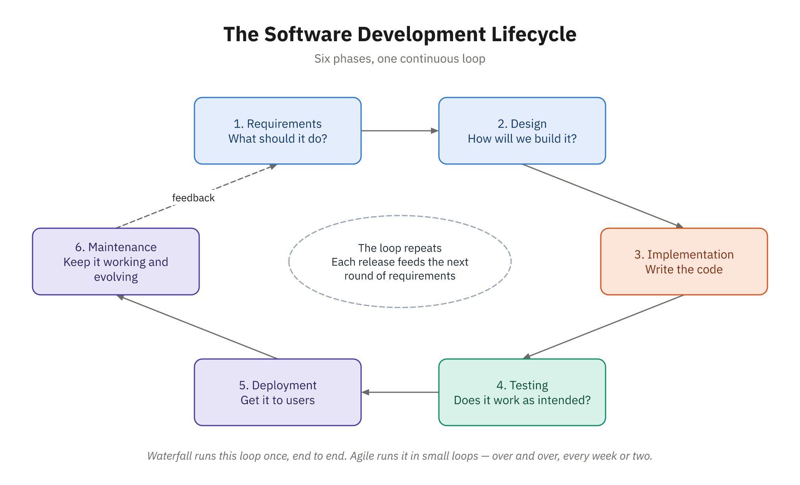
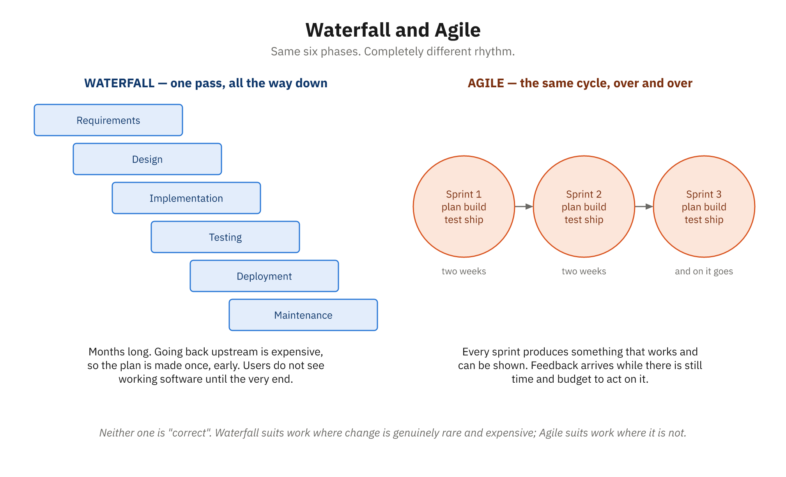
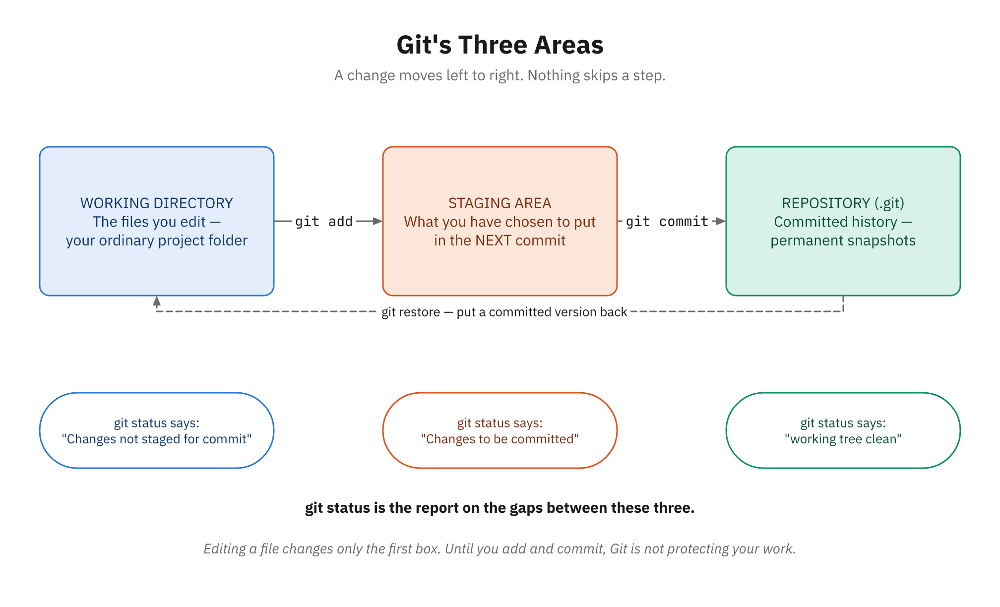
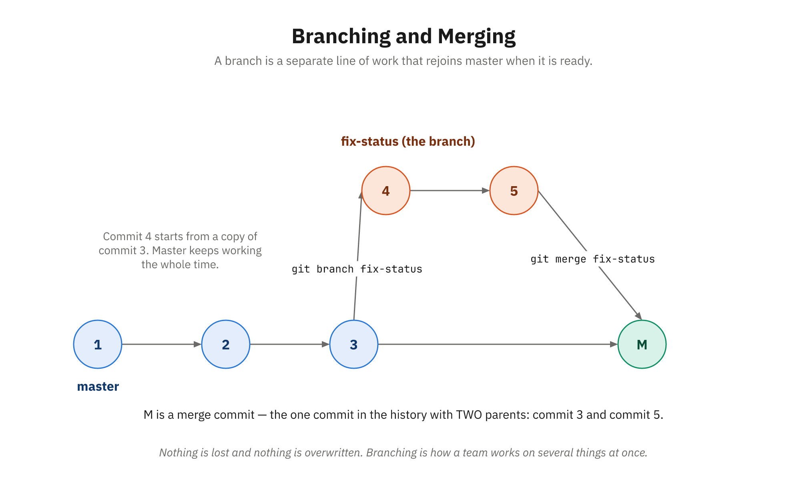
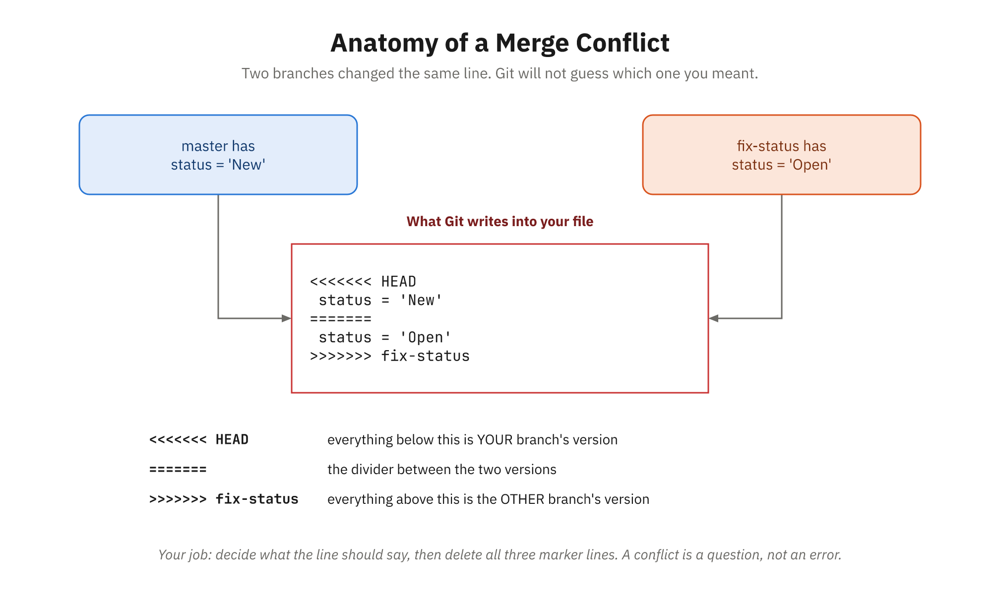
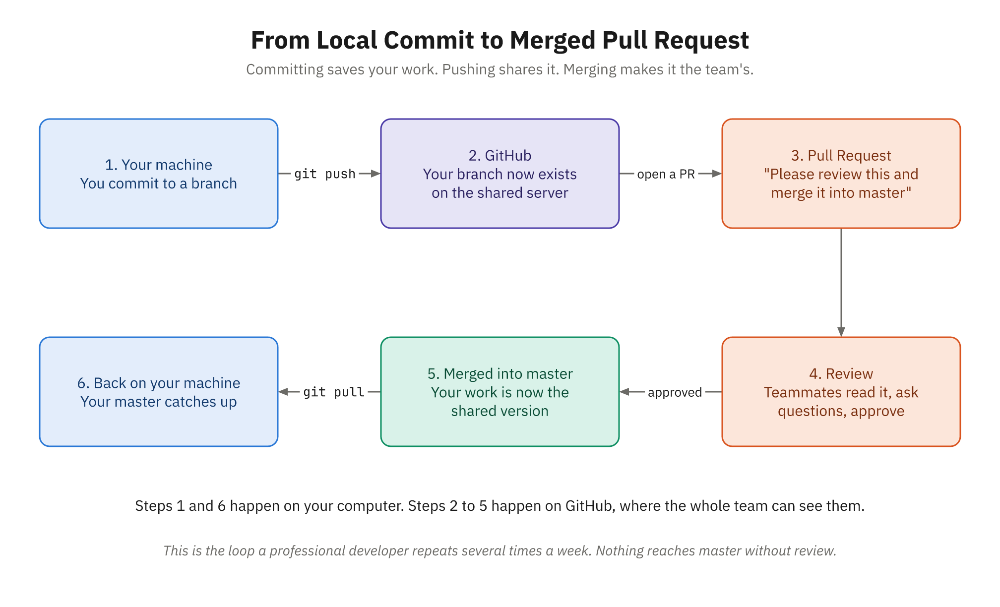

# Overview

## What This Module Covers

- Shift from individual coding to team collaboration
- The Software Development Lifecycle (SDLC) and methodologies
- Version control with Git, the industry standard
- Writing clear documentation in Markdown
- Code review, code quality, and technical debt
- Designed for career changers from other fields

## Learning Objectives

- Explain SDLC phases and why each matters
- Compare Waterfall, Agile, Scrum, Kanban, DevOps
- Use Git to manage code and branches
- Collaborate through pull requests and code review
- Communicate technically by writing in Markdown
- Recognize code quality, technical debt, and team roles

## Key Themes and the Course Project

- From individual programmer to coordinating team member
- Structure (sprints, reviews, branches) makes teamwork possible
- Tools enable practices; they solve real problems
- Quality is built in, not added at the end
- Course project: put CivicTrack's README under version control
- Branch, make a change, review it via pull request

# The Big Picture: SDLC

## What Is the SDLC?

- Structured process: turn an idea into working software
- Every industry has a development lifecycle
- Six phases, from requirements through maintenance
- A framework for how phases relate and feedback flows
- Different teams sequence and emphasize phases differently

## The Six Phases of the SDLC

| Phase          | Core Question                    |
|----------------|----------------------------------|
| Requirements   | What should the software do?     |
| Design         | How will we build it?            |
| Implementation | How do we write the code?        |
| Testing        | Does it work as intended?        |
| Deployment     | How do we get it to users?       |
| Maintenance    | How do we keep it working?       |

- Maintenance can consume 40–80% of total lifetime cost


## The SDLC as a Loop



## Waterfall: The Original Model

- Sequential phases, like water down a waterfall
- Gather all requirements, then design, build, test, deploy
- Emerged when hardware was costly and change expensive
- Strengths: predictable, well-documented, fits fixed-price contracts
- Weakness: handles change poorly; problems surface late
- Users see working software only at the very end

## The Agile Revolution

- 2001 Manifesto: value adaptation over rigid planning
- Individuals and interactions over processes and tools
- Working software over comprehensive documentation
- Customer collaboration over contract negotiation
- Responding to change over following a plan
- Small feedback loops catch problems early

## Methodologies Compared

| Method    | Style               | Best For                |
|-----------|---------------------|-------------------------|
| Waterfall | Sequential, planned | Stable, regulated work  |
| Scrum     | Iterative sprints   | Changing requirements   |
| Kanban    | Continuous flow     | Support and maintenance |
| DevOps    | Automation, CI/CD   | Rapid cloud deployment  |

- Lean: eliminate waste, maximize customer value
- Most teams blend several approaches in practice


## Waterfall and Agile, Side by Side



## Roles and Agile Team Rituals

- Developers, QA, product owners, designers, architects
- Scrum Masters facilitate and remove blockers
- Sprints: time-boxed iterations, usually two weeks
- Daily standup: a 15-minute team sync, not a status report
- Sprint review demos work; retrospective drives improvement
- Planning poker estimates effort with Fibonacci cards

# Working Locally with Version Control

## The Problem Version Control Solves

- The "final_v2_FINAL_real.docx" naming nightmare
- Software magnifies it: thousands of files, daily changes
- Multiple developers editing the code simultaneously
- Need history, safe revert, and who-changed-what
- "Save as" completely breaks down at scale

## Snapshots, Commits, and Branches

- Commit: a snapshot of the whole project
- Includes author, timestamp, message, and parent link
- Repository stores all snapshots and history
- Branch: an independent line of development
- Merge combines branches; overlaps become conflicts
- Conflicts need human judgment to resolve

## Distributed Version Control and Why Git Won

- Centralized (SVN): one server, no offline work
- Distributed (Git): everyone has full history locally
- Git is fast; most operations are local
- Cheap branching enables safe experimentation
- Staging area controls exactly what you commit
- GitHub (2008) made sharing code trivially easy

## Core Git Concepts

| Term              | Meaning                        |
|-------------------|--------------------------------|
| Working directory | Files you edit                 |
| Staging area      | Changes prepared for commit    |
| Repository        | Stored history of commits      |
| Branch            | Independent line of development|
| Merge             | Combining work from branches   |

- `.gitignore` keeps secrets, builds, and dependencies untracked


## Git's Three Areas



# Hands-On with Git

## Installing and Configuring Git

- Install via installer (Windows) or package manager
- Set your identity before your first commit

```bash
git --version
git config --global user.name "Your Name"
git config --global user.email "you@example.com"
git config --list
```

## The Everyday Workflow

- Edit, stage, commit, repeat
- `git status` is your diagnostic best friend
- Write messages that explain the why

```bash
git status
git add users.js tests.js
git commit -m "Add user creation function"
git log --oneline
```

## Working with Branches

- Create a branch per feature; work in isolation
- Switch freely while master stays safe
- Delete the branch once it is merged

```bash
git branch                       # list branches
git switch -c feature/new-login  # create and switch
git switch master                # switch back
git branch -d feature/new-login  # delete after merge
```


## Branching and Merging, Drawn



## Merging and Resolving Conflicts

- Switch to the target branch, then merge
- Non-overlapping changes merge automatically
- Same-line edits create a conflict to fix

```bash
git switch master
git merge feature/new-login
# edit conflicted files, then:
git add users.js
git commit -m "Merge feature/new-login into master"
```


## Anatomy of a Merge Conflict



## Remotes, Pushing, and Recovery

- `push` uploads commits; `pull` downloads and merges
- Recovery tools exist; use them wisely

```bash
git push -u origin feature/new-login
git pull origin master
git restore users.js   # discard local changes
git revert d4e5f6a     # safely undo a commit
git stash              # shelve work in progress
```

# Writing in Markdown

## Why Programmers Love Markdown

- Plain text: version-control friendly, editable anywhere
- Simple syntax you can learn in minutes
- Portable: works on GitHub, Slack, and more
- Documentation lives alongside the code
- Great tooling: previews, converters, site generators

## Basic Markdown Syntax

- Headings use `#`; more `#` means smaller
- Asterisks for emphasis; dashes or numbers for lists

```markdown
# Heading 1
## Heading 2

*italic*  **bold**  ***both***

- Bullet item
  - Nested item
1. First step
2. Second step
```

## Code, Tables, and Links

- Backticks mark inline code and fenced blocks
- Pipes and dashes build simple tables
- Square brackets plus parentheses make links

```markdown
Use `len()` inline, or link to [the docs](https://example.com).

| Name  | Age | City     |
|-------|-----|----------|
| Alice | 28  | New York |
| Bob   | 34  | Boston   |
```

## READMEs and Good Documentation

- The README is your project's front door
- Cover: what, why, how to use, how to contribute
- Know your audience; lead with the simplest case
- Prefer clarity over cleverness; keep docs current

```markdown
# Project Name
Brief description of what this project does.

## Features
- Feature 1
- Feature 2
```

# Collaboration and Code Quality

## Why Code Quality Matters

- Most code time is maintenance, not writing
- Roughly 8% writing, 60%+ maintaining over its life
- Clear code: bugs found fast, features added quickly
- Messy code: slow changes, more bugs, unhappy developers
- Quality is a business concern, not just technical

## What Is Clean Code?

- Readable, well-named, simple, and consistent
- Each function should do one thing well
- Comments explain why, not what

```javascript
// Unclear
let d = 5;
function p(x, y) { }

// Clean
let maxRetries = 5;
function calculateTotalCost(quantity, unitPrice) { }
```

## Technical Debt

- Shortcuts now, repaid later with interest
- Skipped tests, copy-paste, quick fixes, postponed refactoring
- Debt compounds: every change gets slower
- Acceptable when intentional, tracked, bounded, communicated
- Healthy teams spend 20–30% paying it down

## Code Review and Pull Requests

- A pull request proposes changes for review before merging
- Reviewers check correctness, design, tests, readability
- Critique the code, not the person; explain why
- Receive feedback openly: "code is not you"
- CI runs automated tests on every pull request


## From Commit to Merged Pull Request



# Wrap-Up

## Key Takeaways

- SDLC phases stay consistent; methodologies suit the context
- Agile favors iteration, feedback, and responding to change
- Git tracks history and enables safe team collaboration
- Daily Git: status, add, commit, branch, merge, push, pull
- Markdown makes documentation clear and version-friendly
- Quality comes from reviews, testing, and managing debt

## Discussion Questions

- Where did your past projects fall on the Waterfall-to-Agile spectrum?
- How did you manage document versions before learning Git?
- Why is the staging area such a useful feature?
- What would a reviewer look for in your code?
- When is taking on technical debt actually worthwhile?
