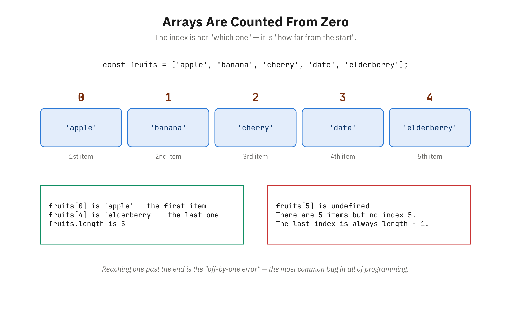
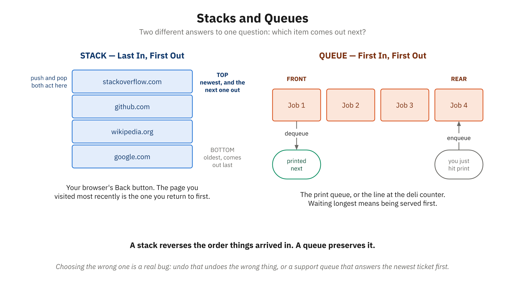
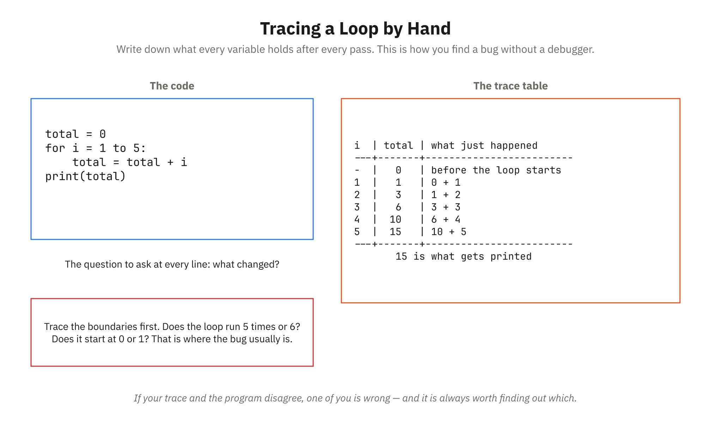

# Overview

## What This Module Covers

- Bridges how you think and how computers execute
- Focuses on *why* programmers structure code as they do
- Teaches reasoning, not just syntax and mechanics
- Language-agnostic concepts expressed in pseudocode
- Foundations every programmer relies on daily

## The Three Core Pillars

- Computational Thinking — the problem-solving framework
- Data Structures — organizing information efficiently
- Algorithms — designing correct, efficient solutions
- Together: the reasoning behind good code
- Applied to CivicTrack, our running project example

## Learning Objectives

- Define computational thinking and its four pillars
- Apply decomposition to complex business problems
- Choose appropriate data structures per scenario
- Write control flow with conditionals and loops
- Understand efficiency through basic Big O notation
- Apply the problem-solving cycle to programming tasks

# Problem-Solving with Computational Thinking

## What Is Computational Thinking?

- A way to approach *any* problem, not just code
- Break down, find patterns, abstract, design steps
- You already use it in business and operations
- Computers do exactly what you tell them
- Requires thinking through every step and scenario

## The Four Pillars

- Decomposition — break big problems into parts
- Pattern Recognition — spot similarities and trends
- Abstraction — focus on what matters, hide the rest
- Algorithm Design — precise, ordered, unambiguous steps
- Interconnected and used together on every problem


## The Four Pillars, Drawn


## Decomposition in Action

- Break a large goal into smaller, focused tasks
- Each part is understood, tested, changed independently
- In code, this becomes functions and modules

```text
Program: CalculatePayroll
  ├─ CollectHours()
  ├─ CalculatePay()
  │    ├─ CalculateGrossPay()
  │    ├─ CalculateTaxes()
  │    └─ CalculateDeductions()
  ├─ GeneratePaycheck()
  └─ UpdateRecords()
```

## Pattern Recognition & Code Reuse

- Spot logic that repeats across your program
- Write it once, then reuse it everywhere
- More maintainable and less error-prone
- Example: validating a number is within range

```text
FUNCTION ValidateRange(value, min, max)
  IF value < min OR value > max THEN
    RETURN false
  ENDIF
  RETURN true
END
```

## Abstraction: Managing Complexity

- Show relevant details, hide unnecessary complexity
- A map shows streets, not every tree
- Call `CalculateTax()` without knowing its internals
- Reduces mental load so you can focus
- Beware over-abstraction: don't hide what matters

## The Problem-Solving Cycle

- Understand — inputs, outputs, constraints, edge cases
- Plan — decompose, find patterns, design the algorithm
- Implement — translate the plan into code
- Review — test and verify correctness and clarity
- Loop back to earlier stages as you learn


## Flowchart Symbols


# Core Data Structures

## Why Data Structures Matter

- Decide how to organize data before processing it
- Right structure: fast, clear, easy to maintain
- Wrong structure: slow, confusing, awkward
- Choices about which operations are fast
- Spreadsheets and address books are everyday structures

## Variables & Data Types

- Variable: a named container for one value
- Numbers — quantities and calculations
- Strings — text like names and addresses
- Booleans — true / false flags
- Null / undefined — "no value" or "unknown"
- Variables are the building blocks of structures

## Arrays / Lists: Ordered Collections

- Ordered values accessed by index (position)
- Indexing usually starts at 0
- Ideal when order and iteration matter
- Fast by position, but slow to search

```text
numbers = [10, 20, 30, 40, 50]
PRINT numbers[0]        // 10
PRINT numbers[4]        // 50
ADD 60 TO numbers       // now ends with 60
FOR EACH n IN numbers
  PRINT n
END FOR
```


## Counting From Zero



## Objects / Dictionaries: Key-Value Pairs

- Access data by meaningful key, not position
- Fast lookup and grouping of related attributes
- Nest arrays and objects for real-world data
- Array of objects mirrors a database table

```text
customer = {
  "name": "Sarah Johnson",
  "age": 28,
  "isPremium": true
}
PRINT customer["name"]   // Sarah Johnson
```

## Stacks & Queues: Specialized Structures

- Stack — Last-In-First-Out, like a stack of plates
- Push to add, pop to remove from the top
- Use: undo/redo and the browser back button
- Queue — First-In-First-Out, like a line
- Enqueue at the back, dequeue from the front
- Use: support tickets and print jobs

```text
PUSH 1; PUSH 2; PUSH 3   // stack: [1, 2, 3]
POP                      // returns 3 (LIFO)

ENQUEUE 1; ENQUEUE 2     // queue: [1, 2]
DEQUEUE                  // returns 1 (FIFO)
```


## Stacks and Queues, Drawn



## Sets & Choosing the Right Structure

- Set — a collection of unique values, no duplicates
- Ideal for membership checks and removing duplicates
- Match the structure to your main operation

| Need | Best Structure |
|------|----------------|
| Access by position | Array |
| Look up by key | Object |
| Membership, no duplicates | Set |
| Last-in-first-out | Stack |
| First-in-first-out | Queue |

# Control Flow Mastery

## What Is Control Flow?

- The order in which statements execute
- Sequential — do A, then B, then C
- Conditional — decide based on a condition
- Repetitive — repeat actions with loops
- Directs the computer to skip, repeat, or branch

## Conditionals: Making Decisions

- IF runs a block when a condition is true
- IF / ELSE chooses between two paths
- ELSE-IF chains handle multiple cases in order
- SWITCH / CASE is clean for many exact matches
- Only one branch ever executes

```text
IF score >= 90 THEN
  PRINT "Grade: A"
ELSE IF score >= 80 THEN
  PRINT "Grade: B"
ELSE
  PRINT "Grade: F"
ENDIF
```

## Comparison & Logical Operators

- Comparisons produce true / false values
- Combine conditions with AND, OR, NOT
- AND — all conditions must be true
- OR — at least one must be true
- Parentheses control evaluation order

| Operator | Meaning |
|----------|---------|
| = | Equal to |
| != | Not equal to |
| > , < | Greater / less than |
| >= , <= | Greater or / less or equal |

## Loops: Repeating Actions

- FOR — when you know the repetition count
- FOR EACH — iterate over values directly
- WHILE — repeat until a condition is false
- DO-WHILE — runs the body at least once

```text
FOR i = 1 TO 5
  PRINT i
END FOR

count = 1
WHILE count <= 5
  PRINT count
  count = count + 1
END WHILE
```


## Tracing a Loop by Hand



## Loop Control, Infinite Loops & Functions

- BREAK — exit the loop immediately
- CONTINUE — skip to the next iteration
- Infinite loop: the condition never becomes false
- Always move toward ending the loop
- Functions: named, reusable blocks of logic
- Functions bring the four pillars together

# Algorithm Basics

## What Is an Algorithm?

- A precise, step-by-step procedure to solve a problem
- Recipes and driving directions are everyday algorithms
- Has well-defined input and output
- Uses clear, unambiguous steps
- Must terminate and produce a correct result

## Linear Search

- Check every item in order until found
- Works on unsorted lists
- Simple and fine for small lists
- Slow for large data: up to N checks

```text
FUNCTION LinearSearch(list, target)
  FOR i = 0 TO LENGTH OF list - 1
    IF list[i] = target THEN
      RETURN i
    ENDIF
  END FOR
  RETURN -1
END
```

## Binary Search

- Requires a sorted list
- Check the middle, then discard half each step
- "Divide and conquer" narrows the search fast
- Only about 20 checks for a million items

## Binary Search — The Algorithm

```text
left = 0
right = LENGTH OF list - 1
WHILE left <= right
  mid = (left + right) / 2   // floor
  IF list[mid] = target THEN
    RETURN mid
  ELSE IF list[mid] < target THEN
    left = mid + 1
  ELSE
    right = mid - 1
  ENDIF
END WHILE
```

## Linear vs. Binary Search

- Linear: no sorting needed, slower at scale
- Binary: needs sorted data, dramatically faster
- Sorting pays off when you search repeatedly

| Case (1,000,000 items) | Linear | Binary |
|------------------------|--------|--------|
| Best | 1 | 1 |
| Average | 500,000 | ~20 |
| Worst | 1,000,000 | ~20 |


## Halving the Problem


## Big O Notation

- Describes how runtime grows with input size
- Ignores constants; focuses on scaling
- O(1) constant, O(log n) logarithmic
- O(n) linear, O(n log n) linearithmic
- O(n²) quadratic, O(2^n) exponential

| Notation | Steps for 1000 items |
|----------|----------------------|
| O(1) | 1 |
| O(log n) | 10 |
| O(n) | 1000 |
| O(n²) | 1,000,000 |

## Sorting Algorithms & Design Strategies

- Bubble and selection sort: simple but O(n²)
- Merge sort and quicksort: efficient at O(n log n)
- Most real-world sorting uses quicksort or merge sort
- Strategies: brute force, divide and conquer
- Greedy choices; dynamic programming reuses results
- Clarity and maintainability matter too

# Wrap-Up

## Key Takeaways

- Computational thinking underlies all programming
- Decompose, find patterns, abstract, design algorithms
- Data structure choice shapes efficiency and clarity
- Control flow: conditionals and loops direct execution
- Algorithm choice can transform performance
- Pseudocode captures logic independent of language

## Discussion Questions

- How would you decompose a complex problem from your field?
- Where have you recognized a useful pattern at work?
- When would you choose an object over an array?
- Which business process maps to a stack or a queue?
- When is binary search worth the cost of sorting first?
