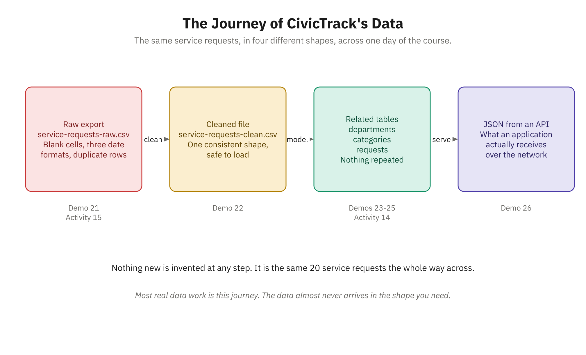
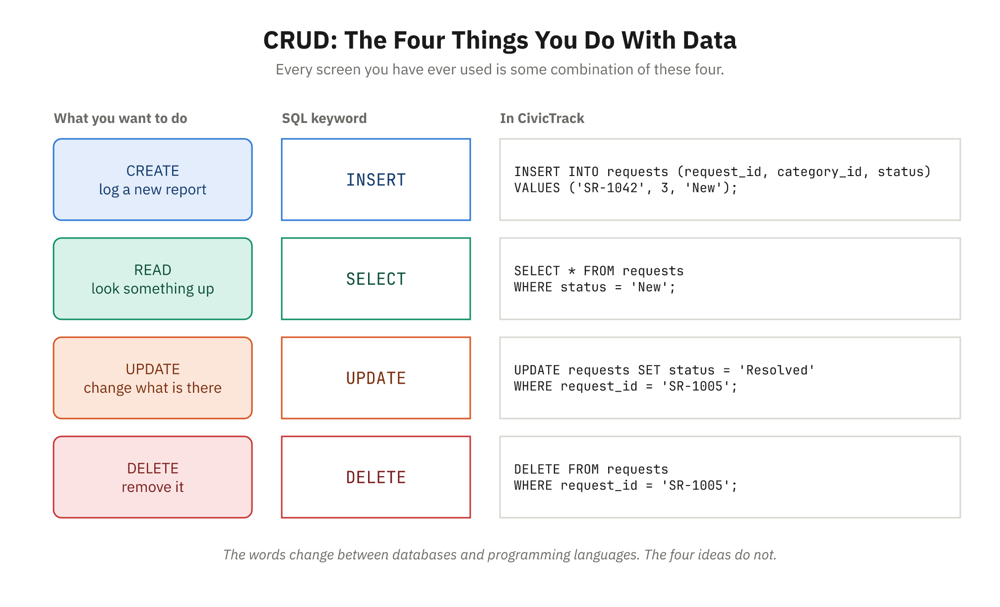

# Overview

## What This Module Covers

- Data as a first-class concern, not an afterthought
- How data is structured, stored, and retrieved
- Practical tools: spreadsheets and CSV files
- Purpose-built databases: SQL and NoSQL
- APIs as a modern data source over the web
- Built for career-changers new to programming

## Learning Objectives

- Distinguish structured, unstructured, and semi-structured data
- Organize data with tables, relationships, and keys
- Use spreadsheets and CSVs, and know their limits
- Recognize when a database is the right tool
- Read and write basic SQL: SELECT, WHERE, JOIN
- Compare SQL vs. NoSQL; understand APIs as sources

## Key Themes and the Course Project

- Data reflects reality; models mirror the real world
- Tradeoffs everywhere: ease vs. scale vs. power
- Programmers think in systems, not single files
- Concurrency, consistency, scalability, and queryability matter
- CivicTrack data: CSV to spreadsheet to database to API

# Foundations of Data Systems

## What Is Data?

- Data is recorded information about the world
- Names, prices, readings, connections, images, histories
- Individual facts: "Alice's phone is 555-0123"
- Collections: "all customers and their purchases"
- Patterns: "urban customers spend 30% more"
- Organizing it well is the core challenge


## The Journey of CivicTrack's Data



## Structured, Unstructured, and Semi-Structured

- Structured: fixed schema, same fields every record
- Examples: customer tables, transactions, inventory
- Unstructured: no schema — documents, images, audio, email
- Semi-structured: some organization, flexible shape
- Examples: JSON, XML, and CSV files
- You've met all three in business already

## Semi-Structured Data: A JSON Example

- JSON labels each value and allows nesting
- Records can vary in fields and structure

```json
{
  "customer_id": 12847,
  "name": "Sarah Chen",
  "account_type": "premium",
  "orders": [
    { "order_id": "ORD-2024-001", "total": 129.99 },
    { "order_id": "ORD-2024-005", "total": 249.50 }
  ]
}
```

## The Tabular Model: Rows and Columns

- Structured data's most common shape: tables
- Row = record; column = field; cell = one value
- Schema defines the columns and their types

| Request ID | Category | Status | Date Submitted |
|---|---|---|---|
| SR-1001 | Pothole | Resolved | 2026-03-01 |
| SR-1004 | Graffiti | New | 2026-03-02 |

## Records, Fields, and Data Types

- Record = one instance; field = one attribute
- Each field has a type governing its values
- Text, numeric, date, boolean, decimal
- Correct types save storage and enable validation
- Types enable operations: sum numbers, sort dates
- Programmers name types when creating the table

## Primary Keys and Unique Identifiers

- A primary key uniquely identifies each record
- No two rows share the same key
- Prevents ambiguity between similar records
- Natural keys: SSN, ISBN, email — genuinely unique
- Surrogate keys: auto-generated IDs that never change
- Most business systems prefer surrogate IDs

## Relationships and Foreign Keys

- Real data is interconnected, not isolated
- One-to-one: employee to assigned vehicle
- One-to-many: one customer, many orders (most common)
- Many-to-many: orders and products, via a junction table
- A foreign key stores another table's primary key
- It links related data without duplicating it

## Data Integrity and CRUD

- Integrity means accurate, consistent, reliable data
- Entity: every row has a unique key
- Referential: foreign keys must point to real rows
- Domain: each field holds only valid values
- CRUD = Create, Read, Update, Delete
- Nearly every data action is one of these four


## CRUD and SQL



# Practical Tools: CSVs and Spreadsheets

## Spreadsheets: Strengths and Limits

- Ubiquitous, flexible tabular tool you already know
- A different tool from databases, not an inferior one

| Great For | Struggles With |
|---|---|
| Small–medium datasets | Millions of rows |
| Flexible, ad-hoc structure | Enforcing data integrity |
| Quick formulas and charts | Complex relationships |
| Non-technical users | Concurrent edits, audit trails |

## Formulas, Validation, and Pivot Tables

- Formulas start with `=` and compute values
- VLOOKUP mimics a JOIN — manually, by hand
- Validation restricts values: lists, types, ranges
- Pivot tables are GROUP BY aggregation, visually

```text
=SUM(A1:A100)
=AVERAGE(B1:B50)
=IF(D5 > 100, "Large Order", "Small Order")
=VLOOKUP(A2, Products!A:D, 3, FALSE)
```

## CSV Files: The Universal Format

- Plain text: Comma-Separated Values
- First line is a header naming the columns
- Each line is one record; commas split fields
- Human-readable, system-agnostic, lossless for data
- The "lingua franca" for exchanging data

```text
request_id,date_submitted,category,status,priority
SR-1001,2026-03-01,Pothole,Resolved,High
SR-1004,2026-03-02,Graffiti,New,Low
SR-1014,2026-03-07,Pothole,In Progress,High
```

## CSV Mechanics: Handling Tricky Values

- Values with commas: wrap the field in quotes
- Quotes inside a value: double them to escape
- Line breaks are allowed inside a quoted field
- Save as UTF-8 to avoid garbled characters
- Empty fields are fine, but plan for missing data

```text
P001,"Johnson, Inc.",49.99,true
P002,"They said, ""great!""",29.99,true
```

## When Spreadsheets Aren't Enough

- Your spreadsheet has become a multi-sheet database
- Multiple people overwrite each other's edits
- Duplicates and invalid data keep appearing
- Questions need ever-more-complex formulas and helpers
- Performance degrades; you need automation or auditing
- These signs mean it's time for a database

# Introduction to Databases

## What Is a Database?

- Purpose-built system to store and retrieve data
- Accessed through applications, not opened directly
- A hidden layer behind every app you use
- Provides concurrency, integrity, and reliability at scale
- Adds powerful queries, security, and audit trails
- Separates data from the apps that use it

## Relational Databases and the Relational Model

- Most business systems use relational databases (RDBMS)
- Tables of rows and columns, related by keys
- CivicTrack: departments, categories, requests
- category_id links each request to its category

| request_id | date_submitted | category_id | status |
|---|---|---|---|
| SR-1001 | 2026-03-01 | 1 | Resolved |
| SR-1014 | 2026-03-07 | 1 | In Progress |


## The CivicTrack Data Model


## Normalization: Store Each Fact Once

- The flat CSV repeated "Public Works" on every row
- Repetition is where typos and stale values come from
- Store it once; point at it with an id
- Cost: answering a question now needs a JOIN

## SQL: Reading Data with SELECT

- SQL is the standard language for relational data
- Declarative: describe what you want, not how
- WHERE filters rows; ORDER BY sorts results

```sql
SELECT request_id, description FROM requests
WHERE status = 'New'
ORDER BY date_submitted DESC;
```

## Summarizing Data: Aggregation and GROUP BY

- Aggregates summarize many rows into one value
- COUNT, SUM, AVG, MIN, and MAX
- GROUP BY computes an aggregate per group
- HAVING filters groups after aggregating

```sql
SELECT status, COUNT(*) AS request_count
FROM requests
GROUP BY status
HAVING COUNT(*) > 2;
```

## Combining Tables with JOIN

- JOIN merges rows from related tables
- Match on a shared key, like category_id
- INNER JOIN: only rows matching in both
- LEFT JOIN: all left rows, NULL where no match

```sql
SELECT r.request_id, c.name AS category, r.status
FROM requests r
JOIN categories c ON r.category_id = c.category_id;
```

## Creating and Inserting Data

- CREATE TABLE defines columns, types, constraints
- PRIMARY KEY and NOT NULL protect integrity
- INSERT adds new rows of data

```sql
CREATE TABLE departments (
  department_id INTEGER PRIMARY KEY,
  name TEXT NOT NULL
);
INSERT INTO departments (department_id, name)
VALUES (1, 'Public Works');
```

## NoSQL Databases: A Different Approach

- "Not only SQL" — for data that resists tables
- Document stores (MongoDB): flexible JSON documents
- Key-value stores (Redis): fast lookups, caching, sessions
- Flexible schema; records can differ freely
- Scales horizontally across many servers
- Weaker consistency; complex queries are harder

## SQL vs. NoSQL: Tradeoffs

- Choose by data shape and access needs
- Many apps use both — "polyglot persistence"

| Aspect | SQL | NoSQL |
|---|---|---|
| Schema | Fixed | Flexible |
| Relationships | JOINs | Denormalized |
| Consistency | Strong (ACID) | Often eventual |
| Best for | Structured data | Scale, hierarchy |

## APIs: How Applications Request Data

- An API is a defined way programs ask each other
- Like a restaurant menu: order without entering the kitchen
- REST + JSON is the common web style
- GET reads, POST creates, PUT updates, DELETE removes
- APIs sit in front of databases for security
- `GET /api/customers/1001` returns JSON


## How an Application Gets Its Data


# Wrap-Up

## Key Takeaways

- Data comes structured, unstructured, or semi-structured
- Tables, keys, and relationships model reality with little redundancy
- Spreadsheets and CSVs are great — until they aren't
- Databases add concurrency, integrity, scale, and queries
- SQL reads and writes structured data declaratively
- NoSQL and APIs round out the modern data toolkit

## Discussion Questions

- Where have you seen structured vs. unstructured data at work?
- What primary keys would fit a dataset you've used?
- Which spreadsheet "turning point" have you experienced?
- When would you choose SQL, NoSQL, or both?
- How does a JOIN improve on spreadsheet VLOOKUPs?
